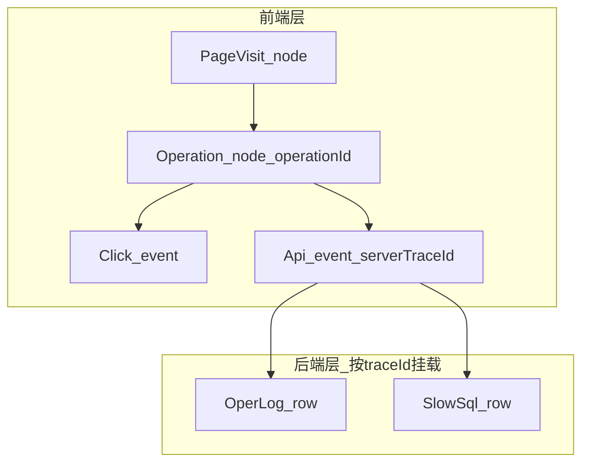
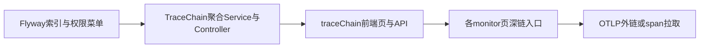

# 全链路监控展示页设计方案

## 1. 现状与目标差距

项目**已具备**链路数据采集与关联字段，但**展示是分散的**：

| 能力 | 存储/入口 | 关联键 |
|------|-----------|--------|
| 页面/按钮/API 事件 | [`sys_client_track`](quickboot/quickboot-web/src/main/resources/db/migration/V39__sys_client_track.sql) + [`quick-ui/src/monitor/`](quick-ui/src/monitor/) | `pageVisitId`、`operationId`、API 事件内 `serverTraceId` |
| 操作日志 | [`sys_oper_log`](quickboot/quickboot-web/src/main/resources/db/migration/V16__sys_oper_log.sql) → [`monitor/operlog`](quick-ui/src/views/monitor/operlog/index.vue) | `trace_id`（单次 HTTP）、`client_operation_id`（一次前端操作） |
| 慢 SQL | [`sys_slow_sql`](quickboot/quickboot-web/src/main/resources/db/migration/V51__sys_slow_sql.sql) → [`monitor/slowSql`](quick-ui/src/views/monitor/slowSql/index.vue) | `trace_id`、`client_operation_id` |

现有页面分工：

- **批次列表** [`clientTrack/index.vue`](quick-ui/src/views/monitor/clientTrack/index.vue)：按批次看摘要，可带 `operationId` 跳到事件链。
- **事件链** [`clientTrack/events.vue`](quick-ui/src/views/monitor/clientTrack/events.vue)：扁平事件表。
- **行为轨迹** [`clientTrack/timeline.vue`](quick-ui/src/views/monitor/clientTrack/timeline.vue)：偏「会话→页面跳转→页内事件树」；API 事件可点 `serverTraceId` 打开**单条**操作日志（[`useOperLogDetail`](quick-ui/src/views/monitor/operlog/useOperLogDetail.js)），**未挂慢 SQL**，也**未按 operationId 一次展示多接口+多 SQL**。

设计文档 [`docs/superpowers/specs/2026-05-30-unified-tracing-design.md`](docs/superpowers/specs/2026-05-30-unified-tracing-design.md) 已明确：**不能用单一 traceId 表示「一次点击」**；正确聚合键是 **`operationId`（前端操作）** + **`traceId`（单次 HTTP 及其 SQL）**。

**目标页面**：用户输入 `operationId` / `traceId` / 用户+时间 等，得到一棵可展开的树：

```text
页面访问 (pageVisitId / 菜单 breadcrumb)
  └─ 用户操作 (operationId) — 触发按钮/表单
       ├─ click / route_enter（前端事件，带 ts）
       ├─ API #1 (serverTraceId = t-111)
       │    ├─ 操作日志 (oper_log, trace_id=t-111)
       │    └─ 慢 SQL × N (trace_id=t-111)
       ├─ API #2 (t-222) …
       └─ …
```

---

## 2. 核心数据模型（展示用 DAG）

不要把四张表硬拼成「一条线」；用**两层父子关系**：



**节点类型与主键**

| 节点类型 | 主键 | 子节点 |
|----------|------|--------|
| `page_visit` | `pageVisitId` + `pagePath` | 多个 `operation` |
| `operation` | `operationId` | `click`/`route`/`api` 事件（来自 `events_json` 或事件链 API） |
| `api` | `serverTraceId` (= 后端 `traceId`) | 0~1 条 oper_log（宽切面可能 0 或多条，见下） |
| `oper_log` | `operId` | — |
| `slow_sql` | `slowId` | — |

**边界（需在 UI 上诚实标注，避免「完美」误解）**

- 无 `operationId` 的后台轮询/被动请求：只能按 `traceId` 查后端，前端树缺「按钮」层。
- 一次 HTTP 可能对应 **0 条** oper_log（`@IgnoreLogger`、URL 排除）或 **多条**（少见）；展示时 `api` 下用列表而非假定 1:1。
- 一次 `traceId` 可对应 **多条** slow SQL（同一请求内多次 JDBC）；全部挂在该 `api` 下。
- oper_log / slow_sql **异步落库**，与前端 `ts` 可能有毫秒~秒级偏差；排序以各源 `oper_time` / `create_time` 为准，前端事件用 `ts`。
- 慢接口：前端 `api_slow` 事件与 `sys_oper_log.cost_time`、慢 SQL 阈值**口径不同**；节点上分别标「前端慢 API / 后端耗时 / SQL 慢」。

---

## 3. 后端：聚合 API（推荐 Phase 1 核心）

**不要**在前端对 oper_log、slow_sql、client_track 各查一遍再拼装（N+1、权限与分页不一致）。新增只读聚合接口，例如：

`GET /monitor/traceChain/graph`

**入参（至少一种主键 + 可选时间窗）**

| 参数 | 用途 |
|------|------|
| `operationId` | **首选**：一次用户操作全链路 |
| `traceId` | 从某次 API/日志反查：返回以该 trace 为焦点的子图（含所属 operation 若存在） |
| `batchId` | 从批次列表/详情跳入 |
| `pageVisitId` | 页级：返回该页下多个 operation（列表模式，限制条数） |
| `userName` + `beginTime`/`endTime` | 探索式查询（需 `LIMIT`，与 timeline 一致防扫表） |

**出参（建议统一 VO）**

```json
{
  "rootType": "operation",
  "rootId": "op-xxx",
  "summary": { "userName", "pagePath", "menuBreadcrumb", "status": "ok|partial|error" },
  "nodes": [
    { "id", "type", "label", "startTime", "durationMs", "status", "attrs": {} }
  ],
  "edges": [ { "from", "to" } ],
  "truncated": false,
  "warnings": ["oper_log 异步未落库", "..."]
}
```

**组装逻辑（[`quickboot-system` 新包 `monitor/tracechain`](quickboot/quickboot-system/src/main/java/io/github/genkidoudou/web/monitor/)）**

1. 以 `operationId` 查 `sys_client_track`（`operation_id` 索引）+ 解析 `events_json`（复用 [`SysClientTrackServiceImpl`](quickboot/quickboot-system/src/main/java/io/github/genkidoudou/web/monitor/clienttrack/service/impl/SysClientTrackServiceImpl.java) 内已有解析工具方法）。
2. 收集事件中的全部 `serverTraceId`（去重）。
3. `SELECT * FROM sys_oper_log WHERE client_operation_id = ?` **或** `trace_id IN (...)`（trace 入口用后者为主）。
4. `SELECT * FROM sys_slow_sql WHERE client_operation_id = ?` **或** `trace_id IN (...)`（[`SysSlowSql`](quickboot/quickboot-system/src/main/java/io/github/genkidoudou/web/system/slowsql/domain/SysSlowSql.java) 已有字段）。
5. 合并排序：同一 `operation` 下按 `min(click.ts, api.ts)`；`api` 子节点按 `oper_time`/`create_time` 与 `api.ts` 对齐。
6. **限额**：单图 max operations（如 20）、max apis per operation（如 30）、max slow sql per trace（如 50），超限 `truncated=true`。

**权限**：`monitor:traceChain:query`（或复用 `monitor:clientTrack:list` + `monitor:operlog:query` + `monitor:slowSql:query` 三者 AND）；菜单挂在监控目录下，与 [`V51` 慢 SQL 菜单](quickboot/quickboot-web/src/main/resources/db/migration/V51__sys_slow_sql.sql) 同级。

**索引**：确认/补充 `sys_oper_log(client_operation_id)`、`sys_slow_sql(client_operation_id)`（V51 已有 `trace_id` 索引；若按 operation 批量查需 `client_operation_id` 索引）。

---

## 4. 前端：专用「全链路」页 UI 设计

**路由建议**：`/monitor/traceChain` → `quick-ui/src/views/monitor/traceChain/index.vue`（新页，不替换 timeline：timeline 继续承担「会话浏览」，traceChain 承担「排障钻取」）。

### 4.1 布局（三栏）

```text
┌─────────────────────────────────────────────────────────────┐
│ 检索：operationId | traceId | 用户 | 时间范围  [查询] [重置]   │
│ 摘要条：用户 / 页面 / 菜单 / 整体状态(成功|异常|慢)            │
├──────────────┬──────────────────────────────────────────────────┤
│ 左侧树/列表   │ 主视图：泳道瀑布（推荐）或 Sankey 简化版          │
│ - 按操作折叠  │ 泳道：页面 | 前端事件 | HTTP | 操作日志 | SQL    │
│ - 选中高亮    │ 时间轴横向：相对 operation 起点 ms               │
├──────────────┴──────────────────────────────────────────────────┤
│ 底部/右侧抽屉：节点详情（复用现有 Panel）                        │
└─────────────────────────────────────────────────────────────┘
```

### 4.2 主视图：泳道瀑布（比纯表格更适合「完美感」）

- **纵轴**：逻辑层级（页面 → 操作 → API → SQL）。
- **横轴**：时间（以 operation 第一个事件为 t0）。
- **节点样式**（对齐 [`DESIGN.md`](DESIGN.md)）：
  - 正常：中性色；`api_error` / oper_log `status=1`：错误色；`api_slow` / 超阈值 SQL：警告色。
  - 节点文案：`菜单 > 页面`、`triggerAction`、`GET /api/... 320ms`、`SELECT ... 1200ms`。
- **交互**：
  - 点击 `api` → 展开/选中其下 oper_log + slow_sql 列表。
  - 点击 `oper_log` → 弹窗 [`OperLogDetailPanel`](quick-ui/src/views/monitor/operlog/OperLogDetailPanel.vue)。
  - 点击 `slow_sql` → 复用 [`slowSql/index.vue`](quick-ui/src/views/monitor/slowSql/index.vue) 详情结构（或抽 `SlowSqlDetailPanel`）。
  - 复制 `operationId` / `traceId`；外链预留 Jaeger（Phase 2）。

**实现选型**：优先 **ECharts custom series / 条形甘特**（项目 [`timeline.vue`](quick-ui/src/views/monitor/clientTrack/timeline.vue) 已用 ECharts）；数据量大时降级为 **可折叠 el-tree + 时间列**（与 timeline 页内表格模式一致）。

### 4.3 入口串联（避免孤岛）

| 来源页 | 跳转 query |
|--------|------------|
| clientTrack 列表/详情 | `?operationId=` |
| events 某行 API | `?traceId=` |
| operlog 列表 | `?traceId=` 或 `?operationId=clientOperationId` |
| slowSql 列表 | `?traceId=` |
| timeline 事件抽屉 | 增加「查看全链路」按钮 → `traceChain` |

### 4.4 前端 API 模块

- `quick-ui/src/api/monitor/traceChain.js` → `getTraceChainGraph(params)`。
- composable：`useTraceChainGraph.js`（加载、truncated 提示、选中节点状态）。

---

## 5. 与「慢接口」的关系

需求文档 [`原始需求/需求.md`](原始需求/需求.md) 提到「慢接口」；当前前端仅有 **`api_slow` 事件**（[`VITE_APP_MONITOR_SLOW_API_MS`](docs/docs/frontend/modules/user-behavior-monitor.md)），**无独立 `sys_slow_api` 表**。

Phase 1 建议：

- 在 `api` 节点 `attrs` 中带 `frontendSlow: true`（来自 client_track 事件）+ `operLogCostTime` + `hasSlowSql`。
- 全链路页筛选器：「仅看慢路径」（任一 API 前端慢 / oper cost 超阈 / 存在 slow_sql）。

若后续要独立慢接口表，再扩展聚合 API，**不改变** operationId/traceId 树模型。

---

## 6. Phase 2（可选）：OTLP / Jaeger

[`docs/docs/deploy/monitoring.md`](docs/docs/deploy/monitoring.md) 已配置 OTLP。在 `api` 节点增加：

- `jaegerUrl`：`search?traceId={traceId}`（**按单次 HTTP**，不是 operationId）。
- 或后端拉取 span 列表写入 `nodes`（成本高，仅 dev/按需）。

这与 MySQL 聚合页**互补**：MySQL 页面向业务排障；Jaeger 面向基础设施 span 树。

---

## 7. 实施顺序（建议）



| 阶段 | 交付物 | 验收 |
|------|--------|------|
| **P1** | 索引 + `GET /monitor/traceChain/graph` + 权限 | 给定 `operationId`，返回含 ≥1 API、oper_log、slow_sql 的 nodes/edges |
| **P2** | `traceChain/index.vue` 泳道/树 + 详情抽屉 | 从 operlog 带 `traceId` 跳入可见完整树；慢 SQL 节点可点开 |
| **P3** | clientTrack/operlog/slowSql/timeline 深链 | 各页一键跳转 traceChain |
| **P4** | Jaeger 外链 / OTLP | 单次请求可打开基础设施 trace |

---

## 8. 关键文件参考（实现时）

- 关联规范：[`docs/superpowers/specs/2026-05-30-unified-tracing-design.md`](docs/superpowers/specs/2026-05-30-unified-tracing-design.md) §2、§9
- 前端采集：[`docs/docs/frontend/modules/user-behavior-monitor.md`](docs/docs/frontend/modules/user-behavior-monitor.md)
- 轨迹构建：[`buildTimelineModel.js`](quick-ui/src/views/monitor/clientTrack/buildTimelineModel.js)、[`clientTrackEvent.js`](quick-ui/src/views/monitor/clientTrack/clientTrackEvent.js)
- 慢 SQL 采集：[`SlowSqlCaptureSupport.java`](quickboot/quickboot-common/src/main/java/io/github/genkidoudou/common/monitor/slowsql/SlowSqlCaptureSupport.java)

---

## 9. 设计结论（一句话）

**「完美」展示的关键不是再采一套日志，而是用 `operationId` 做业务根、`traceId` 做请求子根，由后端一次聚合四源数据，前端用泳道瀑布统一时间轴，并复用现有 operlog/slowSql 详情组件；接受无 operationId、异步落库、多 SQL 等边界，用 `truncated` 与 `warnings` 透明告知。**
