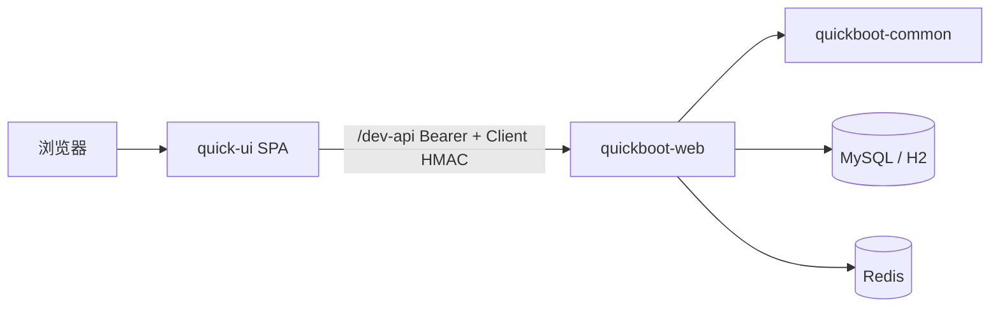

# 系统架构

## 模块职责

| 模块 | 职责 |
|------|------|
| quick-ui | 管理端 UI、权限路由、C7 组件 |
| quickboot-web | REST、OAuth2、定时任务、代码生成 |
| quickboot-common | 防火墙、Excel、日志 AOP、文件、缓存 |
| quickboot-core | 预留扩展 |

## 认证链路

1. `POST /login` + Client HMAC → Sa-Token  
2. 后续请求 `Authorization: Bearer` + HMAC  
3. 第三方 OAuth：`/oauth2/client/authorize` → callback → 同 Token 语义  

## 部署形态

- **开发**：H2 + local Token + Vite 代理  
- **生产**：MySQL + Redis + Nginx 静态 + 反向代理 API  

详见 [部署配置](../deploy/configuration)。
