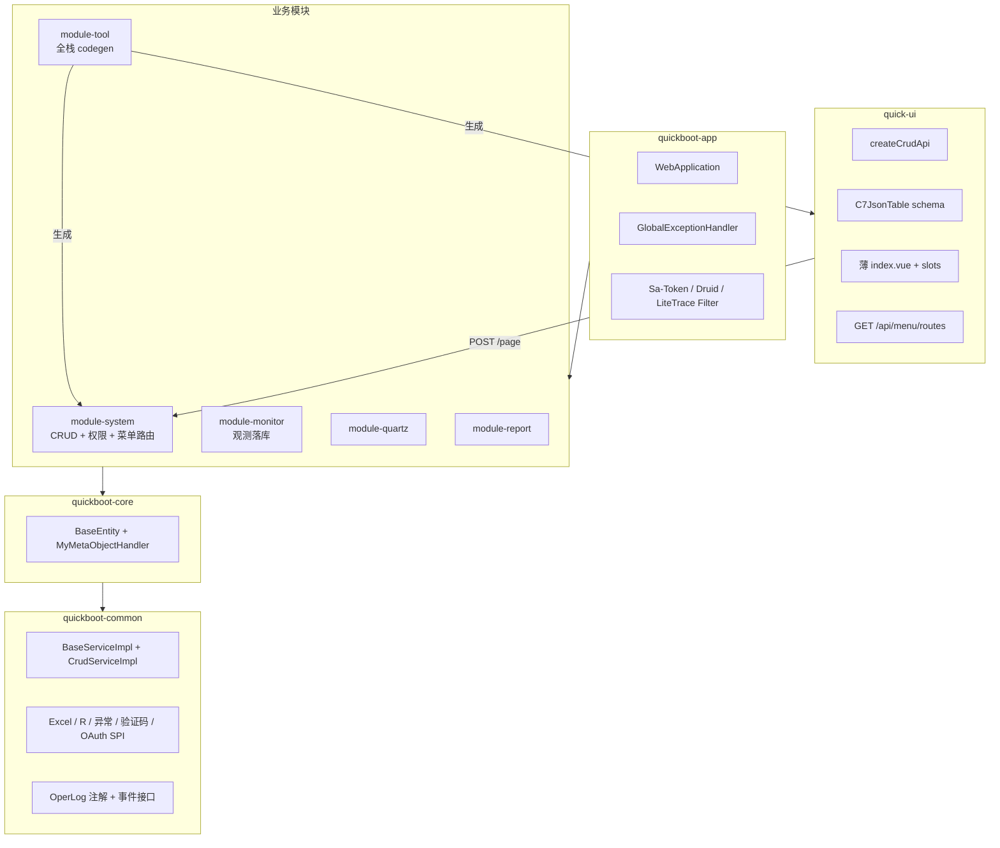

# quickboot 全栈激进简化方案

> **文档版本**：v1.1  
> **更新日期**：2026-09-01  
> **状态**：**已完成**（OpenSpec change [`fullstack-simplify`](../../../openspec/changes/fullstack-simplify/)，进度 49/49）  
> **范围**：`quickboot` 后端 + `quick-ui` 管理端

---

## 1. 决策摘要

经确认，本方案按以下约束执行：

| # | 决策项 | 结论 |
|---|--------|------|
| 1 | 表结构 | **保持现网约定**，Flyway 仅允许新增脚本，禁止 ALTER 改列类型/重命名表 |
| 2 | Service 命名 | **保留** `ISysXxxService` + `SysXxxServiceImpl` |
| 3 | 简化范围 | **后端 + quick-ui 一起收** |
| 4 | 激进程度 | **激进**（允许破坏性 API 整理、删死代码、横切收拢） |
| 5 | Maven 模块 | **保留** `quickboot-core` 与 `quickboot-common` 分立，**不合并** |
| 6 | Quartz API 前缀 | **默认**：保持 `monitor/job`、`monitor/job-log`（不改菜单权限域） |
| 7 | Tier-1 DTO 策略 | **删除 Entity 对外暴露**；API 仅 `Vo`，Service 内部 `toEntity()` |

---

## 2. 量化目标（12 周）

| 指标 | 现状（约） | 目标 |
|------|-----------|------|
| 后端 main Java | 429 | ≤ 320（−25%） |
| system 模块类 | 162 | ≤ 110 |
| common 模块类 | 129 | ≤ 90 |
| Maven 模块 | 8 | **8**（core / common 保持分立） |
| 前端 `api/*.js` | 43 | ≤ 18 |
| 手写 CRUD `index.vue`（Tier A） | ~150 行/页 | ~40 行/页（schema 驱动） |
| GET `/list` vs POST `/page` 双轨 | 14+ 控制器 | **100% POST `/page`**（只读树形除外） |
| 无后端的前端 API | 14 文件 | **0** |
| 集成测试 | ~10 | ≥ 40 |

---

## 3. 硬性不变项（锁死）

依据仓库 `code_formater.md` §4、§5、§6，简化过程中**不得破坏**：

### 3.1 数据库

- 表名：`sys_*` + snake_case
- 主键：雪花 `ASSIGN_ID`，字段如 `user_id`
- 审计：`create_by` / `create_time` / `update_by` / `update_time`（`BaseEntity`）
- 软删：`del_flag` CHAR(1) + `@TableLogic`
- 是否类：**禁止** entity 及表映射 VO 使用 `boolean`；统一 `String` + `0`/`1`
- 字典列：列注释 `描述(dict_type)`；库存字典 **value**

### 3.2 后端

- 统一响应：`R<T>` + `PageInfo`
- Service：`ISysXxxService` + `SysXxxServiceImpl`
- 写操作：默认 `@PostMapping`（非 PUT/DELETE）
- 异常：`WarningException` / `ErrorException`，禁止 `IllegalArgumentException` 作业务失败
- Controller 不写业务逻辑；OpenAPI `@Tag` / `@Operation` 保留

### 3.3 前端

- HTTP 只走 `src/api/` + `utils/request`
- 列表页不展示业务主键；展示创建时间 `yyyy-MM-dd HH:mm:ss`
- 字典：`useDict` + `C7DictTag`，禁止页面写死 options
- 列表/表单优先 `C7JsonTable` / `C7Dialog`

---

## 4. 目标架构



### 4.1 核心变化

1. **`quickboot-core` 保持独立**：继续承载 `BaseEntity`、MyBatis-Plus 审计填充等项目级抽象（依赖链 `module-* → core → common` 不变）
2. **common 不再承载业务表实体**；OperLog/SlowSql 采集 SPI 化，落库归 system/monitor
3. **Tier-1 CRUD**：API 层仅 `Vo`；`Entity` 只在 persistence 层使用
4. **标准 CRUD 模板**：`CrudServiceImpl`（放 common）统一分页/拷贝/导出骨架
5. **前端 CRUD**：`createCrudApi` + schema 驱动页面
6. **删除 `ScaffoldCompatController`** → 正式 `MenuRouteController`

---

## 5. Tier-1「删除 Entity 暴露」约定

适用于简单配置类 CRUD 域（Config、DictType、DictData、FileClassify 等）。

### 5.1 分层规则

| 层 | 可见类型 | 说明 |
|----|----------|------|
| Controller | 仅 `SysXxxVo` | 入参/出参不出现 `SysXxx` Entity |
| `ISysXxxService` | `Vo` / `PageInfo<Vo>` | public 方法签名不含 Entity |
| `SysXxxServiceImpl` | Entity 内部使用 | `toEntity(vo)` / `toVo(entity)` 仅在 impl 内 |
| Mapper | `SysXxx` Entity | 不变 |
| 跨模块 `api` | `*View` record | Modulith 边界保留 |

### 5.2 禁止项

- Controller 返回 `SysXxx` Entity
- 对外 REST/OpenAPI schema 出现 Entity 字段
- 前端 TypeScript/JSDoc 引用 Entity 名

### 5.3 保留 Entity 双模型的域（Tier-2）

以下域业务复杂，**暂不合并 Vo**，但 API 仍不直接暴露 Entity：

- `SysUser`（密码、角色、导入）
- `SysRole`（菜单/数据权限）
- `SysMenu`（树、路由 meta）
- `SysDept`（树）
- `SysOauthClient`（缓存、密钥）
- `SysFile`（上传存储）

---

## 6. 统一 API 契约

### 6.1 标准 CRUD

| 操作 | Method | Path | Body |
|------|--------|------|------|
| 分页 | `POST` | `{prefix}/page` | `PageRequest<QueryVo>` |
| 详情 | `GET` | `{prefix}/{id}` | — |
| 新增 | `POST` | `{prefix}/add` | `SaveVo` |
| 修改 | `POST` | `{prefix}/update` | `SaveVo` |
| 删除 | `POST` | `{prefix}/remove` | `{ ids: [] }` |
| 导出 | `POST` | `{prefix}/export` | `QueryVo` |
| 导入 | `POST` | `{prefix}/import` | multipart |
| 模板 | `GET` | `{prefix}/importTemplate` | — |

**Quartz 前缀（已确认默认）**：

- `monitor/job`
- `monitor/job-log`

### 6.2 待迁移：GET list → POST page

| 控制器 | 现路径 | 前端 API | 阶段 |
|--------|--------|----------|------|
| `SysDeptController` | `GET list` | `dept.js` | P1 |
| `SysFileController` | `GET /list` | `file.js` | P1 |
| `SysFileClassifyController` | `GET /list` | `fileClassify.js` | P1 |
| `SysUserOnlineController` | `GET /list` | `online.js` | P1 |
| `SysJobController` | `GET /list` | `job.js` | P1 |
| `SysJobLogController` | `GET /list` | `jobLog.js` | P1 |
| `SysSlowSqlController` | `GET /list` | `slowSql.js` | P1 |
| `SysMenuController` | `GET /list` | `menu.js` | P2（树形可暂留 list 别名） |
| `GenController` | `GET /list` | `gen.js` | P2 |
| `LogHubController` | `GET /list` | `logHub.js` | P3 |

**兼容策略**：旧 GET 端点保留 **4 周** `@Deprecated` 别名，响应头 `Deprecation: true`。

### 6.3 动态路由 API

| 现网 | 目标 |
|------|------|
| `GET /getRouters` | `GET /api/menu/routes` |
| `ScaffoldCompatController` | `MenuRouteController` |

前端：`api/menu.js` 新增 `getMenuRoutes()`；旧 URL 后端转发 1 版本后删除。

---

## 7. 后端实施阶段

### 阶段 A：基础设施（第 1～2 周）

#### A1. 新增 CRUD 模板（common）

```text
common/mybatisplus/
  BaseServiceImpl.java          # 已有
  CrudServiceImpl<M,T,V>.java   # 新增：page/get/save/update/remove/export
  CrudQuerySupport.java         # applyQuery 钩子接口

common/web/
  CrudControllerSupport.java    # 可选：R 包装 default 方法
```

`CrudServiceImpl` 约定：

- 子类实现 `applyQuery(LambdaQueryWrapper<T>, V query)`
- `ISysXxxService` 接口保留；Impl `extends CrudServiceImpl` + `implements ISysXxxService`
- Tier-1 查询条件字段并入 `SysXxxVo`（沿用 `beginTime` / `endTime` / `ids` 模式）
- 实体仍继承 `quickboot-core` 的 `BaseEntity`，**不迁移** core 包

**验收**：`mvn clean install -DskipTests` 通过。

#### A2. 集成测试基架

```text
quickboot-app/src/test/java/
  support/QuickbootIntegrationTestBase.java
  system/SysConfigCrudIT.java
  system/LoginAndOperLogIT.java
  monitor/SlowSqlCaptureIT.java
```

---

### 阶段 B：system 域 CRUD 收敛（第 3～5 周）

#### B1. Tier-1 迁移清单（Entity 不暴露）

| 实体 | ServiceImpl | 动作 |
|------|-------------|------|
| `SysConfig` | `SysConfigServiceImpl` | `CrudServiceImpl` + Vo-only API |
| `SysDictType` | `SysDictTypeServiceImpl` | 同上 |
| `SysDictData` | `SysDictDataServiceImpl` | 同上 |
| `SysFileClassify` | `SysFileClassifyServiceImpl` | 同上 + POST page |
| `SysDeployRecord` | `SysDeployRecordServiceImpl` | 只读为主 |
| `SysLogininfor` | `SysLogininforServiceImpl` | 只读 + `record()` |
| `SysOperLog` | `SysOperLogServiceImpl` | 只读 |

#### B2. Tier-2（只收骨架）

| 实体 | 保留自定义逻辑 |
|------|----------------|
| `SysUser` | 密码、角色、导入 |
| `SysRole` | 菜单/数据权限 |
| `SysMenu` | 树、路由 |
| `SysDept` | 树 |
| `SysOauthClient` | 缓存、密钥 |
| `SysFile` | 上传 |

#### B3. Controller 薄化目标

Tier-1 Controller ≤ **80 行**：只做鉴权、委托 Service、返回 `R.ok(...)`。

#### B4. 菜单路由正式化

- 删除 `ScaffoldCompatController`
- 新增 `MenuRouteController`：`GET /api/menu/routes`
- 兼容：`GET /getRouters` deprecated 转发

---

### 阶段 C：横切链路收拢（第 5～7 周）

#### C1. 操作日志

**目标结构**：

```text
common:  @OperLog + OperLogCapturedEvent + 脱敏
system:  OperLogRecorder（合并 Assembler/Meta/Persist）+ Listener
monitor: LogHub 仅调 system.api.OperLogMonitorQuery
```

#### C2. 慢 SQL

```text
common:  SlowSqlCapturedEvent + MapperId 拦截 SPI
app:     SlowSqlDruidFilter（注册）
monitor: Persist + SysSlowSqlService + Controller
```

#### C3. 文件分类 Vo 去重

- 删除 `common.file.FileClassifyVo`
- 统一 `system.internal.vo.SysFileClassifyVo`

#### C4. monitor Maven 解耦

- `monitor` 仅依赖 `system.api`、`quartz.api`
- 禁止 `import ...system.internal...`

#### C5. GlobalExceptionHandler

- common 定义 `ExceptionReporter` 接口
- monitor 实现；app 通过 `ObjectProvider` 注入，不直接 import monitor 类

---

### 阶段 D：tool 全栈 codegen（第 7～9 周）

扩展 `quickboot-module-tool` + Skill `quickboot-system-codegen`。

| 生成物 | 说明 |
|--------|------|
| Entity + Mapper | persistence |
| `ISysXxxService` + `SysXxxServiceImpl extends CrudServiceImpl` | 保留 I 前缀 |
| Controller | Vo-only |
| Vo + ImportRow（可选） | API / Excel |
| `src/api/...js` | `createCrudApi` 薄封装 |
| `src/views/.../index.vue` | schema 驱动 |
| Flyway | 新表 DDL + `sys_menu` + 权限串 |

#### schema 示例（前端）

```json
{
  "module": "system/config",
  "permPrefix": "system:config",
  "columns": [
    { "prop": "configName", "label": "参数名称", "search": { "type": "input" } },
    { "prop": "configKey", "label": "参数键名" },
    { "prop": "configValue", "label": "参数键值" },
    { "prop": "createTime", "label": "创建时间", "width": 170 }
  ],
  "form": [
    { "prop": "configName", "label": "参数名称", "required": true },
    { "prop": "configType", "label": "系统内置", "type": "dict", "dictType": "sys_yes_no" }
  ]
}
```

---

### 阶段 E：激进清理（第 9～11 周）

#### E1. 删除无后端前端 API

移入 `_future/` 或直接删除：

```text
quick-ui/src/api/knowledge/*   (8)
quick-ui/src/api/ai/*          (4)
quick-ui/src/api/workflow/*    (2)
```

#### E2. 依赖清理

- 移除 `quick-ui` 未使用的 `lodash`
- 评估 `components/Crontab` → npm cron 库

#### E3. dev E2E 页 → Vitest

- 删除 `views/dev/C7*E2E.vue`（18 文件）
- 在 `packages/__tests__/` 补组件测试

#### E4. `ruoyi.js` 收缩

| 保留/迁移 | 删除 |
|-----------|------|
| `handleTree` → `utils/tree.js` | `resetForm` |
| `getNormalPath` → `utils/route.js` | `selectDictLabel` |
| `parseTime` → `utils/formatTime.js`（dayjs） | `main.js` 全局挂载 |

#### E5. C7 薄封装

- 评估删除：`C7Button`、`C7Title`
- 保留：`C7JsonTable`、`C7Dialog`、`C7DictTag`、`C7Excel*`、`C7Pagination`

#### E6. Modulith 落地

- 各 module `package-info.java` 加 `@ApplicationModule`
- `api` 包 `@NamedInterface("api")`
- 启用 `ModularityTests`

---

## 8. 前端实施阶段

### 阶段 F1：`createCrudApi` 工厂（第 2～3 周）

新建 `src/api/_factory/createCrudApi.js`：

```javascript
import request from '@/utils/request'

/**
 * 标准 quickboot CRUD API 工厂。
 * @param {string} basePath 如 '/sys/config'
 */
export function createCrudApi(basePath, options = {}) {
  const { export: enableExport = false, import: enableImport = false } = options
  return {
    page: (data) => request.post(`${basePath}/page`, data),
    get: (id) => request.get(`${basePath}/${id}`),
    add: (data) => request.post(`${basePath}/add`, data),
    update: (data) => request.post(`${basePath}/update`, data),
    remove: (ids) => request.post(`${basePath}/remove`, {
      ids: (Array.isArray(ids) ? ids : [ids]).map(String)
    }),
    ...(enableExport && {
      export: (data) => request.post(`${basePath}/export`, data, { responseType: 'blob' }),
      importTemplate: () => request.get(`${basePath}/importTemplate`, { responseType: 'blob' }),
      import: (formData) => request.post(`${basePath}/import`, formData)
    })
  }
}
```

**迁移顺序**：

1. `config.js`、`dict/type.js`、`dict/data.js`
2. `oauthClient.js`、`role.js`、`user.js`
3. `logininfor.js`、`operlog.js`、`deployRecord.js`
4. `job.js`、`jobLog.js`（配合 POST page）

### 阶段 F2：schema 驱动页（第 4～6 周）

**Tier A 首批（10 页）**：

| 页面 | 目标行数 |
|------|----------|
| `system/config/index.vue` | ~40 |
| `system/dict/type/index.vue` | ~40 |
| `system/dict/data/index.vue` | ~45 |
| `system/fileClassify/index.vue` | ~50 |
| `monitor/online/index.vue` | ~35 |
| `monitor/logininfor/index.vue` | ~40 |
| `monitor/operlog/index.vue` | ~45 |
| `monitor/deployRecord/index.vue` | ~35 |
| `monitor/slowSql/index.vue` | ~55 |
| `monitor/job-log/index.vue` | ~40 |

**Tier B**（slot 扩展）：`user`、`role`、`oauthClient`、`file`、`job`

**不宜模板化**：`menu`、`liteTrace`、`logHub`、`userBehavior`、`tool/gen/edit`

### 阶段 F3：路由简化（第 6 周）

1. `router/index.js` 三条 `dynamicRoutes` → Flyway 写入 `sys_menu`（hidden）
2. 删除 `filterDynamicRoutes`
3. 前端改 `getMenuRoutes()`

### 阶段 F4：时间展示统一

- 列配置统一 `formatter: formatDateTime`（dayjs）
- 依赖后端 JVM 东八区（见 `JacksonTimeConfig` JVM 时区同步）

---

## 9. OpenSpec 工作包拆分

建议拆为 **5** 个 change，可部分并行：

| Change ID | 名称 | 周期 | 依赖 |
|-----------|------|------|------|
| `simplify-crud-template` | CrudServiceImpl + 测试基架 | 2w | — |
| `simplify-api-unify` | POST page 统一 + createCrudApi | 2w | crud-template |
| `simplify-system-crud` | system Tier-1/2 迁移 | 3w | api-unify |
| `simplify-crosscut` | OperLog/SlowSql/monitor 解耦 | 2w | system-crud |
| `simplify-ui-schema` | schema 页 + 删 dead API | 3w | api-unify |

---

## 10. 风险与回滚

| 风险 | 缓解 |
|------|------|
| POST page 破坏旧客户端 | 4 周 deprecated GET 别名 |
| Vo-only 校验遗漏 | `@Validated` 分组；分域迁移 |
| codegen 覆盖手写逻辑 | 复杂域标记 `codegen: false` |
| monitor 解耦编译失败 | 先补 api Facade |
| 路由改名 | 双 URL 兼容 1 版本 |

**回滚**：每 change 独立分支；Flyway 只 ADD；可选 `qc.compat.get-routers=true`。

---

## 11. 验收清单

- [x] `mvn clean install` + `pnpm build`（docs/ui）通过（本 change：`mvn clean install -DskipTests` + `pnpm run build:prod`）
- [x] 登录 → 动态菜单 → Config CRUD → 导出 Excel 冒烟（`LoginAndOperLogIT` 服务层覆盖；浏览器手测可选）
- [x] 操作/登录日志有新记录（`LoginAndOperLogIT` 写入登录日志并分页；操作日志分页冒烟）
- [x] `@SaCheckPermission` 未丢失（Tier-1 Controller 保留注解；codegen 模板含权限）
- [x] Tier-1 API 响应中无 Entity 类型名（`Tier1ControllerVoOnlyTest`）
- [x] 集成测试达到阶段门槛（app 侧 IT/`ModularityTests` 合计 **40** 个 `@Test`）
- [x] monitor 无 `system.internal` 引用（阶段 C 后）
- [ ] OpenAPI `/v3/api-docs` 无 broken schema（建议上线前人工扫一眼）
- [ ] 操作/登录日志时间为东八区（依赖运行态时区配置，建议浏览器手测确认）

---

## 12. 第一周启动任务板

| 序 | 任务 | 产出 |
|----|------|------|
| 1 | `CrudServiceImpl` + `SysConfigServiceImpl` 试点 | 1 域端到端 Vo-only |
| 2 | `createCrudApi` + 迁移 `config.js` | 工厂 + 示范 |
| 3 | `MenuRouteController` + 双 URL | 路由兼容 |
| 4 | 删除 `api/knowledge\|ai\|workflow` | −14 文件 |
| 5 | `QuickbootIntegrationTestBase` + Config IT | 测试门禁 |

---

## 13. 相关文档

- 编码事实源：仓库根目录 `code_formater.md`
- Agent 协作：`AGENTS.md`
- 后端 codegen Skill：`.cursor/skills/quickboot-system-codegen/SKILL.md`
- Modulith 模板：`openspec/changes/spring-modulith-maven-layering/new-domain-module-template.md`

---

## 14. 修订记录

| 版本 | 日期 | 说明 |
|------|------|------|
| v1.1 | 2026-09-01 | 移除 core/common 合并；保留 8 模块分立，Crud 模板仍放 common |
| v1.0 | 2026-09-01 | 初稿：确认表结构不变、ISysXxxService、全栈激进、monitor/job 前缀、Tier-1 Entity 不暴露 |
