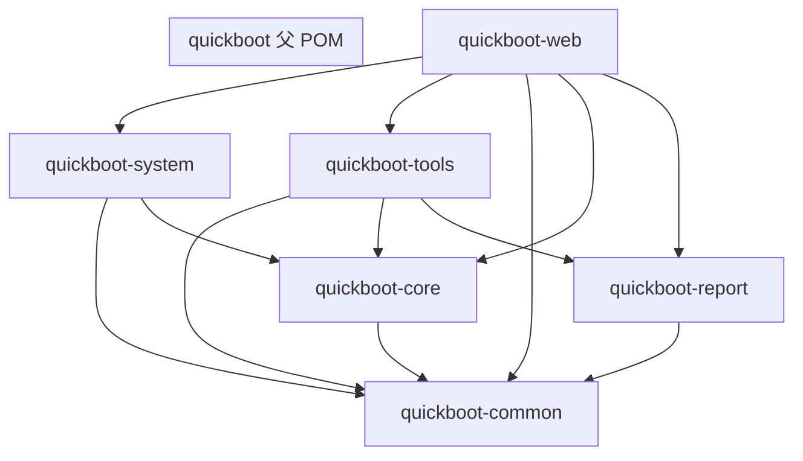
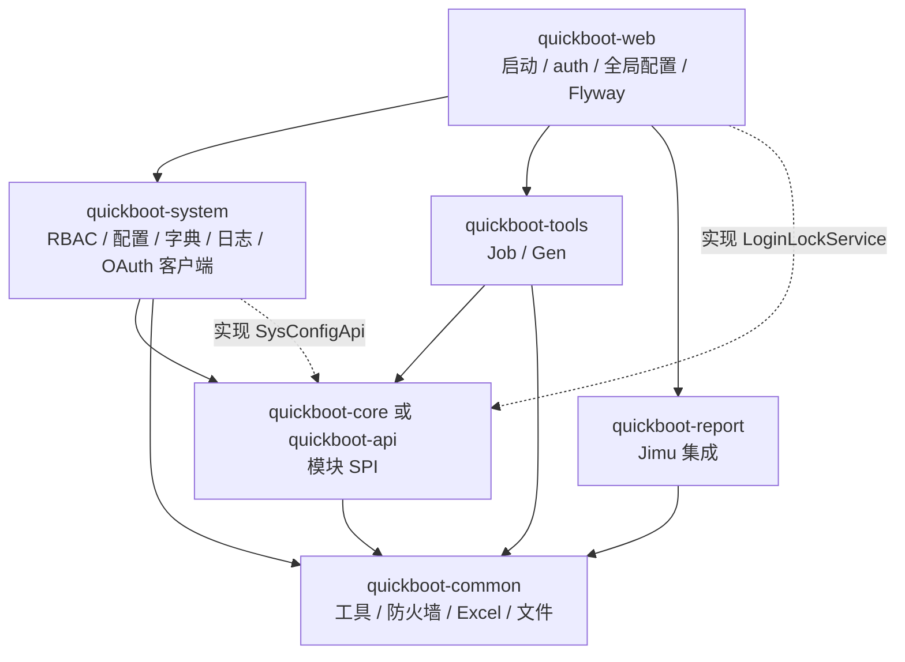

# quickboot 模块与功能归属分析

> 分析时间：2026-05-28  
> 分析范围：`quickboot/` Maven 多模块后端  
> 目的：梳理各模块职责、功能包归属、依赖关系，并指出不合理之处与改进建议。

---

## 1. 总览

### 1.1 模块清单与规模

| Maven 模块 | artifactId | 主代码 Java 数 | 测试 Java 数 | 定位（设计意图） |
|------------|------------|----------------|--------------|------------------|
| 父工程 | `quickboot` | — | — | 依赖版本管理、模块聚合 |
| 通用层 | `quickboot-common` | 119 | 33 | 跨业务通用能力（API 响应、异常、安全防火墙、缓存、Excel、文件、操作日志采集等） |
| 核心契约 | `quickboot-core` | 2 | 0 | 跨模块 SPI/接口（极薄） |
| 报表集成 | `quickboot-report` | 11 | 0 | 积木报表 / JimuBI 自动配置与 Token |
| 系统业务 | `quickboot-system` | 166 | 0 | RBAC、配置、字典、通知、OAuth 客户端/提供商、在线用户/操作日志/登录日志等 |
| 工具业务 | `quickboot-tools` | 63 | 0 | 定时任务（Quartz）、代码生成（Gen） |
| 启动聚合 | `quickboot-web` | 27 | 20 | Spring Boot 入口、认证/OAuth2、全局配置、报表桥接、资源与 Flyway |

### 1.2 依赖关系（当前）



**说明：**

- `quickboot-web` 同时直接依赖 `common/core/report/system/tools`，存在**传递依赖重复声明**（见 §5.1）。
- `quickboot-tools` 依赖 `quickboot-report`，但 tools 内 **无** `import io.github.genkidoudou.report.*`（见 §5.4）。
- `quickboot-system` **不**依赖 `quickboot-report`，报表桥接放在 `quickboot-web`（合理，但包名不统一，见 §5.2）。

---

## 2. 各模块功能归属

### 2.1 quickboot-common（通用基础设施）

**包根：** `io.github.genkidoudou.common.*`

| 子包 | 约略类数 | 功能 |
|------|----------|------|
| `api` | 5 | 统一响应 `R`、分页 `PageRequest`/`PageInfo`、`TraceIds` |
| `exception` | 4 | `BaseException`、`ErrorCodes`、业务异常体系 |
| `validation` | 3 | 校验工具、分组 `AddGroup`/`UpdateGroup` |
| `cache` | 6 | Caffeine/Redis 动态 TTL、`QuickbootCacheAutoConfiguration` |
| `excel` | 15 | EasyExcel 导入导出、字典转换、合并策略 |
| `file` | 20 | 本地/MinIO 文件存储、`FileTemplate`、URL 序列化 |
| `desensitization` | 7 | Jackson 脱敏 |
| `captcha` | 3 | 天爱验证码、`CaptchaController` |
| `i18n` | 2 | 国际化消息 |
| `oauth2` | 1 | OAuth2 配置属性 |
| `monitor.operlog` | 10 | **操作日志采集**（AOP、事件、属性）；持久化在 system |
| `security.firewall.*` | 42 | XSS/SQL 注入/敏感词/CORS/安全头/幂等/密码编解码等 |
| `servlet` | 1 | Servlet 工具 |

**Spring Boot 自动配置：** `META-INF/spring/org.springframework.boot.autoconfigure.AutoConfiguration.imports`（13 项）。

**特点：** 体量大、职责杂，但符合「可复用基础设施」定位；部分能力（如 `CaptchaController`）偏 Web 层却放在 common（见 §5.3）。

---

### 2.2 quickboot-core（跨模块契约，极薄）

**包根：** `io.github.genkidoudou.core.service`

| 类型 | 名称 | 实现位置 | 用途 |
|------|------|----------|------|
| 接口 | `SysConfigApi` | `quickboot-system` → `SysConfigApiImpl` | 按 key 读系统参数（供 Gen 等调用） |
| 接口 | `LoginLockService` | `quickboot-web` → `LoginLockServiceImpl` | 登录失败锁定（缓存实现） |

**设计意图：** 打破 system ↔ web 循环依赖，由 core 定义契约、各模块实现。

**问题：** core 仅 2 个接口，模块存在感弱；`LoginLockService` JavaDoc 引用 `AuthLoginService`（在 system），文档耦合（见 §5.5）。

---

### 2.3 quickboot-report（积木报表）

**包根：** `io.github.genkidoudou.report.*`

| 子包 | 功能 |
|------|------|
| `config` | Jimu 自动配置、数据源同步、Redis Drag、属性 |
| `token` | `JimuReportTokenServiceImpl`、`JimuDragExternalServiceImpl` |
| `security` | 分享访问 Filter、Token Header Bridge |
| `bridge` | **`JimuAuthBridge` 接口**（由 web 实现） |

**依赖：** `quickboot-common` + Jimu 相关 starter + `spring-boot-starter-web`。

**边界：** 报表引擎与 quickboot 认证的**适配层**；业务用户/菜单/字典数据通过 `JimuAuthBridge` 回调 system。

---

### 2.4 quickboot-system（系统管理 + 部分原 monitor 能力）

**包根：** `io.github.genkidoudou.web.system.*`

| 子包 | 类数 | 功能（管理端 API） |
|------|------|-------------------|
| `user` | 31 | 用户 CRUD、导入导出、数据权限（DataScope AOP/拦截器） |
| `role` | 17 | 角色、数据权限、用户授权 |
| `menu` | 15 | 菜单树、角色菜单 |
| `dept` | 9 | 部门树 |
| `dict` | 17（含 type） | **字典类型**；`dict/support` 含 Excel 字典标签实现 |
| `config` | 10 | 参数配置 + `SysConfigApiImpl` |
| `notice` | 9 | 通知公告（HTML 消毒） |
| `oauthclient` | 20 | OAuth 客户端、ClientSign 过滤器与服务 |
| `oauthprovider` | 9 | 第三方登录提供商绑定 |
| `online` | 7 | 在线用户（原 `monitor.online`，**包名已改为 system.online**） |
| `operlog` | 14 | 操作日志查询/持久化（原 `monitor.operlog`） |
| `logininfor` | 8 | 登录日志（原 `monitor.logininfor`） |

**依赖：** `quickboot-common`、`quickboot-core`；**未**声明 `spring-boot-starter-web`（靠 common 传递的 Spring Web 相关依赖编译 Controller）。

**与 common 协作：** `common.monitor.operlog` 发布事件 → `system.operlog` 监听落库。

---

### 2.5 quickboot-tools（定时任务 + 代码生成）

**包根：** `io.github.genkidoudou.web.*`

| 子包 | 类数 | 功能 |
|------|------|------|
| `monitor.job` | 37 | Quartz 定时任务、任务日志、调度工具 |
| `tool.gen` | 26 | 代码生成（表导入、模板渲染、预览） |

**依赖：** `common`、`core`、`report`（**report 未被 tools 源码引用**）、`spring-boot-starter-quartz`、`mybatis-plus-generator`。

**与 system 关系：** 无直接 `import web.system`；通过 `SysConfigApi`（core）间接读配置。

---

### 2.6 quickboot-web（启动与横切能力）

**包根：** 混用 `io.github.genkidoudou` 与历史 `io.github.genkidoudou.web.*`（仅测试）

#### 主代码（27 个类）

| 包 | 功能 |
|----|------|
| `WebApplication` | Spring Boot 启动类（`io.github.genkidoudou`） |
| `auth` | 登录、`QuickbootStpInterfaceImpl`、安全 MVC 配置、登录日志写入 |
| `auth.oauth2.*` | OAuth2 服务端/客户端/OpenAPI、Sa-Token 持久化 |
| `bridge` | `JimuAuthBridgeImpl`（报表 ↔ system） |
| `config` | Jackson 时间、`MybatisPlusPaginationConfig`（含数据权限拦截器） |
| `exception` | `GlobalExceptionHandler` |

#### 资源（仍在 web，未按模块拆分）

- `application*.yml`、`logback-spring.xml`
- `db/migration/V*.sql`（Flyway，36+ 版本）
- `vm/quickboot/*.ftl`（代码生成模板，与 `tool.gen` 配套）
- `sensitive-word-*.txt`

#### 测试（20 个类，**多数仍引用已迁走的 `web.*` 包**）

测试目录仍保留 `io.github.genkidoudou.web.auth`、`web.system`、`web.monitor`、`web.tool` 等路径，与主代码包结构**不一致**（见 §5.6）。

---

## 3. 功能域 → 模块映射（业务视角）

| 业务域 | 主要模块 | 关键入口/API 包 |
|--------|----------|-----------------|
| 认证登录 | web (`auth`) | `AuthController`、`LoginLockServiceImpl` |
| OAuth2 / OpenAPI | web (`auth.oauth2`) | `SaOAuth2ServerController`、`OpenApi*` |
| 用户/角色/菜单/部门 | system | `web.system.user/role/menu/dept` |
| 参数配置 | system + core API | `SysConfigController`、`SysConfigApi` |
| 字典 | system（仅 type） | `DictTypeController`；**缺 dict.data**（§5.7） |
| 通知公告 | system | `SysNoticeController` |
| OAuth 客户端/提供商 | system | `SysOauthClientController`、`SysOauthProviderController` |
| 在线用户 | system (`online`) | `SysUserOnlineController` |
| 操作日志 | common 采集 + system 存储 | AOP → `SysOperLogService` |
| 登录日志 | system (`logininfor`) | `SysLogininforController` |
| 定时任务 | tools (`monitor.job`) | `SysJobController` |
| 代码生成 | tools (`tool.gen`) | `GenController` |
| 积木报表 | report + web bridge | Jimu starter + `JimuAuthBridgeImpl` |
| 安全防火墙 | common | 各类 `*Firewall*` AutoConfiguration |
| 文件上传 | common | `FileTemplate`、`FileStorageAutoConfiguration` |
| 验证码 | common | `CaptchaController` |

---

## 4. 拆分演进说明（相对原 quickboot-web 单体）

按设计文档 `docs/superpowers/specs/2026-05-28-quickboot-web-split-design.md`：

- **计划：** `web.system` + `monitor.online|operlog|logininfor` → system；其余 → tools；web 仅聚合。
- **现状：**
  - system 已承接上述能力，但 **online/operlog/logininfor 包名改为 `web.system.*`**，不再保留 `web.monitor.*` 前缀。
  - tools 仅含 `monitor.job` 与 `tool.gen`（符合「job 归 tools」决策）。
  - auth、全局配置、报表桥接留在 web；**包名从 `web.auth` 调整为根下 `auth`**。

---

## 5. 不合理之处与风险

### 5.1 quickboot-web 依赖重复、职责仍偏重

`quickboot-web/pom.xml` 在已依赖 `quickboot-system`、`quickboot-tools` 的情况下，仍**重复声明** `quickboot-common`、`quickboot-core`、`quickboot-report`。

- **风险：** 版本漂移、依赖调解混乱；违背「web 只做启动聚合」目标。
- **建议：** web 仅保留 `system`、`tools`、`spring-boot-starter-*`、DB/Flyway/Jasypt/Sa-Token OAuth2 等**运行时基础设施**；去掉对 common/core/report 的重复 direct dependency（若需显式版本，用 `dependencyManagement` 统一）。

---

### 5.2 包命名不一致（`web.*` vs 根包 `auth` / `bridge` / `config`）

| 模块 | 包风格 |
|------|--------|
| system / tools | `io.github.genkidoudou.web.*` |
| web 主代码 | `io.github.genkidoudou.auth`、`bridge`、`config`、`exception` |

- **风险：** 新人难以判断新类应放在哪；扫描虽在根包下仍有效，但**破坏统一命名空间**。
- **建议：** 统一为 `io.github.genkidoudou.web.auth` 或拆 `quickboot-auth` 子模块；桥接类建议 `web.report.bridge` 与 report 模块对称。

---

### 5.3 quickboot-common 过重且掺入 Web 控制器

- 119 个类，含 **CaptchaController**、大量 Servlet Filter、Sa-Token starter。
- **问题：** 「common」名义上是库模块，却直接暴露 HTTP 端点；单测依赖 `spring-boot-starter-web`（test scope）。
- **建议：** 拆为 `quickboot-common-core`（纯工具）+ `quickboot-starter-security`（防火墙 + 自动配置）；Controller 迁至 web 或独立 starter。

---

### 5.4 quickboot-tools 无谓依赖 quickboot-report

`quickboot-tools/pom.xml` 声明 `quickboot-report`，但 63 个源文件中 **零引用** report 包。

- **建议：** 移除该依赖；若 Gen 模板生成报表相关代码，再按需加回。

---

### 5.5 quickboot-core 过薄且文档耦合

- 仅 2 个接口，与「核心模块」名称预期不符。
- `LoginLockService` JavaDoc 写 `@link AuthLoginService`（类在 system），core 不应依赖业务概念。

**建议：** 扩展 core 为「模块间 API 契约」层（如 `SysConfigApi`、`LoginLockService`、`OperLogWriter` 等），或合并进 common 的 `spi` 包并改名 `quickboot-api`。

---

### 5.6 测试代码与主代码包结构脱节

`quickboot-web/src/test` 仍使用 `io.github.genkidoudou.web.auth.*` 等路径，主代码已迁至 `auth` / `system` / `tools`。

- 示例：`LoginLockServiceImplTest` import `io.github.genkidoudou.auth.LoginLockServiceImpl`，但文件路径仍为 `web/auth/LoginLockServiceImplTest.java`。
- 另有 `web/hotel/Hotel.java` 等非业务测试类。

**建议：** 测试随模块迁移：`system` 测 system、`tools` 测 tools、web 只测 auth/bridge/config；删除或隔离 `Hotel.java` 等临时类。

---

### 5.7 编译风险：`dict.data` 缺失

`quickboot-web` 中 `JimuAuthBridgeImpl` 依赖：

- `io.github.genkidoudou.web.system.dict.data.domain.SysDictData`
- `io.github.genkidoudou.web.system.dict.data.service.DictDataService`

当前 `quickboot-system` 的 `dict` 下**仅有 `dict.type`**，无 `dict.data` 包。

- **风险：** JDK 17 下完整编译可能失败；报表字典下拉不可用。
- **建议：** 补全字典数据 CRUD 模块，或 bridge 改为调用已有 `DictTypeService`/缓存接口。

---

### 5.8 monitor 包名拆分不一致

- 原设计：`monitor.online|operlog|logininfor` 进 system，**保留 monitor 前缀**。
- 现状：迁入 `web.system.online|operlog|logininfor`；仅 `monitor.job` 留在 tools 的 `web.monitor.job`。
- **问题：** 同一「监控」域在两个层级命名下分裂；API 路径若仍用 `/monitor/*` 需核对 Controller `@RequestMapping`。
- **建议：** 二选一并文档化：  
  - **A：** system 内统一 `web.system.monitor.{online,operlog,logininfor}`；  
  - **B：** 恢复 `web.monitor.*` 包名但模块归属 system（物理模块与逻辑包分离）。

---

### 5.9 资源与配置全部堆在 quickboot-web

Flyway、代码生成模板、敏感词词库、应用配置均在 web。

- **问题：** system/tools 无法独立集成测试或单独打包；与「业务模块」拆分目标不完全一致。
- **建议（渐进）：**  
  - Flyway 可保留 web（启动模块负责迁移）或抽 `quickboot-db-migration`；  
  - `vm/*.ftl` 迁至 `quickboot-tools/src/main/resources`；  
  - 敏感词与 firewall 配置对齐 common。

---

### 5.10 quickboot-system 未显式声明 Web 依赖

Controller 依赖 Servlet/Spring MVC 注解，但 pom 无 `spring-boot-starter-web`。

- **现状：** 靠 `quickboot-common` 传递的 `spring-web`/`spring-webmvc` 勉强编译。
- **建议：** system 显式添加 `spring-boot-starter-web`（或 `spring-boot-starter` + `spring-webmvc`），避免 common 变更导致 system 编译失败。

---

### 5.11 groupId 不统一

| 模块 | groupId |
|------|---------|
| 父工程 / core | `io.github.genkidoudou` |
| common | `io.github.genkidoudou.common` |
| report | `io.github.genkidoudou.report` |
| system / tools / web | `io.github.genkidoudou.web` |

不影响运行，但不利于发布与依赖检索。**建议：** 统一为 `io.github.genkidoudou` + 不同 artifactId，或全部采用 `io.github.genkidoudou.quickboot` 前缀。

---

### 5.12 构建环境

项目要求 **Java 17**，当前部分环境仍为 JDK 8，会导致 `无效的目标发行版: 17`。

**建议：** 在根 `pom.xml` 增加 `maven-enforcer-plugin` 校验 JDK 版本；CI 与 README 明确 `JAVA_HOME`。

---

### 5.13 quickboot-common 重复依赖

`pom.xml` 中 `spring-boot-starter-actuator` 声明了 **两次**（Maven 已 warning）。

**建议：** 删除重复项。

---

## 6. 改进路线图（建议优先级）

| 优先级 | 项 | 动作 |
|--------|-----|------|
| P0 | 修复 `dict.data` 缺失 | 实现 `DictDataService` 或修改 `JimuAuthBridgeImpl` |
| P0 | 测试迁移与包路径对齐 | 按模块搬迁测试，修正 import |
| P1 | 清理 web 重复依赖 | pom 只依赖 system + tools + 基础设施 |
| P1 | tools 移除 report 依赖 | 减小编译图 |
| P1 | system 显式 web 依赖 | 编译边界清晰 |
| P2 | 统一包命名 | auth/bridge/config 归入 `web.*` 或独立 auth 模块 |
| P2 | monitor 命名策略 | 文档 + 包名统一 |
| P2 | 资源拆分 | Gen 模板 → tools；评估 Flyway 独立模块 |
| P3 | common 瘦身 | 控制器与安全 starter 分离 |
| P3 | core 扩展或改名 | `quickboot-api` 承载模块契约 |
| P3 | Enforcer JDK17 + 统一 groupId | 工程化 |

---

## 7. 目标架构参考（推荐态）



---

## 8. 附录：快速核对命令

```bash
# 各模块主代码规模
cd quickboot
for m in quickboot-common quickboot-core quickboot-report quickboot-system quickboot-tools quickboot-web; do
  echo -n "$m: "
  find "$m/src/main/java" -name "*.java" 2>/dev/null | wc -l
done

# 检查 tools 是否引用 report
rg "import io\\.github\\.genkidoudou\\.report" quickboot-tools/src

# 检查 dict.data 是否存在
rg "dict\\.data" quickboot-system/src quickboot-web/src
```

---

*本文档基于仓库当前工作区静态分析生成；若后续提交继续迁移包或 pom，请以实际代码为准更新本节。*
