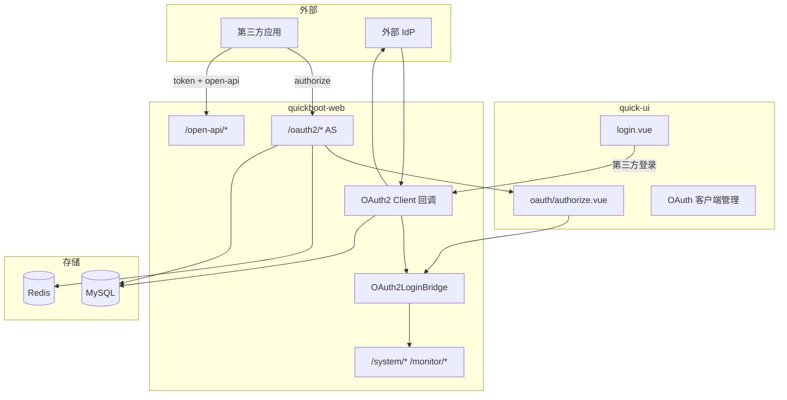

# OAuth2.0 双角色集成设计（授权服务器 + 客户端）

## 1. 背景与目标

在 `quickboot` + `quick-ui` 现有 **Sa-Token 账号密码登录** 基础上，基于 [Sa-Token OAuth2 模块](https://sa-token.cc/doc.html#/oauth2/readme) 扩展：

1. **OAuth2 授权服务器（AS）**：对外提供标准授权端点，第三方/子系统按 scope 获取 `access_token`，只读访问用户基础信息。
2. **OAuth2 客户端（Client）**：管理端可选「通过外部 IdP 登录」（如企业微信、Keycloak、GitHub 等），与本地账号绑定后仍走现有 `StpUtil` 会话与 RBAC。

**已确认决策（2026-05-23）**：

| 项 | 决策 |
|----|------|
| 角色 | **C**：AS + Client 双角色 |
| 授权模式 | **C**：四种模式均实现；**生产默认关闭** password / implicit，通过配置按 client 启用 |
| 第三方数据范围 | **A**：仅只读 `openid` / `profile`（不含 permissions、写接口） |
| Sa-Token 版本 | **A**：实施时升级至 **1.44 或 1.45**，全站 Sa-Token 行为回归 |

## 2. 范围与非范围

### 2.1 范围

- Maven：升级 `sa-token.version`，新增 `sa-token-oauth2`、**Redis 持久化**（OAuth2 code/token 与多实例）。
- 后端：OAuth2 Server 端点、DataLoader、Strategy 桥接现有登录、开放只读 API、OAuth2 Client 回调与账号绑定。
- 数据库：OAuth 客户端、openid 映射、外部身份绑定、可选授权记忆。
- 管理端：`quick-ui` OAuth 客户端管理、授权/登录页、登录页第三方入口（可配置显示）。
- 文档：第三方对接说明、Grant Type 启用矩阵、与「防火墙客户端认证」的概念区分。

### 2.2 非范围（本期不做）

- 向第三方开放管理端 `/system/*`、`/monitor/*` 全量 API。
- OIDC 完整 IdP 产品化（如 discovery、JWKS、完整 OIDC claim 集）——预留扩展点，不强制验收。
- 替换现有 `quick-ui` 主登录为纯 OAuth（账号密码登录保留）。
- 旧需求 `X-Client-Id` 防火墙客户端认证的本期改造（仅文档说明二者区别）。

## 3. 总体架构

### 3.1 三轨认证模型

| 轨道 | Token / 凭证 | 用途 | 校验 |
|------|----------------|------|------|
| **内部管理会话** | Sa-Token `Authorization: Bearer`（现有） | `quick-ui` → `/system/*`、`/monitor/*` | `StpUtil.checkLogin()` + `@SaCheckPermission` |
| **OAuth2 对外访问** | OAuth2 `access_token` | 第三方 → `/open-api/**` | Sa-Token OAuth2 校验 + `@SaCheckScope` |
| **外部 IdP 联邦登录** | 外部 provider 的 code/token（短期） | 换本地 `StpUtil` 会话 | Client 模块 + `sys_oauth_user_bind` |

**硬性隔离**：OAuth2 `access_token` **不得**访问管理端 API；内部 Admin-Token **不得**冒充 OAuth2 token 访问开放 API 的 scope 逻辑（路径前缀分离）。

### 3.2 架构图



## 4. Sa-Token 升级策略（决策 4-A）

### 4.1 目标版本

- 父 POM `sa-token.version` 升至 **1.44.0 或 1.45.0**（与 [官方 OAuth2 文档](https://sa-token.cc/doc.html#/oauth2/readme) 对齐）。
- 依赖新增：`sa-token-oauth2`、`sa-token-redis-template`（或项目既有 Redis 整合方案，OAuth2 数据必须落 Redis）。

### 4.2 升级回归清单

| 区域 | 回归点 |
|------|--------|
| `/login`、`/logout`、`/getInfo`、`/getRouters` | 行为不变 |
| `SaTokenWebMvcConfig` 拦截与白名单 | 新增 `/oauth2/**`、Client 回调路径 |
| `@SaCheckPermission` | 全模块抽样 |
| 在线用户 `searchTokenValue` | Redis 下 token 枚举 |
| 操作日志异步落库 | Web 上下文快照仍有效 |
| `NotLoginException` / 权限异常 | `GlobalExceptionHandler` HTTP 码 |

### 4.3 配置迁移

- 核对 `sa-token` 1.39+ OAuth2 **不向下兼容**项（`SaOAuth2ServerProcessor`、`SaOAuth2DataLoader` 等新接口）。
- `application-prod.yml`：`is-log`、timeout 与 Redis 连接池保持 prod 加固策略。

## 5. OAuth2 授权服务器（AS）

### 5.1 端点（Sa-Token 标准）

挂载 `SaOAuth2ServerProcessor.instance.dister()`，路径前缀 **`/oauth2/*`**（实现类名以 1.44+ 为准）：

| 路径 | 用途 |
|------|------|
| `/oauth2/authorize` | 授权码 / 隐式入口 |
| `/oauth2/token` | 换 token、password、refresh |
| `/oauth2/refresh` | 刷新 token |
| `/oauth2/revoke` | 撤销 token |
| `/oauth2/doLogin` | OAuth 流程内登录 |
| `/oauth2/doConfirm` | 用户确认 scope |
| `/oauth2/client_token` | 客户端凭证模式 |

以上路径加入 **Sa-Token 拦截器白名单**（OAuth 模块内部处理登录态）。

### 5.2 四种 Grant Type（决策 2-C）

**实现**：四种模式均在 `SaClientModel.addAllowGrantTypes(...)` 与 Server 配置中支持。

**生产默认策略**（通过 `sys_config` + 单 client 配置双重控制）：

| 模式 | 开发默认 | 生产默认 | 说明 |
|------|----------|----------|------|
| authorization_code | 开 | 开 | 第三方 Web 标准路径 |
| refresh_token | 开 | 开 | 与授权码配套 |
| client_credentials | 开 | 按 client | 仅机器间、无用户 profile |
| password | 开 | **关** | 仅第一方高信任 client 可单独开启 |
| implicit | 开 | **关** | 兼容老 SPA；新项目优先 PKCE+授权码（二期） |

全局开关建议键名：

- `qc.oauth2.server.grant.password-enabled`（默认 `false` prod）
- `qc.oauth2.server.grant.implicit-enabled`（默认 `false` prod）

### 5.3 Scope 定义（决策 3-A）

| Scope | 等级 | 开放 API | 返回字段（示例） |
|-------|------|----------|------------------|
| `openid` | 必选基础 | `GET /open-api/v1/userinfo` | `openid` |
| `profile` | 可选 | 同上 | `userName`, `nickName`, `deptName`（只读、脱敏） |
| `userid` | **不默认签约** | 不开放 | 内部映射用，不给予第三方 |

**禁止** scope：`permissions`、`roles`、任何写操作 scope。

`client_credentials` 模式：**不返回用户 profile**；仅允许访问无用户上下文的开放接口（若未来有 `/open-api/v1/ping` 类接口）。

### 5.4 与现有登录桥接

`SaOAuth2Strategy.doLoginHandle` / 自定义 Strategy：

1. 调用 `AuthLoginService.authenticate`（复用密码校验、停用账号检查）。
2. 调用 `LoginLockService`（失败锁定对 OAuth 登录页同样生效）。
3. **验证码**：OAuth 授权页登录默认 **要求验证码**（与 `qc.login.captcha-enabled` 一致）；`client_credentials` 不涉及用户登录。
4. 成功后 `StpUtil.login(userId)`，并写 `SysLogininforLogService`（`msg` 标注 `OAuth2-AS`）。
5. **不**在 OAuth 流程中调用 `OnlineSessionRecorder` 以外的数据权限刷新差异需评估：`LoginDataScopeService.refreshSession` 在 AS 登录后仍应执行，以便若用户继续访问管理端 session 一致。

### 5.5 授权确认 UI

- 路由：`/oauth/authorize`（`quick-ui`，需登录或跳转 OAuth 登录页）。
- 展示：应用名称、请求的 scope 中文说明、同意/拒绝。
- 风格：`DESIGN.md` + 列表页规范；禁止服务端拼接 HTML 字符串作为长期方案（Demo 级 HTML 仅 dev 兜底）。

### 5.6 开放 API

前缀：**`/open-api/v1/**`**，独立 `@Tag`，响应仍用 `R<T>`。

| 方法 | 路径 | Scope | 说明 |
|------|------|-------|------|
| GET | `/open-api/v1/userinfo` | openid 或 profile | 按 token scope 裁剪字段 |
| GET | `/open-api/v1/.well-known/openid-configuration` | 无 | 可选，二期 |

鉴权：Sa-Token OAuth2 注解（1.39+ `@SaCheckScope("profile")`）或统一拦截器解析 Bearer `access_token`。

## 6. OAuth2 客户端（Client，外部 IdP 登录）

### 6.1 场景

用户在 `login.vue` 点击「企业微信 / Keycloak / … 登录」→ 跳转外部 authorize → 回调 `quickboot` → 绑定本地用户 → 签发 **内部** `access_token`（现有 Cookie 流程）。

### 6.2 配置模型

`sys_oauth_provider`（外部 IdP 注册，与 AS 的 client 区分命名）：

| 字段 | 说明 |
|------|------|
| provider_code | 如 `wecom`, `keycloak`, `github` |
| client_id / client_secret | 在外部 IdP 注册的凭证（secret 加密存库） |
| authorize_url / token_url / userinfo_url | 或 discovery_url |
| redirect_uri | 固定为 `{baseUrl}/oauth2/client/callback/{provider_code}` |
| enabled | 开关 |
| auto_register | 是否允许首次登录自动建本地用户（默认 false） |

`sys_oauth_user_bind`：

| 字段 | 说明 |
|------|------|
| provider_code | IdP |
| external_subject | 外部唯一 id（sub / openid） |
| user_id | 本地 `sys_user.user_id` |
| bind_time | |

### 6.3 回调流程

1. `GET /oauth2/client/authorize/{provider}`：重定向到 IdP。
2. `GET /oauth2/client/callback/{provider}?code=...`：后端换 token，拉 userinfo。
3. 查 `sys_oauth_user_bind`：已绑定 → `StpUtil.login`；未绑定 → 走绑定策略（管理员预绑定 / 首次登录绑定已有账号 / 禁止登录）。
4. 返回前端：`redirect` 到 `quick-ui` 带 **内部** token（与现有 `/login` 相同写入 `Admin-Token` 的方式，避免引入第二套前端 token 逻辑）。

### 6.4 与 AS 的边界

- **AS**：quickboot 发 token 给别人。
- **Client**：quickboot 从别人拿身份。
- 同一 `client_id` 字符串不得混用于 AS 表与 IdP 表；代码与文档命名空间分离：`oauth2.server.*` vs `oauth2.client.*`。

## 7. 数据模型（Flyway）

### 7.1 `sys_oauth_client`（AS 第三方应用）

| 字段 | 说明 |
|------|------|
| client_id | 主键，公开 |
| client_secret | 加密存储 |
| client_name | 应用名 |
| redirect_uris | JSON 数组或关联表 |
| grant_types | 逗号分隔或 JSON |
| scopes | 签约 scope |
| status | 0 正常 / 1 停用 |
| is_confidential | 是否保密客户端 |
| remark, audit 字段 | 与现有表风格一致 |

### 7.2 `sys_oauth_user_openid`

| 字段 | 说明 |
|------|------|
| client_id | |
| user_id | |
| openid | 稳定对外标识 |
| 唯一约束 | (client_id, user_id), (client_id, openid) |

### 7.3 `sys_oauth_approve`（可选）

用户已对某 client 同意的 scope + 过期时间，减少重复确认。

### 7.4 菜单与权限（管理端）

| 菜单 | perms |
|------|-------|
| OAuth 客户端 | `system:oauthClient:list` |
| 新增/修改/删除 | `system:oauthClient:add` 等 |
| 外部 IdP 配置 | `system:oauthProvider:list`（Client 角色） |

## 8. 后端模块划分

```text
quickboot-web/src/main/java/.../web/auth/oauth2/
  server/
    SaOAuth2ServerController.java
    SaOAuth2DataLoaderImpl.java
    SaOAuth2ServerConfigurer.java
    OAuth2LoginBridgeService.java
  client/
    OAuth2ClientController.java
    OAuth2ClientService.java
    provider/WeComOAuth2Provider.java ...（策略模式）
  open/
    OpenApiUserinfoController.java
quickboot-web/.../system/oauthclient/   # CRUD
quickboot-web/.../system/oauthprovider/ # IdP CRUD
```

`SaOAuth2DataLoaderImpl`：

- `getClientModel(clientId)` ← `sys_oauth_client`
- `getOpenid(clientId, loginId)` ← `sys_oauth_user_openid`（无则生成并插入）

## 9. 前端改造要点

| 页面 | 路径 | 说明 |
|------|------|------|
| OAuth 客户端管理 | `views/system/oauthClient/index.vue` | 参照 `system/config` |
| 外部 IdP 管理 | `views/system/oauthProvider/index.vue` | Client 配置 |
| 授权确认 | `views/oauth/authorize.vue` | AS 用户确认 scope |
| 登录页扩展 | `views/login.vue` | 可配置第三方按钮列表 |

API：`api/system/oauthClient.js`、`api/system/oauthProvider.js`、`api/oauth/authorize.js`。

## 10. 安全与合规

| 项 | 要求 |
|----|------|
| redirect_uri | 精确匹配，禁止生产 `*` |
| client_secret | BCrypt/项目 PasswordCodec 加密；日志与 operlog 脱敏 |
| state | 启用并校验（Sa-Token 1.39+） |
| HTTPS | prod 强制 |
| CORS | 仅开放 authorize 回调域 |
| 审计 | 授权、换 token、撤销写 `sys_logininfor` 或独立 `sys_oauth_audit` |
| 防火墙 `X-Client-Id` | 文档明确：HTTP 客户端认证 ≠ OAuth2 client_id |

## 11. 配置项汇总

```yaml
qc:
  oauth2:
    server:
      enabled: true
      issuer: https://your-domain   # 可选，OIDC 预留
    client:
      enabled: true
      default-redirect-after-login: /
sa-token:
  # 版本 1.44+
  # oauth2 与 redis 详见实施阶段 application.yml
```

## 12. 分阶段实施计划

| 阶段 | 内容 | 验收 |
|------|------|------|
| **P0** | Sa-Token 升级 + Redis + 回归 | 现有登录/权限/在线用户/operlog 通过 |
| **P1** | AS 骨架：DataLoader、/oauth2/*、授权码换 token | Postman 跑通 code 流程 |
| **P2** | Scope + `/open-api/v1/userinfo` + 四种 grant 开关 | 各 grant 在 dev 可测；prod 配置关闭 password/implicit |
| **P3** | Vue 授权页 + OAuth 登录桥接 + 客户端管理 CRUD | 浏览器完整 AS 流程 |
| **P4** | OAuth2 Client：1 个 IdP（建议 Keycloak 或 GitHub 沙箱）+ 绑定表 + 登录按钮 | 外部登录进入管理端 |
| **P5** | 对接文档、OpenSpec 归档、prod 配置清单 | 第三方可按文档集成 |
| **P6** | Client 签名（§16）+ 合并 `sys_oauth_client` + quick-ui 加签 | 重放/停用/过期用例通过 |

## 13. 风险与缓解

| 风险 | 缓解 |
|------|------|
| Sa-Token 大版本升级行为变化 | P0 全量回归 + 锁定版本号 |
| 四种模式全开扩大攻击面 | prod 默认关 password/implicit；按 client 最小授权 |
| Token 混用 | 路径隔离 + 集成测试断言 403 |
| Redis 未启用导致 code 丢失 | 启动检查Teleport 前校验 Redis；dev 可单实例内存但文档标注 |
| AS 与 Client 概念混淆 | 命名空间、表名、文档三分 |

## 14. 与旧栈 / 防火墙的关系

- **已决策（2026-05-23 补充）**：原「防火墙 `X-Client-Id`」能力 **合并进 `sys_oauth_client`**，统一由 **Client 签名拦截器** 校验，不再单独维护一套 client 表/头语义。
- `原始需求/后端/安全防火墙-客户端认证.md` 中的 `OauthClient` 概念由 `sys_oauth_client` + 签名校验替代；与 OAuth2 **用户授权**（`/login` Admin Token、`/open-api` scope）仍分离。

## 16. Client 签名鉴权（无状态 Client Token，已决策）

> **目标**：OAuth/开放侧 **不维护 client access_token**；用 **HMAC 签名** 证明调用方是已登记应用；**用户授权**仍由 Admin Token（管理端）或 OAuth User Token（开放 API）负责。

### 16.1 已确认决策

| # | 决策 |
|---|------|
| 1 | 签名字段：`method`、`path`、`body`、`timestamp`、`nonce` |
| 2 | **5 分钟**时间窗 + **防重放**；nonce 存 **Spring `CacheManager`**（建议 cache 名 `clientSignNonce#300`） |
| 3 | `sys_oauth_client.status != 正常` 等 **立即拒绝**（每次验签查库或短 TTL 缓存 + 写操作 evict） |
| 4 | **几乎所有 API 请求**必须带 Client 签名（见 16.4 白名单） |
| 5 | 与 **`sys_oauth_client` 合并**，单一数据源 |

### 16.2 请求头（建议）

| Header | 说明 |
|--------|------|
| `X-Client-Id` | `sys_oauth_client.client_id` |
| `X-Client-Timestamp` | Unix 秒 |
| `X-Client-Nonce` | UUID / 32+ 随机十六进制 |
| `X-Client-Signature` | Base64(HMAC-SHA256) |

### 16.3 签名算法

1. **Body 摘要**：`bodyHash = SHA-256(rawBody)` 小写十六进制；GET 等无 body 用空串哈希。
2. **规范化串**（UTF-8，换行分隔）：

```text
{method}\n
{path}\n
{bodyHash}\n
{timestamp}\n
{nonce}\n
{clientId}
```

- `method`：大写，如 `GET`、`POST`。
- `path`：**仅 path**（不含 query），与 `request.getRequestURI()` 或网关转发后约定一致；query 若参与鉴权需写入规范串扩展项（本期不含 query）。
3. **密钥**：`client_secret` 解密后的明文（与 OAuth2 入库 SM4 一致）。
4. **签名**：`signature = Base64( HMAC-SHA256(secret, canonical) )`。

### 16.4 校验顺序（立即拒绝）

1. 白名单路径 → 跳过（见下）。
2. 必填头齐全 → 否则 `401`。
3. `|now - timestamp| <= 300s` → 否则 `401`。
4. `CacheManager`：`putIfAbsent(cacheKey, "1")`，`cacheKey = clientId + ":" + nonce`；已存在 → **重放** `401`。
5. 加载 `sys_oauth_client`：`del_flag`、`status` 非正常 → **立即** `403`（不依赖 token 吊销）。
6. 重算 HMAC 与 `X-Client-Signature` 常量时间比较 → 失败 `401`。

### 16.5 路径范围

- **默认**：`/**` 全部拦截（注册在 `WebMvcConfigurer`，顺序 **早于** Sa-Token 登录拦截）。
- **白名单**（必须，否则浏览器 OAuth / CORS 无法工作）：
  - `OPTIONS /**`（预检）
  - `/oauth2/**`（浏览器授权重定向，无签名能力）
  - `/error`
  - 按环境：`/actuator/**`、`/h2-console/**`（与 `application-dev.yml` 一致）
  - **首方 SPA 登录**：`/login`、`/login/captcha-config`、`/api/captcha/**` 等是否豁免见 16.6
- **仍须用户鉴权的路径**（Client 签名通过后）：
  - `/system/*`、`/monitor/*` → `StpUtil` + RBAC
  - `/open-api/*` → OAuth User Token + scope（与 Client 签名 **叠加**）

### 16.6 首方 quick-ui 与机密客户端

| 类型 | 说明 |
|------|------|
| **机密客户端**（服务端） | 持有 `client_secret`，按 16.3 签名 |
| **首方 SPA（quick-ui）** | **已选 C（2026-05-23）**：编译期 `VITE_APP_CLIENT_ID` + `VITE_APP_CLIENT_SIGN_KEY`，与 `sys_oauth_client`（`quick-ui`）中 secret 一致；**接受密钥进前端包的风险**，仅用于首方管理端。 |

**实现要点**：`quick-ui` 在 `axios` 拦截器对**每个请求**加签；密钥通过 `.env.development` / 构建流水线注入，**禁止**提交生产真实密钥到仓库。

### 16.7 与 OAuth2 Token 存储的关系

| 能力 | 策略 |
|------|------|
| Client 能否访问系统 | **仅签名**，Sa-Token **不存** client access_token |
| 用户授权（管理端） | 仍 `POST /login` → Admin Token |
| 用户授权（开放 API） | 仍 `authorization_code` → OAuth access_token（可后续再 JWT 化） |
| `client_credentials` | 可选保留给纯机机；与签名二选一，避免双机制重复 |

### 16.8 CacheManager

- 使用项目已有 `quickbootCaffeineCacheManager`（dev 无 Redis）/ `quickbootRedisCacheManager`（prod）。
- 缓存名：`clientSignNonce#300`（与 `DynamicTtlCaffeineCacheManager` 约定一致，TTL 300s）。
- 多实例：prod 必须用 **Redis** `CacheManager`，否则 nonce 无法跨节点防重放。

### 16.9 实施阶段（建议 P6）

| 步骤 | 内容 |
|------|------|
| 1 | `ClientSignInterceptor` + `ClientSignProperties`（白名单、时间窗） |
| 2 | `ClientSignService`（canonical、HMAC、nonce、查 `SysOauthClient`） |
| 3 | 注册 `quick-ui` 首方 client；文档给第三方 SDK 示例 |
| 4 | `quick-ui` axios 拦截器统一加签 |
| 5 | 集成测试：重放、过期、停用 client、缺头 |

### 16.10 风险

| 风险 | 缓解 |
|------|------|
| SPA 泄露 secret | 首方不用机密 secret；用 B 方案 |
| 每个请求查库 | client 表小；可加 `clientSignMeta#60` 缓存，**更新 client 时 evict** |
| 全站加签遗漏白名单 | 清单进配置 + 契约测试 |
| 与 OAuth 浏览器流冲突 | `/oauth2/**` 白名单 |
| Ant 路径 `/**` 触发 SQL 防火墙 | `sql-injection.ignore-json-fields` 跳过 `apiPathPatterns` |

### 16.11 接口授权（Ant 路径，已实现）

- 字段：`sys_oauth_client.api_path_patterns`（每行一条 Ant 路径，Spring `AntPathMatcher`）。
- 校验：`ClientSignService` 验签后 + `OpenApiOAuth2Interceptor`（OAuth token）按 `client_id` 匹配 path。
- 管理端：原「授权范围」多选已改为「接口授权」文本框；`scopes` 仍默认 `openid,profile` 供 OAuth 授权页。
- 种子：`V29` 增列，`V30` 将 `quick-ui` 改为 Ant 路径（如 `/system/**`）。

## 17. OAuth 客户端管理（管理端）

- 查看 Secret：需当前用户密码，`POST .../revealSecret`。
- 回调地址：仅 `authorization_code` / `implicit` 必填。
- 修改时 Secret 留空表示不轮换。

## 15. 参考

- [Sa-Token OAuth2 模块说明](https://sa-token.cc/doc.html#/oauth2/readme)
- [搭建 OAuth2-Server](https://sa-token.cc/doc.html#/oauth2/oauth2-server)
- [SSO vs OAuth2 选型](https://sa-token.cc/doc.html#/fun/sso-vs-oauth2)
- 仓库现状：`AuthController`、`SaTokenWebMvcConfig`、`QuickbootStpInterfaceImpl`、`quick-ui/src/store/modules/user.js`

---

**状态**：已实现（OpenSpec 变更 `add-oauth2-integration`；对接说明见 `docs/oauth2-integration-guide.md`）。
