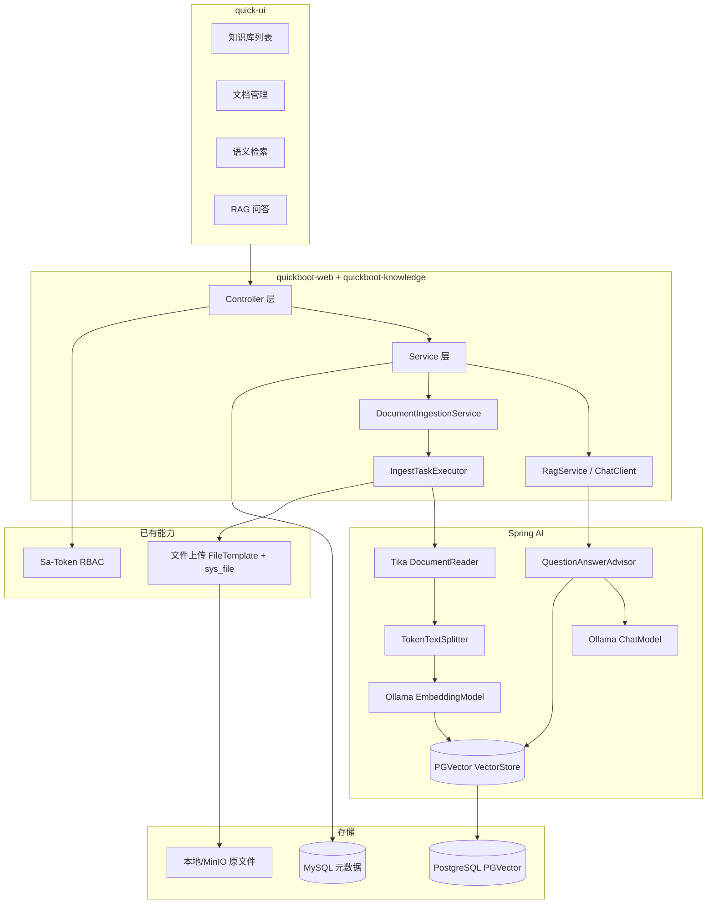
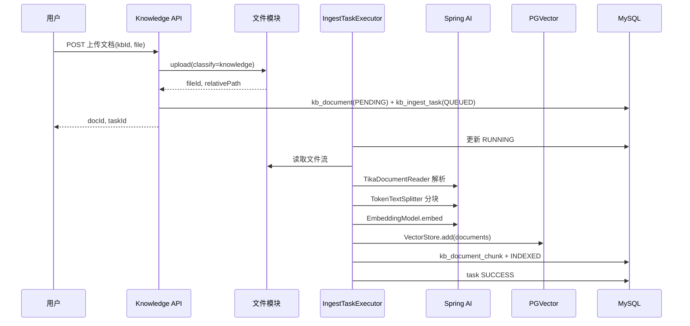

# 知识管理库（Spring AI · 本地 RAG + PGVector）设计说明

**日期**：2026-06-06  
**状态**：已定稿（经 brainstorming 澄清：1A、2A、3A、4A）  
**依据**：用户诉求「基于 Spring AI 搭建知识管理库，本地 RAG + 向量库」+ 本节 Q&A 结论

---

## 1. 背景与目标

### 1.1 背景

`quickboot2` 已具备企业后台基础能力（Sa-Token 鉴权、文件上传登记、异步导入/导出任务、Flyway 迁移等），但**尚未集成 Spring AI**。用户希望在现有架构上新增**知识库管理 + 语义检索 + RAG 问答**，且要求：

- **本地部署**：LLM 与 Embedding 均走本地运行时，数据不出内网；
- **向量检索**：使用专用向量库持久化 chunk embedding；
- **管理端可用**：提供完整的后台页面，而非仅 API。

### 1.2 目标（P0 MVP）

| 能力 | 说明 |
|------|------|
| 知识库管理 | 创建/编辑/删除知识库，配置分块策略 |
| 文档管理 | 上传 PDF/Word/Markdown/TXT 等，异步解析、分块、向量化 |
| 语义检索 | 自然语言检索相关片段（可不调用 LLM） |
| RAG 问答 | 检索片段 + 本地 LLM 生成带引用的回答 |
| 任务可观测 | 入库任务状态、失败原因、重试/重建索引 |

### 1.3 非目标（P0 不做）

- 多模态（图片/音视频 OCR）
- Agent 工具调用、多步推理工作流
- 公网 SaaS LLM（架构预留适配点，P0 不实现）
- 按部门/角色的知识库数据隔离（见 §8，澄清 4A）
- SSE 流式问答（Phase 2）
- 混合检索 BM25 + 向量（Phase 2）

---

## 2. 已定稿技术选型（Q&A 结论）

| 题号 | 选项 | 结论 |
|------|------|------|
| 1 | A | **PGVector 独立 Postgres** 作为向量库 |
| 2 | A | **Ollama** 同时提供 Chat + Embedding |
| 3 | A | 管理端 **四页**：知识库 / 文档 / 检索 / 问答 |
| 4 | A | **全局可见**，由具备权限的管理员维护（不做库级/部门 ACL） |

### 2.1 推荐模型（Ollama）

| 用途 | 模型 | 维度 | 备注 |
|------|------|------|------|
| Embedding | `nomic-embed-text` | 768 | 与 PGVector `dimensions` 一致 |
| Chat | `qwen2.5:7b`（或 `llama3.1:8b`） | — | 中文场景优先 qwen 系 |

### 2.2 Spring AI 版本

- 对齐 **Spring AI 1.0.x** 正式版 BOM；
- 与当前 **Spring Boot 3.5.3** 在实施前做一次兼容性验证（依赖引入与启动冒烟）。

### 2.3 核心依赖（模块级）

```xml
spring-ai-starter-model-ollama
spring-ai-starter-vector-store-pgvector
spring-ai-tika-document-reader
```

---

## 3. 系统架构



### 3.1 存储职责划分

| 存储 | 内容 | 说明 |
|------|------|------|
| **MySQL**（现有主库） | 知识库、文档、分块元数据、入库任务 | Flyway 迁移；与业务库同一实例 |
| **PGVector**（独立 Postgres） | chunk embedding + Spring AI Document metadata | 专用向量库，与 MySQL 物理隔离 |
| **文件存储**（现有 FileTemplate） | 原始文档二进制 | 上传 classify=`knowledge` |

> **原则**：向量不写入 MySQL；MySQL 仅存 `vector_id` / metadata 映射，便于审计与重建索引。

### 3.2 Maven 模块

新增 **`quickboot-knowledge`**，由 `quickboot-web` 引入：

```
quickboot/
├── quickboot-knowledge/     # 新增
│   ├── config/              # Spring AI、Ollama、PGVector、独立 DataSource
│   ├── controller/
│   ├── service/
│   ├── mapper/
│   ├── domain/
│   ├── dto/
│   ├── ingest/              # 解析 → 分块 → 向量化流水线
│   └── rag/                 # ChatClient、Advisor 封装
└── quickboot-web/           # 依赖 quickboot-knowledge
```

通用 AI 相关错误码可放 `quickboot-common`（按需，避免 knowledge 模块反向依赖过重）。

---

## 4. 数据模型（MySQL · Flyway）

### 4.1 表清单

| 表名 | 用途 |
|------|------|
| `kb_knowledge_base` | 知识库 |
| `kb_document` | 文档（关联 `sys_file.file_id`） |
| `kb_document_chunk` | 分块记录（content 摘要、vector 映射） |
| `kb_ingest_task` | 异步入库任务 |

P0 **不建** 会话表；问答为无状态单次请求（Phase 2 可加 `kb_chat_session` / `kb_chat_message`）。

### 4.2 `kb_knowledge_base`

| 字段 | 类型 | 说明 |
|------|------|------|
| `kb_id` | BIGINT PK | 主键 |
| `name` | VARCHAR | 知识库名称 |
| `description` | VARCHAR | 描述 |
| `chunk_size` | INT | 分块 token 上限，默认 800 |
| `chunk_overlap` | INT | 重叠 token，默认 120 |
| `status` | TINYINT | 0 正常 / 1 停用 |
| `create_by` / `create_time` 等 | — | 审计字段（对齐项目规范） |
| `deleted` | TINYINT | 逻辑删除 |

### 4.3 `kb_document`

| 字段 | 类型 | 说明 |
|------|------|------|
| `doc_id` | BIGINT PK | 主键 |
| `kb_id` | BIGINT | 所属知识库 |
| `file_id` | BIGINT | 关联 `sys_file.file_id` |
| `title` | VARCHAR | 展示标题（默认可取自原始文件名） |
| `doc_status` | VARCHAR | `PENDING` / `PARSING` / `INDEXED` / `FAILED` |
| `chunk_count` | INT | 成功入库分块数 |
| `error_msg` | VARCHAR | 失败原因 |
| 审计 + `deleted` | — | 同项目规范 |

### 4.4 `kb_document_chunk`

| 字段 | 类型 | 说明 |
|------|------|------|
| `chunk_id` | BIGINT PK | 主键 |
| `doc_id` | BIGINT | 所属文档 |
| `chunk_index` | INT | 文档内序号 |
| `content_preview` | VARCHAR(500) | 片段摘要（列表/引用展示） |
| `vector_id` | VARCHAR | PGVector 中 Document id（Spring AI 分配） |
| `token_count` | INT | 可选，统计用 |
| `page_number` | INT | 可选，PDF 页码（metadata 同步） |

### 4.5 `kb_ingest_task`

| 字段 | 类型 | 说明 |
|------|------|------|
| `task_id` | BIGINT PK | 主键 |
| `doc_id` | BIGINT | 目标文档 |
| `status` | VARCHAR | `QUEUED` / `RUNNING` / `SUCCESS` / `FAILED` |
| `progress` | INT | 0–100 |
| `retry_count` | INT | 重试次数 |
| `error_msg` | VARCHAR | 失败信息 |
| `start_time` / `end_time` | DATETIME | 执行窗口 |

### 4.6 PGVector Document Metadata

写入 Spring AI `Document` 的 metadata（检索过滤与引用）：

```json
{
  "kbId": "1",
  "docId": "100",
  "chunkId": "10001",
  "fileName": "手册.pdf",
  "pageNumber": 3
}
```

检索时通过 `FilterExpression` 按 `kbId`（及可选 `docId`）过滤；**P0 不做用户级 metadata 隔离**（与 4A 一致）。

---

## 5. 核心流程

### 5.1 文档入库（异步）



**规则：**

- 上传接口**同步返回**；向量化在后台线程池执行（参考 `ImportAsyncConfiguration` 模式：独立线程池 + Semaphore 限流）。
- **更新/重索引**：按 `docId` 从 PGVector **删除旧向量** → 重建 chunk 与 embedding。
- **删除文档**：逻辑删 MySQL 记录 + 按 metadata `docId` 删除 PGVector 向量 + 可选删除 `sys_file`（与文件管理删除策略对齐，P0 建议仅删向量与 kb 记录，原文件保留或软删由实现与文件模块约定）。

### 5.2 语义检索

```
POST /knowledge/search
  → EmbeddingModel.embed(query)
  → VectorStore.similaritySearch(SearchRequest: topK, filter=kbId, threshold)
  → 返回 List<ChunkHitVo>（content, score, docId, chunkId, fileName, pageNumber）
```

### 5.3 RAG 问答（P0 非流式）

```
POST /knowledge/chat
  → RagService.ask(kbId, question)
  → ChatClient + QuestionAnswerAdvisor(vectorStore, searchRequest)
  → 返回答案 + citations[]
```

**系统提示词约束：**

- 仅依据检索到的上下文回答；无相关内容时明确告知；
- 回答附带引用列表（文档名、片段摘要、相似度）；
- 可选接入项目敏感词过滤（P1）。

---

## 6. API 设计

前缀：`/knowledge/**`；修改/删除使用 `@PostMapping`；参数校验在 Bo 上；OpenAPI 注解齐全。

| 路径 | 方法 | 权限标识 | 说明 |
|------|------|----------|------|
| `/knowledge/base/list` | GET | `knowledge:base:list` | 知识库分页 |
| `/knowledge/base/getInfo` | GET | `knowledge:base:query` | 详情 |
| `/knowledge/base/add` | POST | `knowledge:base:add` | 新增 |
| `/knowledge/base/update` | POST | `knowledge:base:edit` | 修改 |
| `/knowledge/base/remove` | POST | `knowledge:base:remove` | 删除（级联删向量） |
| `/knowledge/doc/list` | GET | `knowledge:doc:list` | 文档分页 |
| `/knowledge/doc/upload` | POST | `knowledge:doc:upload` | 上传并触发入库 |
| `/knowledge/doc/reindex` | POST | `knowledge:doc:reindex` | 重建向量 |
| `/knowledge/doc/remove` | POST | `knowledge:doc:remove` | 删除 |
| `/knowledge/task/getInfo` | GET | `knowledge:doc:list` | 入库任务进度 |
| `/knowledge/search` | POST | `knowledge:search` | 语义检索 |
| `/knowledge/chat` | POST | `knowledge:chat` | RAG 问答 |

**文件上传：**

- 复用 `FileTemplate`，新增 classify `knowledge`（在 `qc.file.classifies` 配置允许的类型与大小，如 pdf/docx/md/txt，单文件上限可设 50MB）。
- 上传后 `SysFileRegisterHook` 自动登记 `sys_file`。

---

## 7. 配置

### 7.1 Spring AI / Ollama / PGVector（`application-dev.yml` 示例结构）

```yaml
spring:
  ai:
    ollama:
      base-url: http://127.0.0.1:11434
      chat:
        options:
          model: qwen2.5:7b
          temperature: 0.3
      embedding:
        options:
          model: nomic-embed-text
    vectorstore:
      pgvector:
        initialize-schema: true
        index-type: HNSW
        distance-type: COSINE_DISTANCE
        dimensions: 768

qc:
  knowledge:
    enabled: true
    ollama-required: false          # true 时启动检测 Ollama，不可用则拒绝 AI 接口
    vector-datasource:              # 独立 PG 数据源（勿与 MyBatis 主库混用）
      url: jdbc:postgresql://127.0.0.1:5433/quickboot_vector
      username: vector
      password: ${VECTOR_DB_PASSWORD:vector}
    ingest:
      async-max-concurrent: 2
      default-chunk-size: 800
      default-chunk-overlap: 120
    rag:
      top-k: 8
      similarity-threshold: 0.65
```

### 7.2 功能开关

- `qc.knowledge.enabled=false` 时不注册 Knowledge 相关 Bean 与菜单（便于 CI/无 AI 环境构建）。
- dev profile 可提供 **SimpleVectorStore** 的 profile 分支（可选），用于无 Docker 的快速冒烟；**生产以 PGVector 为准**。

### 7.3 Docker Compose（开发/部署向量库）

```yaml
services:
  pgvector:
    image: pgvector/pgvector:pg16
    ports: ["5433:5432"]
    environment:
      POSTGRES_DB: quickboot_vector
      POSTGRES_USER: vector
      POSTGRES_PASSWORD: ${VECTOR_DB_PASSWORD:-vector}
    volumes:
      - pgvector_data:/var/lib/postgresql/data
```

Ollama 由宿主机或独立节点安装，默认 `http://127.0.0.1:11434`。

---

## 8. 权限与安全（4A：全局可见）

| 层级 | P0 策略 |
|------|---------|
| 接口鉴权 | Sa-Token `@SaCheckPermission`，按上表权限标识 |
| 数据可见性 | **所有具备菜单权限的用户可见全部知识库**；不做 `dept_id` / 成员 ACL |
| 维护角色 | 具备 `knowledge:*:add/edit/remove/upload` 的管理员维护内容 |
| 检索/RAG | 请求必须带 `kbId`；向量 metadata 按 `kbId` 过滤，防止跨库串数据 |
| 审计 | 问答接口记录 operlog（用户、kbId、问题摘要、耗时）；入库任务记录操作人 |

Phase 2 若需部门隔离，可在 `kb_knowledge_base` 增 `dept_id` 并接入现有数据权限组件，**不影响 PGVector 表结构**（metadata 增字段即可）。

---

## 9. 前端（quick-ui）

菜单域：**知识管理**（与 system/monitor/tool 并列）。

| 路由 | 页面 | 功能 |
|------|------|------|
| `/knowledge/base` | `views/knowledge/base/index.vue` | 知识库 CRUD（C7JsonTable） |
| `/knowledge/document` | `views/knowledge/document/index.vue` | 文档列表、上传、状态、重索引、删 |
| `/knowledge/search` | `views/knowledge/search/index.vue` | 选库 + 检索词 → 片段列表（score、来源） |
| `/knowledge/chat` | `views/knowledge/chat/index.vue` | 选库 + 对话区 + 引用卡片 |

**实现约束：**

- 列表页对照 `views/system/config/index.vue` 与 `DESIGN.md`；
- API 模块：`quick-ui/src/api/knowledge/`；
- 文档 `doc_status` 为 `PENDING/PARSING` 时轮询 `task/getInfo` 或列表刷新；
- 引用可跳转文件预览（复用 `/file/preview` 或 `/system/file/view`）。

**菜单与权限 SQL：** Flyway 脚本插入 `sys_menu` 及按钮权限，与后端 `@SaCheckPermission` 一致。

---

## 10. 分阶段交付

| 阶段 | 范围 |
|------|------|
| **P0（本设计）** | 模块骨架、Flyway 表、PGVector + Ollama 集成、入库流水线、检索与 RAG API、四页前端、菜单权限 |
| **P1** | SSE 流式问答、入库任务面板优化、敏感词、Ollama 健康检查与友好降级 |
| **P2** | 会话记忆、混合检索、PDF 页码定位预览、按部门数据权限（若业务需要） |
| **P3** | 可选 OpenAI 兼容端点、Agent 扩展 |

---

## 11. 风险与对策

| 风险 | 对策 |
|------|------|
| Ollama 未启动 | `ollama-required=false` + 接口返回明确业务错误码 |
| 大文件入库耗时 | 异步 + 并发限流；前端展示进度 |
| MySQL 与 PGVector 不一致 | 删除/重索引「先删 vector 再更新 DB」；提供 `reindex` |
| PG 运维成本 | 开发文档提供 compose；生产独立备份 |
| Spring AI 与 Boot 版本 | 实施前锁定 BOM 并跑 `mvn -pl quickboot-web spring-boot:run` 冒烟 |

---

## 12. 验证标准（P0 完成定义）

1. 创建知识库 → 上传 PDF → 任务成功 → `doc_status=INDEXED`，PGVector 可查得向量。
2. 语义检索返回与文档相关的 topK 片段及 score。
3. RAG 问答返回答案 + 至少一条 citation。
4. 删除文档后，对应向量不可再被检索到。
5. 无 `knowledge:doc:upload` 权限的用户无法上传；有列表权限的用户可检索全部库（4A）。
6. 前端 `pnpm build:prod` 通过；后端 `mvn -pl quickboot-web -am clean install -DskipTests` 通过。

---

## 13. 后续步骤

1. 用户审阅本文档（当前步骤）。
2. 通过后：OpenSpec 变更（proposal / design / tasks）或 `writing-plans` 产出实现计划。
3. 按 P0 任务顺序实施：`quickboot-knowledge` 模块 → Flyway → 后端 API → 前端四页 → 联调 Ollama + PGVector。
