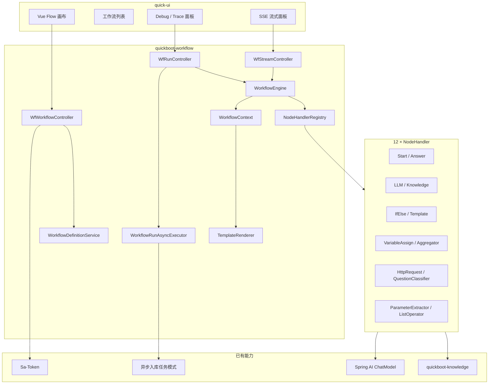
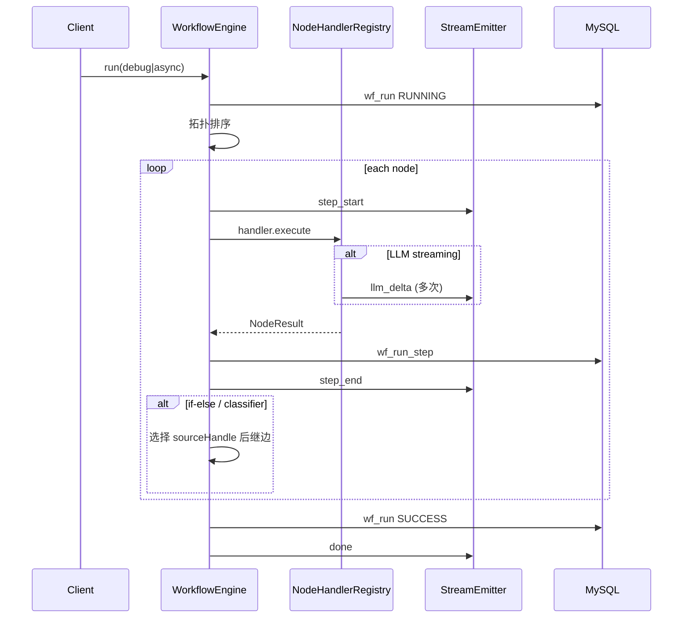

# AI 工作流引擎（参考 Dify / Coze）— 设计说明

**日期**：2026-06-07  
**状态**：已定稿（brainstorming 澄清结论）  
**依据**：用户诉求「参考 Dify/Coze 工作流设计，在本项目中实现」  
**澄清结论**：1C、2D、3D、4A、5A、6A、7A

---

## 1. 背景与目标

### 1.1 背景

`quickboot2` 已完成知识库 P0（CRUD、异步入库、语义检索、RAG 问答）及多来源入库扩展。当前 `RagService` 为**固定链路**：

```text
用户问题 → PGVector 检索 → QuestionAnswerAdvisor → LLM → 返回答案
```

用户希望引入 **Dify / Coze 式可视化工作流**：DAG 编排、变量传递、条件分支、HTTP 调用、运行 Trace、版本发布，并在后续支持对外 Bot/API 运行时。

### 1.2 目标（本期一次交付）

| 能力 | 说明 |
|------|------|
| 可视化 DAG 编排 | Vue Flow 画布：拖拽节点、连线、属性配置、校验 |
| **12 种核心节点** | 对齐 Dify 常用节点（不含 Code，见 §6） |
| 同步 Debug 运行 | 画布内调试，逐步 Trace |
| **异步长任务** | 任务表 + 轮询；超时 LLM/HTTP 不阻塞 HTTP 连接 |
| **SSE 流式输出** | LLM 节点与 Answer 节点支持 token 流式推送 |
| 草稿 / 发布版本 | 仅已发布版本可用于生产运行与（预留）对外 API |
| 与知识库集成 | `knowledge-retrieval` 复用 `KnowledgeSearchService` |
| 独立入口 | **保留** `/knowledge/chat`；工作流为增强能力 |

### 1.3 非目标（本期不做）

- **Code 节点**（任意脚本执行；P0–P1 均不做，见 7A）
- 公网 Bot 广场、多租户 SaaS 计费
- 完整复刻 Dify 全部节点（50+）与子工作流嵌套
- 替换或改造现有 `/knowledge/chat` 实现（4A）
- 按部门的工作流/知识库 ACL（延续全局可见）
- 多模态（图片/音视频）节点

### 1.4 架构预留（1C — P0 不做 UI，接口预留）

| 预留项 | P0 范围 | 后续 |
|--------|---------|------|
| 对外 REST 调用已发布工作流 | 表字段 + 配置开关 `external-api.enabled=false` | P1 开放 API Key |
| Bot 绑定工作流 | `wf_workflow.bot_enabled` 字段 | P1 Bot 管理页 |
| 调用方鉴权 | 内部 Sa-Token | 外部 `wf_api_key` |

---

## 2. 已定稿产品决策（Q&A）

| 题号 | 选项 | 结论 |
|------|------|------|
| 1 | C | P0 **管理员后台编排**；架构预留对外 API/Bot，P0 不开放外网 |
| 2 | D | **一次交付 Dify 常用 12 节点**（无 Code） |
| 3 | D | **同步 Debug + 异步任务 + SSE 流式** 均需在本期实现 |
| 4 | A | **保留** `/knowledge/chat`；工作流独立入口 |
| 5 | A | 画布 **`@vue-flow/core`** |
| 6 | A | 新建 **`quickboot-workflow`** Maven 模块 |
| 7 | A | **不做 Code 节点**（P0–P1） |

---

## 3. 方案对比与选型

| 方案 | 概要 | 优点 | 缺点 |
|------|------|------|------|
| **A（采用）** | `quickboot-workflow` + DSL + `NodeHandlerRegistry` + `WorkflowEngine` | 与 knowledge 解耦；对齐 ExportOrchestrator 模式；可扩展 | 工作量大，需分期任务拆解 |
| B | knowledge 内硬编码场景模板 | 上线快 | 非真正工作流 |
| C | 嵌入 Dify 开源版，QuickBoot 仅 SSO | 功能全 | 双栈、权限与数据割裂 |

**采用方案 A**：独立模块，Handler 调用 knowledge / Spring AI / HTTP 等能力。

---

## 4. 总体架构



### 4.1 设计原则

| 原则 | 说明 |
|------|------|
| **薄编排** | Engine 负责拓扑、上下文、Trace、流式桥接；业务在 Handler |
| **Handler 单一真相** | 每节点类型一个 Handler + JSON Schema 校验 |
| **JSON DSL 为存储格式** | 画布 ↔ DSL 双向转换；后端校验后持久化 |
| **三态运行语义** | 同步 Debug / 异步 Run / SSE Stream 共用同一 Engine |
| **安全默认拒绝** | HTTP 节点 SSRF 对齐 `WebContentFetcher`；Trace 脱敏 |

---

## 5. 工作流 DSL

### 5.1 顶层结构

```json
{
  "version": 1,
  "nodes": [
    {
      "id": "start_1",
      "type": "start",
      "position": { "x": 80, "y": 200 },
      "data": {
        "inputs": [
          { "key": "question", "type": "string", "required": true, "label": "用户问题" }
        ]
      }
    },
    {
      "id": "kb_1",
      "type": "knowledge-retrieval",
      "data": {
        "kbId": "{{sys.kbId}}",
        "query": "{{start_1.question}}",
        "topK": 5,
        "similarityThreshold": 0.65
      }
    },
    {
      "id": "llm_1",
      "type": "llm",
      "data": {
        "systemPrompt": "你是企业助手，仅依据上下文回答。",
        "userPrompt": "问题：{{start_1.question}}\n\n上下文：{{kb_1.contextText}}",
        "temperature": 0.3,
        "streaming": true
      }
    },
    {
      "id": "answer_1",
      "type": "answer",
      "data": {
        "output": "{{llm_1.text}}",
        "citations": "{{kb_1.citations}}"
      }
    }
  ],
  "edges": [
    { "id": "e1", "source": "start_1", "target": "kb_1" },
    { "id": "e2", "source": "kb_1", "target": "llm_1" },
    { "id": "e3", "source": "llm_1", "target": "answer_1" }
  ]
}
```

### 5.2 变量引用

| 语法 | 含义 | 示例 |
|------|------|------|
| `{{nodeId.field}}` | 节点输出 | `{{kb_1.contextText}}` |
| `{{sys.*}}` | 运行时注入 | `sys.runId`, `sys.kbId`, `sys.userId` |
| `{{inputs.key}}` | Start 入参简写 | 等价 `{{start_1.key}}` |

`TemplateRenderer`：正则 + 安全 JSON 路径解析；**禁止** SpEL/脚本执行。

### 5.3 图校验（saveGraph / publish）

1. 有且仅有一个 `start`、至少一个 `answer`
2. DAG 无环（`list-operator` 内部迭代不展开为图环）
3. 边引用的节点均存在
4. 从 `start` 可达所有 `answer`；无孤立节点
5. `if-else` 出口边必须带 `sourceHandle`：`true` / `false`
6. `question-classifier` 出口边带 `sourceHandle`：类别 id
7. 各节点 `data` 通过 JSON Schema 校验

---

## 6. 节点类型定义（12 种，无 Code）

| # | type | 说明 | 主要配置 | 输出字段 |
|---|------|------|----------|----------|
| 1 | `start` | 定义运行入参 | `inputs[]` | 各 input key |
| 2 | `answer` | 终止并组装响应 | `output`, `citations?` 模板 | 最终响应 |
| 3 | `llm` | 调用 ChatModel | system/user prompt, temperature, streaming | `text`, `tokenUsage?` |
| 4 | `knowledge-retrieval` | 语义检索 | kbId, query, topK, threshold | `chunks[]`, `citations[]`, `contextText` |
| 5 | `if-else` | 条件分支 | 条件组（AND/OR）、比较符 | `branch`: `true`/`false` |
| 6 | `template-transform` | 文本模板拼接 | template 字符串 | `result` |
| 7 | `variable-assign` | 写入变量 | assignments: key → 模板 | 各 assignment key |
| 8 | `variable-aggregator` | 多路变量合并 | groupId, variables[] | `aggregated` (object) |
| 9 | `http-request` | HTTP 调用 | method, url, headers, body 模板 | `status`, `headers`, `body` |
| 10 | `question-classifier` | 意图分类 | classes[], query 模板, fallback | `classId`, `className` |
| 11 | `parameter-extractor` | 结构化参数抽取 | schema(JSON), query 模板 | 按 schema 字段 |
| 12 | `list-operator` | 列表过滤/取项/遍历 | operation, list 模板, filter | `items[]`, `first`, `count` |

### 6.1 节点实现要点

**knowledge-retrieval**  
- 调用 `KnowledgeSearchService.search`  
- `contextText`：将 chunks 拼接为 LLM 上下文（≤ 模型窗口可配置上限）

**llm**  
- `streaming=true` 时向 `WorkflowStreamEmitter` 推送 delta  
- 非流式：`ChatClient.call()`

**if-else**  
- 支持运算符：`eq`, `ne`, `contains`, `not_contains`, `gt`, `gte`, `lt`, `lte`, `empty`, `not_empty`  
- 左/右值均支持模板

**http-request**  
- SSRF：同 `qc.knowledge.web-fetch`（内网拒绝、跳转复检、大小/超时）  
- 默认 `qc.workflow.http-request.enabled=true`（因 2D 需交付）

**question-classifier**  
- P0 实现：LLM 分类（prompt + JSON 输出），非独立微调模型  
- 每条 `sourceHandle` 对应一个 class

**parameter-extractor**  
- LLM + JSON schema 约束输出；解析失败 → 节点 FAILED

**list-operator**  
- `filter` / `first` / `last` / `map-field`；**不做**图级循环节点（避免与 DAG 环混淆）

### 6.2 与现有 RAG 的等价模板

内置只读模板「默认 RAG 工作流」：

```text
start → knowledge-retrieval → llm → answer
```

供管理员复制修改；**不**替换 `/knowledge/chat`。

---

## 7. 执行引擎

### 7.1 三种运行模式

| 模式 | API | 行为 | 适用 |
|------|-----|------|------|
| **同步 Debug** | `POST /workflow/run/debug` | 阻塞至完成或超时；返回完整 Trace | 画布调试 |
| **异步 Run** | `POST /workflow/run/async` | 立即返回 `runId`；后台执行 | 长链路、HTTP 慢 |
| **SSE Stream** | `GET /workflow/run/stream?runId=` | 推送 `step_start` / `llm_delta` / `step_end` / `done` | 流式 LLM 体验 |

同步与异步共用 `WorkflowEngine.execute(runId)`；SSE 通过 `WorkflowStreamEmitter`（内存队列 + Redis 可选 P1）订阅 run 事件。

### 7.2 执行流程



### 7.3 核心类

| 类 | 职责 |
|----|------|
| `WorkflowEngine` | 拓扑排序、分支路由、超时、失败短路 |
| `WorkflowContext` | 节点输出 Map + 运行时 sys 变量 |
| `NodeHandler` | `type()`, `validateSchema()`, `execute()` |
| `NodeHandlerRegistry` | Spring 注入注册表 |
| `WorkflowGraphValidator` | DSL 结构与 JSON Schema |
| `TemplateRenderer` | `{{...}}` 解析 |
| `WorkflowRunAsyncExecutor` | 线程池 + afterCommit 派发 |
| `WorkflowStreamEmitter` | SSE 事件发布/订阅 |

### 7.4 超时与并发

```yaml
qc:
  workflow:
    enabled: true
    sync-debug-timeout-ms: 60000
    async-timeout-ms: 600000
    max-concurrent-runs-per-user: 3
    stream:
      heartbeat-interval-ms: 15000
    http-request:
      enabled: true
      timeout-ms: 15000
      max-bytes: 5242880
```

---

## 8. 领域模型与表结构

Flyway **`V6x__workflow_engine.sql`**（编号以仓库当前最大版本为准）。

### 8.1 `wf_workflow`

| 字段 | 类型 | 说明 |
|------|------|------|
| `workflow_id` | BIGINT PK | |
| `name` | VARCHAR(128) | |
| `description` | VARCHAR(512) | |
| `status` | VARCHAR(16) | `DRAFT` / `PUBLISHED` / `DISABLED` |
| `published_version_id` | BIGINT NULL | 当前发布版本 |
| `bot_enabled` | TINYINT | 预留：是否允许 Bot 绑定（P0 默认 0） |
| `external_api_enabled` | TINYINT | 预留：是否允许 API Key 调用（P0 默认 0） |
| 审计 + `deleted` | | |

### 8.2 `wf_workflow_version`

| 字段 | 说明 |
|------|------|
| `version_id` | PK |
| `workflow_id` | FK |
| `version_no` | INT |
| `graph_json` | LONGTEXT |
| `checksum` | SHA-256 |
| `is_draft` | 1=当前编辑草稿 |
| `remark` | |

### 8.3 `wf_run`

| 字段 | 说明 |
|------|------|
| `run_id` | PK |
| `workflow_id` / `version_id` | |
| `trigger_type` | `DEBUG` / `ASYNC` / `API`（预留） |
| `run_mode` | `SYNC` / `ASYNC` |
| `status` | `QUEUED` / `RUNNING` / `SUCCESS` / `FAILED` / `CANCELLED` |
| `inputs_json` | |
| `outputs_json` | |
| `error_msg` | |
| `duration_ms` | |
| `stream_enabled` | 是否 SSE |
| `start_time` / `end_time` | |

### 8.4 `wf_run_step`

| 字段 | 说明 |
|------|------|
| `step_id` | PK |
| `run_id` | FK |
| `node_id` / `node_type` | |
| `status` | |
| `inputs_json` / `outputs_json` | 脱敏后 |
| `error_msg` | |
| `duration_ms` | |
| `order_no` | |

### 8.5 预留 — `wf_api_key`（P0 建表不启用）

| 字段 | 说明 |
|------|------|
| `key_id` | PK |
| `workflow_id` | 绑定工作流 |
| `api_key_hash` | 存储哈希 |
| `status` | |
| `expire_time` | |

---

## 9. API 设计

前缀 `/workflow`；修改/删除 `@PostMapping`；权限 `workflow:*`。

### 9.1 定义管理

| 路径 | 权限 | 说明 |
|------|------|------|
| `GET /list` | `workflow:list` | 分页 |
| `GET /getInfo` | `workflow:query` | 元数据 + 草稿 graph |
| `POST /add` | `workflow:add` | |
| `POST /update` | `workflow:edit` | 元数据 |
| `POST /saveGraph` | `workflow:edit` | 校验 + 保存草稿 |
| `POST /validateGraph` | `workflow:edit` | 仅校验，不保存 |
| `POST /publish` | `workflow:publish` | 生成新版本 |
| `POST /remove` | `workflow:remove` | 逻辑删除 |
| `GET /template/list` | `workflow:query` | 内置模板（含默认 RAG） |

### 9.2 运行

| 路径 | 说明 |
|------|------|
| `POST /run/debug` | `{ workflowId, inputs, kbId? }` 同步 + 完整 Trace |
| `POST /run/async` | 返回 `{ runId }`；`stream=true` 时客户端再连 SSE |
| `GET /run/getInfo` | run 详情 + steps |
| `GET /run/list` | 历史记录 |
| `GET /run/stream` | SSE：`runId` 必填；事件见 §9.3 |

### 9.3 SSE 事件类型

| event | payload 要点 |
|-------|----------------|
| `step_start` | runId, nodeId, nodeType, orderNo |
| `llm_delta` | nodeId, delta, accumulated |
| `step_end` | nodeId, status, durationMs, outputs(摘要) |
| `done` | status, outputs |
| `error` | message, nodeId? |
| `heartbeat` | ts |

### 9.4 功能开关

```yaml
qc:
  workflow:
    enabled: true
    external-api:
      enabled: false    # 1C 预留
    sync-debug-timeout-ms: 60000
    async-timeout-ms: 600000
    http-request:
      enabled: true
      timeout-ms: 15000
      max-bytes: 5242880
```

`qc.workflow.enabled=false` 时不注册 Workflow Bean（对齐 `qc.knowledge.enabled`）。

---

## 10. 前端（quick-ui）

### 10.1 依赖

```json
"@vue-flow/core": "^1.x",
"@vue-flow/background": "^1.x",
"@vue-flow/controls": "^1.x"
```

### 10.2 菜单与路由

| 菜单 | 路由 | 组件 |
|------|------|------|
| 工作流 | `/workflow/list` | `workflow/list/index.vue` |
| 工作流设计 | `/workflow/design/:id` | `workflow/design/index.vue` |
| 运行记录 | `/workflow/run` | `workflow/run/index.vue` |

权限：`workflow:list/add/edit/publish/run/remove`；Flyway 菜单种子。

### 10.3 设计器布局

```text
┌──────────────────────────────────────────────────────────────┐
│ [保存] [校验] [Debug运行] [异步运行▾] [发布]                    │
├──────────┬───────────────────────────────┬───────────────────┤
│ 节点面板  │      Vue Flow 画布             │  属性面板          │
│ 12 种    │  拖拽 / 连线 / 小地图           │  动态表单 + 变量助手 │
├──────────┴───────────────────────────────┴───────────────────┤
│ Trace 时间线 | SSE 流式输出区（Markdown 渲染）                    │
└──────────────────────────────────────────────────────────────┘
```

- 节点面板：12 种节点图标 + 拖拽  
- 属性面板：按 `type` 渲染表单；kbId 用知识库下拉；Prompt 支持插入 `{{}}`  
- **Debug**：`POST /run/debug` → 逐步高亮节点 + Trace  
- **异步+流式**：`POST /run/async` + `stream=true` → `EventSource` 订阅 `/run/stream`  
- 视觉遵循 `DESIGN.md`；列表页参照 `views/system/config/index.vue`

### 10.4 自定义节点组件

每种 `type` 对应 `workflow/design/nodes/XxxNode.vue` + `XxxPanel.vue`（属性表单），注册到 Vue Flow `nodeTypes`。

---

## 11. 模块结构（quickboot-workflow）

```text
quickboot-workflow/
├── pom.xml
└── src/main/java/.../workflow/
    ├── config/          # WorkflowProperties, AutoConfiguration
    ├── controller/      # WfWorkflowController, WfRunController, WfStreamController
    ├── domain/          # WfWorkflow, WfRun, ...
    ├── dto/
    ├── mapper/
    ├── engine/          # WorkflowEngine, Context, Validator, TemplateRenderer
    ├── stream/          # WorkflowStreamEmitter, Sse endpoints
    ├── async/           # WorkflowRunAsyncExecutor
    └── handler/         # NodeHandler 接口 + 12 实现 + Registry
```

`quickboot-web` 引入依赖；`quickboot-knowledge` **不**依赖 workflow（workflow → knowledge 单向）。

---

## 12. 权限与安全

| 项 | 策略 |
|----|------|
| RBAC | `workflow:*` 按钮权限 |
| 数据可见性 | P0 全局可见（与知识库 4A 一致） |
| HTTP 节点 | SSRF + 超时 + 大小限制 |
| Trace 脱敏 | Authorization、Cookie、手机号掩码 |
| 并发 | `max-concurrent-runs-per-user` |
| 发布校验 | 未校验通过的 graph 禁止 publish |
| 对外 API | P0 `external-api.enabled=false`；表结构预留 |

---

## 13. 测试要点

| ID | 场景 |
|----|------|
| TC_WF_001 | 登录后可打开工作流列表与设计器 |
| TC_WF_010 | 默认 RAG 模板 Debug 运行 SUCCESS |
| TC_WF_011 | knowledge-retrieval 跨库隔离 |
| TC_WF_012 | if-else true/false 分支路由正确 |
| TC_WF_013 | http-request 内网 URL → 节点 FAILED |
| TC_WF_014 | question-classifier 多出口连线 |
| TC_WF_020 | 异步 run 轮询至 SUCCESS |
| TC_WF_021 | SSE 收到 llm_delta 与 done |
| TC_WF_022 | 发布后再改草稿不影响已发布版本运行 |
| TC_WF_030 | `/knowledge/chat` 行为与改造前一致 |
| TC_WF_031 | `qc.workflow.enabled=false` 无 `/workflow/**` |

---

## 14. 实施任务概览（供 writing-plans / OpenSpec）

建议拆为 **4 个迭代**（同一 OpenSpec change 内分 task 组）：

### 迭代 1 — 基础骨架
1. Flyway 表 + 实体 + `qc.workflow` 配置  
2. DSL 校验 + `WorkflowEngine`（线性 DAG）+ Start/Answer Handler  
3. CRUD API + 列表页  

### 迭代 2 — 核心 AI 节点
4. LLM + KnowledgeRetrieval Handler（含流式 emitter 接口）  
5. Template / VariableAssign / VariableAggregator  
6. Vue Flow 画布 + Start/LLM/KB/Answer 节点 UI  

### 迭代 3 — 逻辑与外部节点
7. IfElse + QuestionClassifier + ParameterExtractor + ListOperator  
8. HttpRequest Handler + SSRF 单测  
9. 画布补齐 12 节点 + 属性面板  

### 迭代 4 — 运行态与联调
10. 同步 Debug + wf_run_step Trace  
11. 异步 Executor + 轮询 API  
12. SSE `/run/stream` + 前端流式区  
13. 发布版本 + 内置 RAG 模板 + 菜单权限 + 联调  

---

## 15. 风险与缓解

| 风险 | 缓解 |
|------|------|
| 12 节点 + 三态运行工作量大 | §14 四迭代；迭代 1 结束可演示线性 RAG |
| SSE 与异步跨实例 | P0 单实例内存 Emitter；P1 可选 Redis Pub/Sub |
| question-classifier 准确率 | 文档说明依赖 LLM；可配置 few-shot 示例 |
| HTTP 节点滥用 | 权限独立 `workflow:run`；审计日志 |
| DSL 演进 | `version` 字段 + 迁移器 |
| 与 knowledge 循环依赖 | 严格单向依赖 workflow → knowledge |

---

## 16. 与 OpenSpec 的衔接

- 建议变更名：`add-ai-workflow`  
- 能力 spec：`workflow-engine`（节点、运行、SSE、版本）  
- 依赖：`knowledge-rag`（已归档或进行中）  
- **不修改** `knowledge-rag` spec 中 `/knowledge/chat` 行为  

---

**请评审本文档**。确认无重大异议后，可基于 §14 编写 OpenSpec `proposal/design/tasks` 或 `writing-plans` 实现计划。
