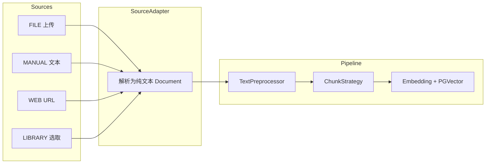

# 知识库多来源入库与分段策略扩展 — 设计说明

**日期**：2026-06-07  
**状态**：已定稿（与 OpenSpec `add-knowledge-ingest-sources` 实现一致）  
**依据**：brainstorming 澄清结论 — 1B、2A、3A、4D、5C、6B、7A

---

## 1. 背景与目标

### 1.1 背景

P0 已实现：知识库 CRUD、**单一路径文件上传**、Token 自动分块、异步入库、语义检索与 RAG。用户希望扩展为与 Dify 类似的多来源录入与可配置分段/清洗能力。

### 1.2 目标（本期一次交付）

| 能力 | 说明 |
|------|------|
| 四种文档来源 | 手动录入、文件上传、网页 URL 抓取、独立「文档库」选取 |
| 两种分段模式 | **自动**（TokenTextSplitter + 可选清洗）、**自定义**（分隔符 + Token 上限/重叠） |
| 预处理规则 | 归一化连续空白；可选删除 URL、电子邮箱（自动/自定义共用开关） |
| 策略粒度 | 知识库级默认；**每次添加文档时可覆盖**；快照落库供重建索引复用 |
| 兼容 P0 | 已有文档/知识库迁移后行为与现网一致（自动模式 + 原 chunk 参数） |

### 1.3 非目标（本期不做）

- 文档库内在线编辑、版本 diff
- 网页定时爬取 / 整站同步
- 多模态（图片 OCR）
- 按部门的知识库 ACL（延续 P0 全局可见）
- 分段预览 UI（可 Phase 2；本期仅配置 + 入库结果）

---

## 2. 已定稿产品决策（Q&A）

| 题号 | 选项 | 结论 |
|------|------|------|
| 1 | B | **独立「知识文档库」**，非系统 `sys_file` 通用文件管理 |
| 2 | A | 填 **URL**，后端抓取正文后入库 |
| 3 | A | **标题 + 纯文本/Markdown** 手动录入 |
| 4 | D | **知识库默认 + 单次添加可覆盖** |
| 5 | C | 自动/自定义 **共用同一套预处理开关** |
| 6 | B | 最大长度、重叠度均为 **Token** |
| 7 | A | **一次全做**（四来源 + 两分段模式） |

---

## 3. 方案对比与选型

| 方案 | 概要 | 优点 | 缺点 |
|------|------|------|------|
| **A（推荐）** | 统一 `DocumentIngestionService` + 来源适配器 + 分段策略链 | 复用异步入库/向量/PGVector；扩展清晰 | 需重构 ingest 入口 |
| B | 每种来源独立 Service + 复制入库后半段 | 来源隔离 | 重复代码多，难维护 |
| C | 来源先全部转成 `sys_file` 再走 P0 单路径 | 改动小 | 网页/手动语义丢失；文档库与 KB 耦合弱 |

**采用方案 A**：所有来源最终产出 `List<Document>`（Spring AI）+ 文档元数据快照，后续分块/向量化逻辑唯一。

---

## 4. 领域模型与表结构

### 4.1 知识库默认分段配置 — 扩展 `kb_knowledge_base`

Flyway **`V59__knowledge_ingest_sources.sql`**（编号以仓库当前最大版本为准）。

| 字段 | 类型 | 默认 | 说明 |
|------|------|------|------|
| `segment_mode` | VARCHAR(16) | `AUTO` | `AUTO` 自动 Token 分块；`CUSTOM` 自定义分隔符 |
| `chunk_delimiter` | VARCHAR(16) | `DOUBLE_NEWLINE` | `SINGLE_NEWLINE` / `DOUBLE_NEWLINE`（仅 CUSTOM 生效） |
| `preprocess_normalize_ws` | TINYINT | 1 | 替换连续空格/换行/制表符为单空格 |
| `preprocess_remove_url` | TINYINT | 0 | 删除 URL |
| `preprocess_remove_email` | TINYINT | 0 | 删除邮箱 |

保留现有 `chunk_size`、`chunk_overlap`（Token，默认 800/120）。

### 4.2 文档表 — 扩展 `kb_document`

| 字段 | 类型 | 说明 |
|------|------|------|
| `source_type` | VARCHAR(16) | `FILE` / `MANUAL` / `WEB` / `LIBRARY` |
| `file_id` | BIGINT NULL | 原文件 `sys_file`；手动/网页抓取后也会生成归档文件 |
| `library_file_id` | BIGINT NULL | 来源为文档库时关联 `kb_doc_library_file.lib_file_id` |
| `source_url` | VARCHAR(2048) NULL | 网页来源 URL |
| `segment_mode` | VARCHAR(16) | **入库时快照**（覆盖 KB 默认） |
| `chunk_size` | INT | 快照 |
| `chunk_overlap` | INT | 快照 |
| `chunk_delimiter` | VARCHAR(16) | 快照 |
| `preprocess_normalize_ws` | TINYINT | 快照 |
| `preprocess_remove_url` | TINYINT | 快照 |
| `preprocess_remove_email` | TINYINT | 快照 |

`file_id` 改为可空需迁移：历史数据 `source_type='FILE'`，`file_id` 保持非空。

重建索引（`reindex`）**使用文档上快照字段**，不随知识库后续修改而变；若用户要应用新库级策略，提供「按库默认重建」可选参数（本期 `reindex` 仍用快照，库表单变更仅影响新文档）。

### 4.3 独立文档库（新表）

**`kb_doc_library_folder`** — 树形目录（可选，支持一级「根目录」）

| 字段 | 说明 |
|------|------|
| `folder_id` | 主键 |
| `parent_id` | 父目录，0 为根 |
| `name` | 目录名 |
| `order_num` | 排序 |
| 审计 + `deleted` | 与项目规范一致 |

**`kb_doc_library_file`** — 文档库文件条目

| 字段 | 说明 |
|------|------|
| `lib_file_id` | 主键 |
| `folder_id` | 所属目录 |
| `file_id` | 关联 `sys_file`（`classify=knowledge-library`） |
| `title` | 展示名 |
| `file_ext` | 扩展名 |
| `file_size` | 字节 |
| `remark` | 备注 |
| 审计 + `deleted` | |

物理文件仍走 `FileTemplate` + `sys_file`，与知识库文档 **`classify` 分离**（`knowledge` vs `knowledge-library`），避免与直接上传到 KB 的文件混放。

### 4.4 配置项 — `qc.knowledge`

```yaml
qc:
  knowledge:
    web-fetch:
      enabled: true
      timeout-ms: 15000
      max-bytes: 5242880          # 5MB
      user-agent: QuickBoot-KnowledgeBot/1.0
      # 可选：allowed-hosts 白名单；为空则仅 SSRF 黑名单
    library:
      max-file-size-mb: 50
      allowed-extensions: pdf,doc,docx,txt,md,html
```

---

## 5. 入库流水线



### 5.1 来源适配器

| 来源 | 实现要点 |
|------|----------|
| **FILE** | 现有 `TikaDocumentReader`；上传 `classify=knowledge` |
| **MANUAL** | 校验 title + content（≤512KB）；`uploadBytes` 存 `.md`；Tika 或直接 `Document` |
| **WEB** | `WebContentFetcher` HTTP GET → Tika `text/html` 或 Jsoup 提取正文 → 存 `.html`/`.txt` 归档 |
| **LIBRARY** | 读 `kb_doc_library_file.file_id` → `FileTemplate.download` → Tika |

### 5.2 网页抓取安全（SSRF）

- 仅 `http`/`https`
- 解析 DNS 后拒绝：loopback、链路本地、RFC1918、169.254.0.0/16
- 禁止跟随重定向到内网（最多 3 次跳转，每跳复检）
- 响应 `Content-Length` 与流式累计超限则中止
- 失败写入 `error_msg`：`网页抓取失败：…`

### 5.3 文本预处理 — `TextPreprocessor`

按快照开关顺序执行（自动/自定义共用）：

1. **normalize_ws**：`[\s]+` → 单空格（保留段落时可先 normalize 再分 delimiter）
2. **remove_url**：正则删除 `http(s)://…` 与 `www.…`
3. **remove_email**：正则删除邮箱

### 5.4 分段策略 — `ChunkStrategy`

**AUTO**

- `TokenTextSplitter`（与 P0 相同参数：`chunkSize`、`chunkOverlap`）

**CUSTOM**

1. 按 `chunk_delimiter` 切分：`SINGLE_NEWLINE` → `\n`；`DOUBLE_NEWLINE` → `\n\n+`
2. 将段落序列 **合并/切分** 至每块 Token ≤ `chunkSize`（估算：chars/4 或 Spring AI Token 计数器若可用）
3. 块间 **Token 重叠** `chunkOverlap`（与 AUTO 一致语义）
4. 实现类：`DelimiterTokenChunkSplitter`（新建，单元测试覆盖）

### 5.5 异步入库

- 延续 `IngestTaskDispatcher.afterCommit` + 任务表
- `DocumentIngestionService.ingest(taskId)` 改为：读 **文档快照策略** → 适配器取文本 → 预处理 → 分块 → 向量化
- `reindex` 清向量/分块后重新 ingest，策略读文档快照

---

## 6. API 设计

前缀与 P0 一致；修改/删除仍 `@PostMapping`。

### 6.1 文档库 `/knowledge/library`

| 路径 | 权限 | 说明 |
|------|------|------|
| `GET /folder/tree` | `knowledge:library:list` | 目录树 |
| `POST /folder/add` | `knowledge:library:add` | 新建目录 |
| `POST /folder/update` | `knowledge:library:edit` | 重命名/移动 |
| `POST /folder/remove` | `knowledge:library:remove` | 删除目录（空目录） |
| `GET /file/list` | `knowledge:library:list` | 分页列表（按 folderId） |
| `POST /file/upload` | `knowledge:library:upload` | 上传到文档库 |
| `POST /file/remove` | `knowledge:library:remove` | 删除库文件 |

### 6.2 文档入库 `/knowledge/doc`

| 路径 | 说明 |
|------|------|
| `POST /upload` | 保留；body/query 增加可选 `SegmentConfigBo` |
| `POST /addManual` | `{ kbId, title, content, segmentConfig? }` |
| `POST /addFromWeb` | `{ kbId, url, title?, segmentConfig? }` |
| `POST /addFromLibrary` | `{ kbId, libFileId, title?, segmentConfig? }` |
| `POST /reindex` | 不变（用文档快照） |
| `GET /list` | 增加列：`sourceType`、`sourceUrl` |

**`SegmentConfigBo`**（均可选，缺省继承 KB）：

```json
{
  "segmentMode": "AUTO|CUSTOM",
  "chunkSize": 800,
  "chunkOverlap": 120,
  "chunkDelimiter": "SINGLE_NEWLINE|DOUBLE_NEWLINE",
  "preprocessNormalizeWs": true,
  "preprocessRemoveUrl": false,
  "preprocessRemoveEmail": false
}
```

### 6.3 知识库 `/knowledge/base`

- `add` / `update` / `getInfo` 增加分段默认字段
- 列表可选展示 `segmentMode`

---

## 7. 前端（quick-ui）

### 7.1 菜单

| 菜单 | 路由 | 组件 |
|------|------|------|
| 文档库 | `/knowledge/library` | `knowledge/library/index` |
| 文档管理 | 改造 | 见下 |

权限：`knowledge:library:*` 按钮；Flyway 插入菜单 2295+。

### 7.2 文档库页

- 左树右表：目录 CRUD + 文件上传/删除/预览
- 上传限制与后端 `allowed-extensions` 一致

### 7.3 文档管理 — 「添加文档」向导

**Step 1 — 来源**（Tab）

- 文件上传（现有 C7Upload）
- 手动录入：标题 + 多行文本
- 网页录入：URL + 可选标题
- 文档库：弹窗选择 `libFileId`（树+表）

**Step 2 — 分段与清洗**

- 默认「继承知识库配置」（只读展示 KB 当前值）
- 开关「自定义本次设置」→ 展开：
  - 模式：自动 / 自定义
  - 自定义：分隔符（单换行/双换行）、chunkSize、chunkOverlap
  - 预处理三 checkbox（归一化空白 / 去 URL / 去邮箱）

**Step 3 — 确认提交** → 调用对应 API → 列表轮询入库状态

列表增加「来源」列（标签：文件/手动/网页/文档库）。

### 7.4 知识库表单

- 增加与 Step 2 相同的默认分段/预处理字段（无「继承」文案）

---

## 8. 权限与安全

| 项 | 策略 |
|----|------|
| 文档库 | 独立权限前缀 `knowledge:library:*` |
| 网页抓取 | SSRF 防护 + 大小/超时限制 |
| 手动录入 | content 长度上限 512KB |
| 鉴权 | 延续 Sa-Token；全局可见 |

---

## 9. 迁移与兼容

1. **V59** 为 `kb_knowledge_base` / `kb_document` 加字段；`kb_document.file_id` 改 NULL + 默认 `source_type='FILE'`
2. 回填：`segment_*` / `preprocess_*` 从所属 KB 复制到已有文档
3. 新建 `kb_doc_library_*` 表与菜单
4. `application.yml` 增加 `web-fetch`、`library` 配置块

---

## 10. 测试要点

| ID | 场景 |
|----|------|
| TC_KB_001 | 登录后可访问文档库与添加向导 |
| TC_KB_010 | 文件上传 + AUTO 分段 → INDEXED |
| TC_KB_011 | 手动录入 Markdown → 检索命中 |
| TC_KB_012 | 合法 URL 抓取 → INDEXED |
| TC_KB_013 | 内网 URL → FAILED + 明确 error_msg |
| TC_KB_014 | 文档库文件 → 选入 KB → INDEXED |
| TC_KB_020 | CUSTOM + 双换行分隔 → chunk 边界符合预期 |
| TC_KB_021 | 预处理去 URL/邮箱 生效 |
| TC_KB_022 | 上传覆盖 KB 默认策略；reindex 仍用快照 |
| TC_KB_030 | 四来源文档 `sourceType` 列表展示正确 |

---

## 11. 实施任务概览（供 writing-plans）

1. Flyway V59 + 实体/DTO/枚举
2. `TextPreprocessor` + `DelimiterTokenChunkSplitter` + 单测
3. `WebContentFetcher` + SSRF 单测
4. 文档库 CRUD API + 前端页
5. 扩展 `KbDocumentService` 四入口 + ingest 重构
6. 知识库/文档前端向导与表单
7. 菜单权限 + 联调 + 文档站点增量

---

## 12. 风险与缓解

| 风险 | 缓解 |
|------|------|
| 网页结构复杂提取差 | Tika + 失败提示；后续可读性算法 |
| CUSTOM Token 估算偏差 | 与 AUTO 同用 TokenTextSplitter 做二次切分 |
| 文档库与 KB 文件重复存储 | 库文件仅引用；入库时可 copy 或共享 file_id（**采用共享 file_id**，入库记录 `library_file_id` 溯源） |
| 一次交付工作量大 | 按 §11 顺序；核心 ingest 先通再补 UI 抛光 |

---

**请评审本文档**。确认无重大异议后，将基于 §11 编写实现计划（`writing-plans` / OpenSpec tasks）。
