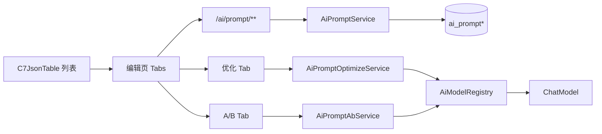

# AI 提示词管理 — 设计说明

**日期**：2026-06-14  
**状态**：已定稿（brainstorming 澄清结论 — 1A、2D、3E、4C、5D、6C、7A、8A；评审确认同步优化 + 编辑页 Tab）  
**关联**：OpenSpec 变更 `add-ai-prompt-management`（待创建）；依赖 `add-ai-model-management`（`quickboot-ai` + `AiModelRegistry`）

---

## 1. 背景与目标

### 1.1 背景

QuickBoot 已在工作流 LLM 节点、RAG 问答、问题分类、参数抽取等场景中大量使用提示词，但内容分散在节点表单或后端硬编码中，缺少统一台账。AI 大模型管理设计（`2026-06-07-ai-model-management-design.md`）将「Prompt 模板管理」列为非目标，现作为 **AI 能力** 域独立子功能交付。

当前工作流 `LlmForm` 已支持 `systemPrompt` / `userPrompt` 与 `{{参数名}}` 变量语法；提示词库的数据结构与变量约定须与之对齐，便于二期接入。

### 1.2 目标（本期 MVP）

| 能力 | 说明 |
|------|------|
| 提示词 CRUD | 维护提示词模板：名称、编码、场景类型、业务域、分类、标签 |
| 多段内容 | 按 `promptType` 动态配置各内容段（system/user/instruction 等） |
| 变量声明 | 声明变量列表（key/type/required/description），编辑时校验 `{{var}}` |
| 草稿 / 发布 | `DRAFT` 可编辑；`PUBLISHED` 只读，修改须新建草稿或优化采纳 |
| 版本历史 | 发布与采纳时生成版本快照；支持查看与两版本 Diff |
| AI 优化 | 选择 Chat 模型，输入优化目标，同步生成优化稿（60s 超时） |
| 优化采纳 | 一键将优化结果写入当前草稿 |
| A/B 对比 | 选两版本 + 样例变量，并行调用模型，人工 1–5 星评分并记录 winner |
| 菜单域 | 「AI 能力」下新增「提示词管理」，`/ai/prompt`，权限 `ai:prompt:*` |

### 1.3 非目标（本期不做）

- 工作流节点「从模板插入」、运行时模板渲染
- 知识库 RAG `RagService` 绑定提示词模板
- Few-shot 多轮示例独立段
- 自动 Prompt 评测大盘 / Token 用量统计
- 跨租户 / 部门隔离（延续 AI 模块 P0 全局可见）
- 优化任务异步队列（本期同步调用，60s 超时）

### 1.4 二期预留（不在 MVP 任务内）

- 工作流 LLM / 分类 / 抽取节点引用已发布模板
- RAG 系统提示词绑定
- `GET /ai/prompt/options` 供业务表单下拉
- 插入工作流时校验 `{{var}}` 与节点输入参数一致性

---

## 2. 已定稿产品决策（Q&A）

| 题号 | 选项 | 结论 |
|------|------|------|
| 1 | A | 独立提示词库 CRUD，本期不与工作流/RAG 集成 |
| 2 | D | 按场景类型（`promptType`）配置多段内容 |
| 3 | E | 优化全集：AI 改写 + 版本 Diff + A/B 测试 + 采纳 |
| 4 | C | 变量声明表 + 编辑时 `{{var}}` 校验（工作流插入校验留二期） |
| 5 | D | 分类 + 标签 + 业务域分组 + 搜索 |
| 6 | C | 草稿 / 已发布 两态 |
| 7 | A | 菜单挂「AI 能力」，`/ai/prompt`，`ai:prompt:*` |
| 8 | A | MVP 一次交付：CRUD + 库内优化闭环，不接业务 |

**评审补充确认**：

- AI 优化采用 **同步调用**，请求超时 **60s**（与 `ai_model.request_timeout_ms` 对齐，优化接口可单独上限 60000ms）
- 编辑页采用 **Tab：内容 | 优化 | 版本 | A/B**
- 停用已发布模板使用 `status=ARCHIVED`（逻辑删除 `deleted=1` 仅用于彻底移除）

---

## 3. 方案对比与选型

| 方案 | 概要 | 优点 | 缺点 |
|------|------|------|------|
| **A（采用）** | 在 `quickboot-ai` 扩展 `prompt` 子域 + 前端 `views/ai/prompt/` | 与 `ai_model` 同构；优化复用 `AiModelRegistry`；API 前缀统一 | `quickboot-ai` 职责增多 |
| B | 新建 `quickboot-prompt` 独立模块 | 边界清晰 | MVP 过重，Flyway/依赖成本高 |
| C | 存 `sys_config` 或单表 JSON | 开发最快 | 无法支撑版本、A/B、变量校验 |

**采用方案 A**。

---

## 4. 模块与菜单

### 4.1 后端包结构（`quickboot-ai` 扩展）

```
quickboot-ai/
  prompt/
    domain/       AiPrompt, AiPromptContent, AiPromptVariable, AiPromptVersion, ...
    constants/    AiPromptType, AiPromptStatus, AiPromptVersionSource, ...
    dto/          Bo / Vo / QueryBo
    mapper/
    service/      AiPromptService, AiPromptOptimizeService, AiPromptAbService
    controller/   AiPromptController
```

包路径：`io.github.genkidoudou.web.ai.prompt.*`

开关：`qc.ai.enabled=false` 时 **CRUD 仍可用**；`/optimize`、`/ab/run` 返回业务异常（错误码提示先启用 AI 并配置 Chat 模型）。

### 4.2 菜单（Flyway 新迁移，menu_id 2330+）

| menu_id | 父级 | 类型 | 名称 | 路由 | 组件 | order | 权限 |
|---------|------|------|------|------|------|-------|------|
| 2330 | 2320 | C | 提示词管理 | `prompt` | `ai/prompt/index` | 3 | `ai:prompt:list` |

按钮权限：

| menu_id | 名称 | perms |
|---------|------|-------|
| 2331 | 提示词查询 | `ai:prompt:query` |
| 2332 | 提示词新增 | `ai:prompt:add` |
| 2333 | 提示词修改 | `ai:prompt:edit` |
| 2334 | 提示词删除 | `ai:prompt:remove` |
| 2335 | 提示词优化 | `ai:prompt:optimize` |

「AI 能力」一级菜单 `remark` 可更新为「AI 大模型、MCP 与提示词管理」。

---

## 5. 场景类型与内容段

### 5.1 `promptType` 枚举

| 值 | 说明 | 内容段（`section_key`） | 必填段 |
|----|------|---------------------------|--------|
| `LLM` | 工作流大模型节点对齐 | `systemPrompt`, `userPrompt` | `userPrompt` |
| `RAG` | 知识库问答对齐 | `systemPrompt`, `userPromptTemplate` | `systemPrompt` |
| `CLASSIFIER` | 问题分类对齐 | `systemPrompt`, `instruction`, `categoriesHint` | `instruction` |
| `EXTRACTOR` | 参数抽取对齐 | `systemPrompt`, `instruction`, `outputSchemaHint` | `instruction` |
| `CUSTOM` | 可扩展 | `sections` JSON 数组自定义 key/label | 至少一段非空 |

### 5.2 变量语法

- 占位符：`{{name}}`、`{{name.sub}}`（与 `InputParameterTemplateRenderer` / 工作流 `TemplateField` 一致）
- 编辑保存 / 发布前：提取模板中所有根键名，须 ⊆ `ai_prompt_variable.var_key`；否则阻断并返回未声明列表
- 优化采纳：同样校验；优化 meta-prompt 要求模型保持 `{{var}}` 不变

### 5.3 组织维度

| 字段 | 说明 | 示例 |
|------|------|------|
| `domain` | 业务域（字典或枚举） | `客服`、`RAG`、`抽取`、`通用` |
| `category` | 单分类 | `开场白`、`总结`、`分类` |
| `tags` | JSON 字符串数组 | `["电商","售后"]` |

列表支持按 `name`、`code`、`promptType`、`domain`、`category`、`status`、标签模糊检索。

---

## 6. 数据模型

### 6.1 表 `ai_prompt`

| 列 | 类型 | 说明 |
|----|------|------|
| `prompt_id` | BIGINT PK | 主键 |
| `code` | VARCHAR(64) UK | 唯一编码 |
| `name` | VARCHAR(100) | 展示名称 |
| `description` | VARCHAR(500) | 备注 |
| `prompt_type` | VARCHAR(24) | LLM/RAG/CLASSIFIER/EXTRACTOR/CUSTOM |
| `domain` | VARCHAR(32) | 业务域 |
| `category` | VARCHAR(64) | 分类 |
| `tags` | JSON | 标签数组 |
| `status` | VARCHAR(16) | DRAFT / PUBLISHED / ARCHIVED |
| `current_version_id` | BIGINT NULL | 当前已发布版本 ID |
| `current_version_no` | INT | 当前版本号（展示用，从 1 递增） |
| `optimize_model_id` | BIGINT NULL | 优化/A/B 默认 Chat 模型 |
| 审计 + `deleted` | | 逻辑删除 |

### 6.2 表 `ai_prompt_content`

| 列 | 类型 | 说明 |
|----|------|------|
| `content_id` | BIGINT PK | |
| `prompt_id` | BIGINT | |
| `version_id` | BIGINT | `0` 表示当前编辑草稿；非 0 关联 `ai_prompt_version` |
| `section_key` | VARCHAR(64) | 如 `systemPrompt` |
| `content` | TEXT | 段正文 |

草稿内容仅 `version_id=0`；发布时将 `version_id=0` 的快照复制到新 `version_id`。

### 6.3 表 `ai_prompt_variable`

| 列 | 类型 | 说明 |
|----|------|------|
| `variable_id` | BIGINT PK | |
| `prompt_id` | BIGINT | |
| `version_id` | BIGINT | 同 content |
| `var_key` | VARCHAR(64) | 变量名 |
| `var_type` | VARCHAR(16) | string/number/array/object |
| `required` | TINYINT | 是否必填 |
| `description` | VARCHAR(200) | 说明 |
| `sort` | INT | 排序 |

### 6.4 表 `ai_prompt_version`

| 列 | 类型 | 说明 |
|----|------|------|
| `version_id` | BIGINT PK | |
| `prompt_id` | BIGINT | |
| `version_no` | INT | 递增版本号 |
| `change_summary` | VARCHAR(500) | 变更摘要 |
| `snapshot_json` | JSON | 完整快照：sections + variables |
| `source` | VARCHAR(24) | EDIT / OPTIMIZE / AB_ADOPT / ROLLBACK / PUBLISH |
| `create_by` | VARCHAR(64) | |
| `create_time` | DATETIME | |

### 6.5 表 `ai_prompt_optimize_session`

| 列 | 类型 | 说明 |
|----|------|------|
| `session_id` | BIGINT PK | |
| `prompt_id` | BIGINT | |
| `model_id` | BIGINT | 使用的 Chat 模型 |
| `optimize_goal` | VARCHAR(1000) | 用户优化目标 |
| `original_snapshot` | JSON | 优化前快照 |
| `result_snapshot` | JSON | 模型输出解析结果 |
| `status` | VARCHAR(16) | SUCCESS / FAILED |
| `error_msg` | VARCHAR(500) | 失败原因 |
| `create_time` | DATETIME | |

### 6.6 表 `ai_prompt_ab_run`

| 列 | 类型 | 说明 |
|----|------|------|
| `run_id` | BIGINT PK | |
| `prompt_id` | BIGINT | |
| `model_id` | BIGINT | |
| `variant_a_version_id` | BIGINT | 版本 A（可为 0 表示当前草稿快照） |
| `variant_b_version_id` | BIGINT | 版本 B |
| `sample_input_json` | JSON | 样例变量键值 |
| `rendered_prompt_a` | TEXT | 渲染后完整 prompt（审计） |
| `rendered_prompt_b` | TEXT | |
| `output_a` | TEXT | 模型输出 A |
| `output_b` | TEXT | 模型输出 B |
| `score_a` | TINYINT NULL | 1–5 |
| `score_b` | TINYINT NULL | 1–5 |
| `winner` | VARCHAR(8) NULL | A / B / TIE |
| `remark` | VARCHAR(500) | |
| `create_time` | DATETIME | |

### 6.7 状态机

```
[新建] → DRAFT
DRAFT --publish--> PUBLISHED（生成 version，current_version_id 更新）
PUBLISHED --createDraft--> DRAFT（复制已发布快照到 version_id=0）
PUBLISHED --archive--> ARCHIVED（停用，不可被二期 options 返回）
任意 --remove--> deleted=1
```

- `PUBLISHED` / `ARCHIVED` 禁止直接 `update` 内容；须 `createDraft` 或 `optimize/adopt`（写入 DRAFT）。
- `publish` 前校验：必填段非空、变量校验通过。

---

## 7. API 设计

前缀：`/ai/prompt`；修改/删除使用 `@PostMapping`；Bo 上 Jakarta Validation；Controller 带 `@Tag` / `@Operation`。

| 路径 | 方法 | 权限 | 说明 |
|------|------|------|------|
| `/list` | GET | `ai:prompt:list` | 分页列表 |
| `/getInfo` | GET | `ai:prompt:query` | 详情（含草稿 content + variables） |
| `/add` | POST | `ai:prompt:add` | 新增，默认 DRAFT |
| `/update` | POST | `ai:prompt:edit` | 更新（仅 DRAFT） |
| `/remove` | POST | `ai:prompt:remove` | 逻辑删除 |
| `/publish` | POST | `ai:prompt:edit` | 发布草稿 |
| `/archive` | POST | `ai:prompt:edit` | 停用（PUBLISHED → ARCHIVED） |
| `/createDraft` | POST | `ai:prompt:edit` | 从已发布版复制草稿 |
| `/versions` | GET | `ai:prompt:query` | 版本列表 |
| `/version/getInfo` | GET | `ai:prompt:query` | 版本快照详情 |
| `/version/diff` | GET | `ai:prompt:query` | 两版本 diff（返回结构化 before/after 或 unified diff 文本） |
| `/optimize` | POST | `ai:prompt:optimize` | 同步 AI 优化，超时 60s |
| `/optimize/adopt` | POST | `ai:prompt:optimize` | 采纳 session 结果到草稿 |
| `/ab/run` | POST | `ai:prompt:optimize` | A/B 运行（同步，双 prompt 顺序或并行调用） |
| `/ab/score` | POST | `ai:prompt:optimize` | 提交评分 |
| `/options` | GET | `ai:prompt:list` | 已发布且非 ARCHIVED 的下拉（二期业务用，本期可实现） |

### 7.1 AI 优化（`POST /optimize`）

**入参**：`promptId`、`optimizeGoal`、可选 `modelId`（缺省用 `optimize_model_id` → 全局 `WORKFLOW_CHAT` → `CHAT` 默认）

**流程**：

1. 读取当前可优化快照（DRAFT 的 `version_id=0`，或指定 `versionId`）
2. 组装 meta-prompt（服务端内置，不暴露配置）：

```text
你是 Prompt 工程师。根据「优化目标」改写以下提示词各段。
规则：保持所有 {{变量名}} 占位符不变；不要删除已声明变量；输出合法 JSON。
格式：{"sections":{"sectionKey":"..."},"changeSummary":"..."}
优化目标：{optimizeGoal}
当前提示词：{snapshotJson}
```

3. `AiModelResolver.resolveChat(modelId)` → `ChatClient` 同步调用，`timeout=60000ms`
4. 解析 JSON；失败则 `status=FAILED`，`result_snapshot` 存原始文本供前端展示
5. 校验 `{{var}}` ⊆ 已声明变量；违规在响应中带 `warnings` 数组
6. 写入 `ai_prompt_optimize_session`，返回 `sessionId` + `resultSnapshot` + `warnings`

### 7.2 采纳（`POST /optimize/adopt`）

- 入参：`sessionId`
- 将 `result_snapshot` 写入 `version_id=0` 的 content/variable；`prompt.status` 置为 `DRAFT`（若原为 PUBLISHED 则自动 createDraft 语义）
- 不自动发布；用户须在「内容」Tab 确认后手动发布

### 7.3 A/B 运行（`POST /ab/run`）

- 入参：`promptId`、`variantAVersionId`、`variantBVersionId`、`sampleInputJson`、`modelId`
- 用样例值替换 `{{var}}`（仅支持一层键替换，复杂嵌套二期）
- 对各版本拼接有效 prompt（按 `promptType` 规则：如 LLM 为 system + user）
- 同步调用两次 Chat（可 `CompletableFuture` 并行，总超时 60s）
- 落库 `ai_prompt_ab_run`，返回 `runId`、双栏输出

### 7.4 Diff（`GET /version/diff`）

- 入参：`leftVersionId`、`rightVersionId`（`0` 表示当前草稿）
- 按 `section_key` 与 `variables` 分别 diff；前端用 `diff` 库或后端返回行级 diff 文本

---

## 8. 前端设计

### 8.1 列表页 — `views/ai/prompt/index.vue`

- 组件：`C7JsonTable`（对齐 `views/ai/model/index.vue`）
- 搜索：name、code、promptType、domain、category、status
- 工具栏：新增
- 行操作：编辑、发布（DRAFT）、停用（PUBLISHED）、删除
- 列：名称、编码、类型、业务域、分类、状态、版本号、更新时间

### 8.2 编辑页 — `views/ai/prompt/edit.vue` 或宽屏 Dialog

路由建议：`/ai/prompt/edit/:promptId?`（新增无 id）

**Tab 1：内容**

- 基础信息表单
- 按 `promptType` 动态段编辑器（复用或简化 `TemplateField`）
- 变量表（增删行）
- 实时 `{{var}}` 校验提示
- 按钮：保存草稿、发布（DRAFT）、从已发布创建草稿（PUBLISHED）

**Tab 2：优化**

- 展示当前草稿/选中版本摘要
- 优化目标输入、模型选择（`listModelOptions('CHAT')`）
- 「AI 优化」按钮 → 加载态 ≤60s
- 结果区：分段 Diff + `changeSummary`
- 「采纳到草稿」/「放弃」

**Tab 3：版本**

- 版本列表（version_no、source、摘要、时间）
- 查看快照、与当前 Diff、回滚为草稿（`createDraft` + 覆盖）

**Tab 4：A/B**

- 选择版本 A / B（含「当前草稿」）
- 样例变量 JSON 编辑器（或 key-value 表单根据变量表生成）
- 运行 → 双栏输出
- 1–5 星评分 + winner + 备注 → 保存

### 8.3 API 封装 — `api/ai/prompt.js`

与 `api/ai/model.js` 风格一致，JSDoc 标注路径与入参。

---

## 9. 架构示意



---

## 10. 错误处理

| 场景 | 行为 |
|------|------|
| 非 DRAFT 调用 `update` | `WarningException`：请先创建草稿 |
| 发布时未声明变量 | 阻断，返回 `undeclaredVars` |
| 无可用 Chat 模型 | 优化/A/B 提示配置大模型或默认模型 |
| 优化返回非 JSON | session 标记 FAILED，前端展示原文 |
| `qc.ai.enabled=false` | 优化/A/B 不可用；列表 CRUD 正常 |
| 请求超时 60s | 返回超时错误，不部分写入 content |

---

## 11. 测试用例（节选）

| ID | 场景 |
|----|------|
| TC_AI_PROMPT_001 | 登录后「AI 能力」下可见「提示词管理」 |
| TC_AI_PROMPT_002 | 无 `ai:prompt:list` 权限不可见菜单 |
| TC_AI_PROMPT_010 | 新增 LLM 类型草稿，保存成功 |
| TC_AI_PROMPT_011 | 内容含未声明 `{{foo}}`，保存/发布被阻断 |
| TC_AI_PROMPT_020 | 发布生成 version_no=1，status=PUBLISHED |
| TC_AI_PROMPT_021 | PUBLISHED 不可直接改内容，createDraft 后可编辑 |
| TC_AI_PROMPT_030 | 优化返回合法 JSON，Diff 展示正确 |
| TC_AI_PROMPT_031 | 采纳后草稿更新，未自动发布 |
| TC_AI_PROMPT_040 | 两版本 Diff 段级正确 |
| TC_AI_PROMPT_050 | A/B 运行双输出，评分落库 |
| TC_AI_PROMPT_060 | ARCHIVED 模板不出现在 options |
| TC_AI_PROMPT_070 | `qc.ai.enabled=false` 时 optimize 返回明确错误 |

---

## 12. 配置

无需新增 `qc.ai` 顶级开关项；复用：

- `qc.ai.enabled`
- `AiModelRegistry` 默认槽位 `WORKFLOW_CHAT` / `CHAT`

可选后续：`qc.ai.prompt.optimize-timeout-ms`（默认 60000），本期硬编码 60000 即可。

---

## 13. 实施顺序建议（供 OpenSpec tasks 参考）

1. Flyway：表结构 + 菜单权限  
2. 后端：CRUD + 发布/草稿/归档 + 变量校验  
3. 后端：版本快照 + diff  
4. 后端：optimize + adopt（同步 60s）  
5. 后端：A/B run + score  
6. 前端：列表 + 编辑 Tab「内容」  
7. 前端：Tab「优化」「版本」「A/B」  
8. 联调与 `pnpm build:prod` 验证  

---

**文档版本**：v1.0 — 2026-06-14 定稿
