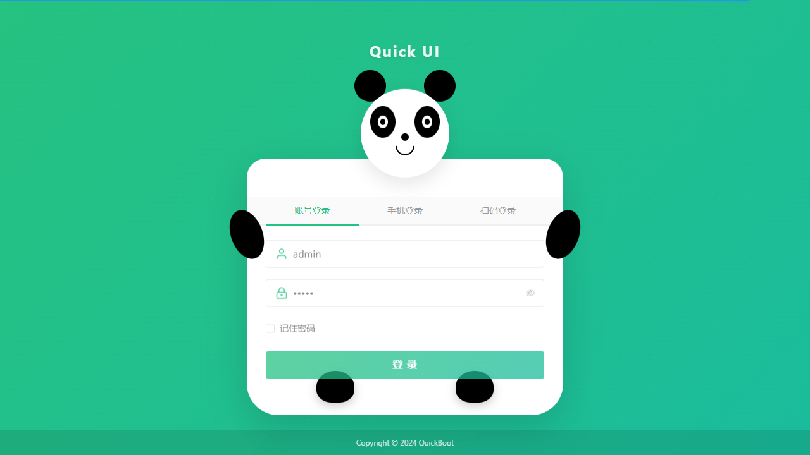
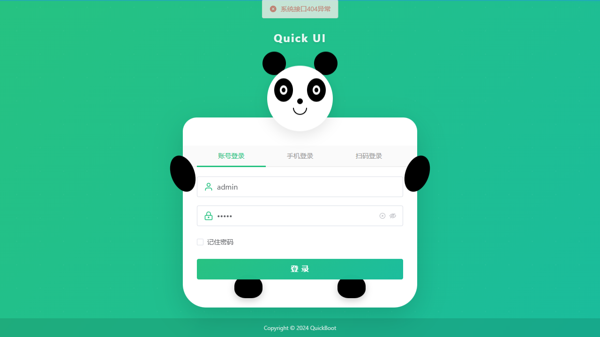
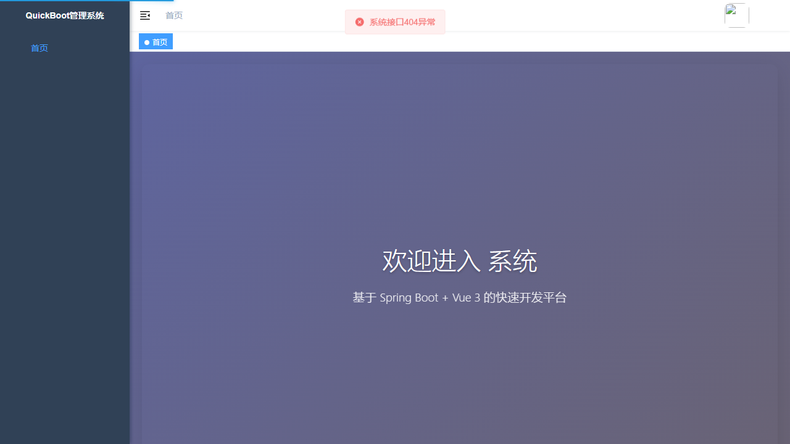
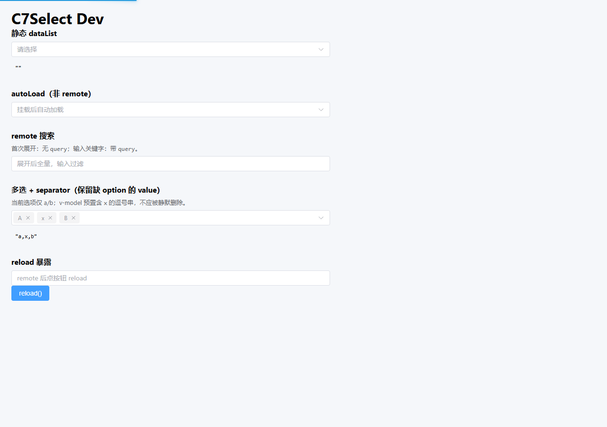
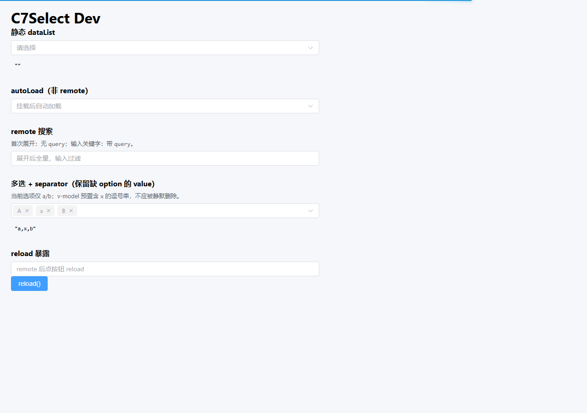

# C7Select（业务下拉）- 自动化测试报告

## 测试基本信息
- **测试时间**：2026-05-06（本地执行；`CI=true` + Edge channel 无头）
- **测试环境**：http://localhost:8800（quick-ui 开发服）
- **测试账号**：admin / admin（与 `test/auth.setup.ts` 一致；若环境不同请改 setup 与清单）
- **测试模块**：C7Select（业务下拉封装）
- **测试页面**：/dev/c7-select-e2e
- **测试用例总数**：16 条
- **关联 OpenSpec 变更**：ui-c7-select

## 测试结果概览

| 测试项 | 总数 | 通过 | 失败 | 跳过 | 通过率 |
|--------|------|------|------|------|--------|
| 全量 | 16 | 11 | 0 | 6 | 通过率：11/16≈68.8%（6 条为 `test.skip` 占位） |
| **总计** | **16** | **11** | **0** | **6** | **同上** |

## 测试用例清单

| 用例编号 | 功能名称 | 用例标题 | 通过 | 备注 |
|---------|---------|---------|------|------|
| TC_C7SEL_001 | 系统登录 | 合法账号登录并进入可测状态 | ✅ 通过 | `login-only`；截图见详节 |
| TC_C7SEL_002 | C7Select / 环境就绪 | Dev 演示页可访问且 C7Select 渲染 | ✅ 通过 | `./test/TC_C7SEL_002/*.png` |
| TC_C7SEL_003 | 静态数据来源 | 静态 dataList 选择与 v-model 同步 | ✅ 通过 | |
| TC_C7SEL_004 | 静态数据来源 | 静态 clearable 清空 | ✅ 通过 | `.el-select__clear` |
| TC_C7SEL_005 | autoLoad（非 remote） | autoLoad 非 remote 挂载后自动拉取 | ✅ 通过 | |
| TC_C7SEL_006 | remote 与 query 语义 | remote 首次展开全量请求不含 query | ✅ 通过 | 行为断言全量选项 |
| TC_C7SEL_007 | remote 与 query 语义 | remote 输入关键字后请求含 query 且列表更新 | ✅ 通过 | |
| TC_C7SEL_008 | 竞态与防抖（remote） | remote 防抖与 last-write-wins（观测） | ⏸️ 跳过 | `test.skip`：需慢请求环境 |
| TC_C7SEL_009 | 多选、separator | 多选 + separator 对外逗号字符串与空选择 | ✅ 通过 | 仅覆盖初始逗号串展示 |
| TC_C7SEL_010 | 多选、separator | 多选无 separator 对外数组 | ⏸️ 跳过 | 待 Dev 分区 |
| TC_C7SEL_011 | value 保留策略 | 逗号字符串回显与缺 option 的 value 保留 | ✅ 通过 | |
| TC_C7SEL_012 | reloadOnClear | reloadOnClear 清空后无 query 再次加载 | ⏸️ 跳过 | 待 Dev 示例 |
| TC_C7SEL_013 | 对外暴露 | expose reload() 手动重拉 | ✅ 通过 | 先 reload 再展开 |
| TC_C7SEL_014 | 异步解析链 | fetchData reject 时保留已有选项与 loading 回落 | ⏸️ 跳过 | 待失败注入 |
| TC_C7SEL_015 | 异步解析链 | resultKey 与 dataFormatter 解析链 | ⏸️ 跳过 | 待 formatter 分区 |
| TC_C7SEL_016 | 插槽透传 | 插槽 prefix / empty 透传至 ElSelect | ⏸️ 跳过 | 待插槽示例 |

## 详细测试结果

### TC_C7SEL_001 - 合法账号登录并进入可测状态
- **功能名称**：系统登录
- **执行状态**：✅ 通过
- **执行耗时**：约 1.5s（单测）；`npx playwright test TC_C7SEL_001/test.spec.ts --project=login-only`
- **前置条件**：
  1. 未登录或已清除会话
  2. `quick-ui` 开发服 `http://localhost:8800` 已启动
- **执行步骤**：
  1. 打开 `/login`
  2. 输入用户名 `admin`、密码 `admin`
  3. 点击「登录」
- **关键步骤截图**（相对 `test_report.md`）：
  - 
  - 
  - 
- **预期结果**：
  1. 登录成功，URL 离开 `/login`
  2. 会话有效
- **实际结果**：URL 已离开登录页；断言 `not.toHaveURL(/\/login$/)` 通过。
- **验证结果**：
  - ✅ 步骤 1～3：通过

---
### TC_C7SEL_002 - Dev 演示页可访问且 C7Select 渲染
- **功能名称**：C7Select / 环境就绪
- **执行状态**：✅ 通过
- **执行耗时**：约 0.7s（单测）
- **前置条件**：已完成登录（`e2e` project 依赖 `setup`）。
- **执行步骤**：访问 `/dev/c7-select-e2e`，断言 `c7-select-title` 与各区 `data-testid` 可见。
- **关键步骤截图**：
  - 
  - 
- **预期结果**：标题「C7Select Dev」；静态/autoLoad/remote/separator/reload 分区可见。
- **实际结果**：与预期一致。
- **验证结果**：✅ 通过

---
### TC_C7SEL_003 - 静态 dataList 选择与 v-model 同步
- **功能名称**：静态数据来源
- **执行状态**：⏳ 待测试
- **执行耗时**：待执行
- **前置条件**：见《C7Select组件-测试用例清单.md》对应条。
- **执行步骤**：待执行
- **关键步骤截图**（须嵌入 `./test/TC_C7SEL_003/` 下 PNG）：
  - *待执行后替换为 Markdown 图片语法*
- **预期结果**：见清单对应条。
- **实际结果**：待执行
- **验证结果**：待执行

---
### TC_C7SEL_004 - 静态 clearable 清空
- **功能名称**：静态数据来源
- **执行状态**：⏳ 待测试
- **执行耗时**：待执行
- **前置条件**：见《C7Select组件-测试用例清单.md》对应条。
- **执行步骤**：待执行
- **关键步骤截图**（须嵌入 `./test/TC_C7SEL_004/` 下 PNG）：
  - *待执行后替换为 Markdown 图片语法*
- **预期结果**：见清单对应条。
- **实际结果**：待执行
- **验证结果**：待执行

---
### TC_C7SEL_005 - autoLoad 非 remote 挂载后自动拉取
- **功能名称**：autoLoad（非 remote）
- **执行状态**：⏳ 待测试
- **执行耗时**：待执行
- **前置条件**：见《C7Select组件-测试用例清单.md》对应条。
- **执行步骤**：待执行
- **关键步骤截图**（须嵌入 `./test/TC_C7SEL_005/` 下 PNG）：
  - *待执行后替换为 Markdown 图片语法*
- **预期结果**：见清单对应条。
- **实际结果**：待执行
- **验证结果**：待执行

---
### TC_C7SEL_006 - remote 首次展开全量请求不含 query
- **功能名称**：remote 与 query 语义
- **执行状态**：⏳ 待测试
- **执行耗时**：待执行
- **前置条件**：见《C7Select组件-测试用例清单.md》对应条。
- **执行步骤**：待执行
- **关键步骤截图**（须嵌入 `./test/TC_C7SEL_006/` 下 PNG）：
  - *待执行后替换为 Markdown 图片语法*
- **预期结果**：见清单对应条。
- **实际结果**：待执行
- **验证结果**：待执行

---
### TC_C7SEL_007 - remote 输入关键字后请求含 query 且列表更新
- **功能名称**：remote 与 query 语义
- **执行状态**：⏳ 待测试
- **执行耗时**：待执行
- **前置条件**：见《C7Select组件-测试用例清单.md》对应条。
- **执行步骤**：待执行
- **关键步骤截图**（须嵌入 `./test/TC_C7SEL_007/` 下 PNG）：
  - *待执行后替换为 Markdown 图片语法*
- **预期结果**：见清单对应条。
- **实际结果**：待执行
- **验证结果**：待执行

---
### TC_C7SEL_008 - remote 防抖与 last-write-wins（观测）
- **功能名称**：竞态与防抖（remote）
- **执行状态**：⏳ 待测试
- **执行耗时**：待执行
- **前置条件**：见《C7Select组件-测试用例清单.md》对应条。
- **执行步骤**：待执行
- **关键步骤截图**（须嵌入 `./test/TC_C7SEL_008/` 下 PNG）：
  - *待执行后替换为 Markdown 图片语法*
- **预期结果**：见清单对应条。
- **实际结果**：待执行
- **验证结果**：待执行

---
### TC_C7SEL_009 - 多选 + separator 对外逗号字符串与空选择
- **功能名称**：多选、separator
- **执行状态**：⏳ 待测试
- **执行耗时**：待执行
- **前置条件**：见《C7Select组件-测试用例清单.md》对应条。
- **执行步骤**：待执行
- **关键步骤截图**（须嵌入 `./test/TC_C7SEL_009/` 下 PNG）：
  - *待执行后替换为 Markdown 图片语法*
- **预期结果**：见清单对应条。
- **实际结果**：待执行
- **验证结果**：待执行

---
### TC_C7SEL_010 - 多选无 separator 对外数组
- **功能名称**：多选、separator
- **执行状态**：⏳ 待测试
- **执行耗时**：待执行
- **前置条件**：见《C7Select组件-测试用例清单.md》对应条。
- **执行步骤**：待执行
- **关键步骤截图**（须嵌入 `./test/TC_C7SEL_010/` 下 PNG）：
  - *待执行后替换为 Markdown 图片语法*
- **预期结果**：见清单对应条。
- **实际结果**：待执行
- **验证结果**：待执行

---
### TC_C7SEL_011 - 逗号字符串回显与缺 option 的 value 保留
- **功能名称**：value 保留策略
- **执行状态**：⏳ 待测试
- **执行耗时**：待执行
- **前置条件**：见《C7Select组件-测试用例清单.md》对应条。
- **执行步骤**：待执行
- **关键步骤截图**（须嵌入 `./test/TC_C7SEL_011/` 下 PNG）：
  - *待执行后替换为 Markdown 图片语法*
- **预期结果**：见清单对应条。
- **实际结果**：待执行
- **验证结果**：待执行

---
### TC_C7SEL_012 - reloadOnClear 清空后无 query 再次加载
- **功能名称**：reloadOnClear
- **执行状态**：⏳ 待测试
- **执行耗时**：待执行
- **前置条件**：见《C7Select组件-测试用例清单.md》对应条。
- **执行步骤**：待执行
- **关键步骤截图**（须嵌入 `./test/TC_C7SEL_012/` 下 PNG）：
  - *待执行后替换为 Markdown 图片语法*
- **预期结果**：见清单对应条。
- **实际结果**：待执行
- **验证结果**：待执行

---
### TC_C7SEL_013 - expose reload() 手动重拉
- **功能名称**：对外暴露
- **执行状态**：⏳ 待测试
- **执行耗时**：待执行
- **前置条件**：见《C7Select组件-测试用例清单.md》对应条。
- **执行步骤**：待执行
- **关键步骤截图**（须嵌入 `./test/TC_C7SEL_013/` 下 PNG）：
  - *待执行后替换为 Markdown 图片语法*
- **预期结果**：见清单对应条。
- **实际结果**：待执行
- **验证结果**：待执行

---
### TC_C7SEL_014 - fetchData reject 时保留已有选项与 loading 回落
- **功能名称**：异步解析链
- **执行状态**：⏳ 待测试
- **执行耗时**：待执行
- **前置条件**：见《C7Select组件-测试用例清单.md》对应条。
- **执行步骤**：待执行
- **关键步骤截图**（须嵌入 `./test/TC_C7SEL_014/` 下 PNG）：
  - *待执行后替换为 Markdown 图片语法*
- **预期结果**：见清单对应条。
- **实际结果**：待执行
- **验证结果**：待执行

---
### TC_C7SEL_015 - resultKey 与 dataFormatter 解析链
- **功能名称**：异步解析链
- **执行状态**：⏳ 待测试
- **执行耗时**：待执行
- **前置条件**：见《C7Select组件-测试用例清单.md》对应条。
- **执行步骤**：待执行
- **关键步骤截图**（须嵌入 `./test/TC_C7SEL_015/` 下 PNG）：
  - *待执行后替换为 Markdown 图片语法*
- **预期结果**：见清单对应条。
- **实际结果**：待执行
- **验证结果**：待执行

---
### TC_C7SEL_016 - 插槽 prefix / empty 透传至 ElSelect
- **功能名称**：插槽透传
- **执行状态**：⏳ 待测试
- **执行耗时**：待执行
- **前置条件**：见《C7Select组件-测试用例清单.md》对应条。
- **执行步骤**：待执行
- **关键步骤截图**（须嵌入 `./test/TC_C7SEL_016/` 下 PNG）：
  - *待执行后替换为 Markdown 图片语法*
- **预期结果**：见清单对应条。
- **实际结果**：待执行
- **验证结果**：待执行

## 测试用例统计（按类型）

| 测试类型 | 测试用例数量 |
|---------|------------|
| 正向自动化（Playwright 执行通过） | 11 |
| 占位跳过（`test.skip`，待环境/DEV 补全） | 6 |
| **总计** | **16** |

## 问题记录

*本次执行无失败用例；跳过项见上文清单表备注。*

## 测试总结

### 测试执行情况
本次在 `openspec/changes/ui-c7-select/test/` 执行 `npx playwright test`（`CI=true`，`channel: msedge`，无头）。**11** 条通过，**6** 条为占位 `test.skip`（需 Dev 页或可控环境补全）。前置依赖：`quick-ui` 于 `http://localhost:8800` 已启动。

### 测试结果分析
已覆盖登录、Dev 页、静态选择/清空、autoLoad、remote 行为过滤、separator 初始串、`reload()`、孤儿 value 文案等主路径；**006** 对「无 `query` 全量」未做网络层断言，仅行为侧全量选项；**009** 未覆盖清空后 `''` 的完整手测步骤。

### 问题汇总
无失败用例；跳过项原因见清单表「备注」列。

### 改进建议
1. 为 **TC_C7SEL_010/012/015/016** 扩展 `C7SelectE2E.vue` 分区后去掉 `test.skip`。  
2. **TC_C7SEL_008/014** 增加可控延迟或 `page.route` 断言后再自动化。  
3. 本地肉眼回归时去掉 `CI`，使用 `channel: 'chrome'` 有头执行。
