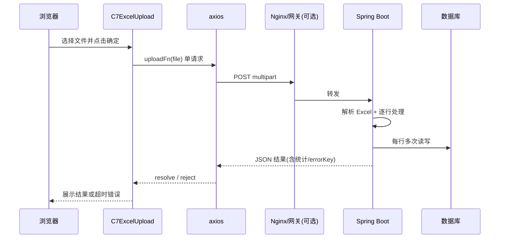
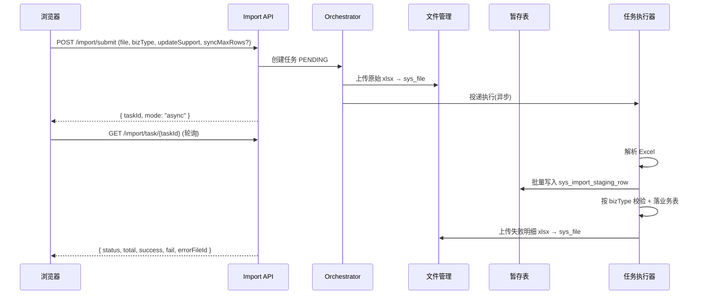

# Excel 导入大批量超时处理设计

> 状态：**已实现**（OpenSpec：`excel-import-async-center`，27/30 任务；余下为单测与文档维护）；classify 实际为 `import-source` / `import-error`（无斜杠，受 `FilePathSupport` 约束）  
> 关联：`原始需求/需求.md`（导入中心 / 实时 vs 异步）、`docs/superpowers/specs/2026-05-10-excel-tool-design.md`、`openspec/changes/excel-tool-common-platform/design.md`  
> 文件管理：`quickboot-system` → `SysFileService` / `FileAccessService`（`sys_file` + `qc.file.classifies`）  
> **导出简化（设计稿）**：`sdd/Excel导出编排简化设计.md` — 同步直出 Blob、异步仍走任务与导入导出中心

## 1. 背景与问题

当前 Excel 导入采用 **「单次 HTTP 请求同步处理到底」** 模式：前端上传文件后一直等待，后端在同一请求线程内完成解析、校验、落库并返回统计结果。当 Excel 行数较多、单行业务较重（多表写入、多次查询）时，**总耗时容易超过前端或网关的超时阈值**，页面表现为：

- 前端提示「接口超时」或网络错误；
- 后端可能仍在继续处理（用户误以为失败，可能重复提交）；
- 即使处理完成，浏览器已断开，用户看不到成功/失败统计与失败明细下载入口。

本设计在 **不改动现有小批量体验** 的前提下，给出超时根因、分层策略与推荐演进路径（含与「导入中心 / 异步导入」愿景的对齐）。

---

## 2. 现状分析

### 2.1 端到端链路



### 2.2 前端

| 项 | 现状 | 影响 |
|----|------|------|
| HTTP 客户端 | `quick-ui/src/utils/request.js` 全局 **`timeout: 10000`（10s）** | 导入请求未单独放宽，**10s 是主要显性超时** |
| 组件 | `C7ExcelUpload`：`uploading` 期间 `await uploadFn(...)`，无进度、无轮询 | 长时间无反馈，用户易重复点击 |
| 导入 API | 如 `importUser` 走默认 `request()`，**未传 `timeout` 覆盖** | 与用户/角色/字典等模块一致 |

### 2.3 后端

| 模块 | 解析方式 | 处理模式 | 事务 | 典型耗时因素 |
|------|----------|----------|------|----------------|
| 用户 `SysUserServiceImpl#importData` | `ExcelUtils.importExcel` **全量 `doReadSync`** | for 循环 `processImportRow` | 单行 `create`/`update` 各自 `@Transactional` | 每行：部门校验、用户查询、`create`/`update`（多表） |
| 角色 `SysRoleServiceImpl#importData` | 监听器 **逐行回调** | 回调内 `importOneRoleRow` | **整次导入方法 `@Transactional`** | 大行数时 **长事务 + 锁持有** |
| 字典类型等 | 监听器逐行 | 回调内 insert/update | 方法级 `@Transactional` | 相对轻量，大行数仍受 HTTP 超时约束 |

公共能力（`quickboot-common`）已具备：

- 监听器回调、`ExcelImportResult`、失败信息聚合；
- OpenSpec 已提出「异步任务 + 查询进度」为开放问题（`excel-tool-common-platform/design.md` §Open Questions）。

失败明细：

- 用户：内存 `ConcurrentHashMap` + `errorKey`，`GET /importError` 下载 xlsx（TTL 15 分钟）；
- 字典/角色等：`ExcelImportResult` 内 **失败摘要 Base64 文本**（非 xlsx），与 `C7ExcelUpload` 的 `errorFileBase64` 展示路径部分对齐。

### 2.4 基础设施与其它超时点

| 层级 | 配置现状 | 说明 |
|------|----------|------|
| Spring multipart | `max-file-size: 100MB` | 文件可上传，**不等于**处理能在 10s 内完成 |
| Redis | `timeout: 10000ms` | 与 HTTP 无关；导入缓存用户侧为 **JVM 内存 Map** |
| Nginx | 文档未统一约定 `proxy_read_timeout` | 生产若默认 60s，**仍可能小于实际处理时间**；且 **先于后端完成也会被前端 10s 截断** |

### 2.5 根因归纳

1. **同步长连接**：一次请求承担「上传 + 全量解析 + 全量落库 + 生成失败文件」。
2. **前端超时过短且全局**：10s 对批量导入不合理。
3. **性能未按批量优化**：全量读入内存、逐行多次 DB、部分模块整表大事务。
4. **缺少任务语义**：无 `taskId`、无进度、无法「提交后继续查结果」。

---

## 3. 目标与非目标

### 3.1 目标

1. **小批量（实时导入）**：保持「选文件 → 一次请求 → 立即展示成功/失败数」，体验与现网一致。
2. **大批量**：避免页面超时；用户可离开页面后通过 **任务状态 / 导入中心** 查看结果并下载失败 Excel。
3. **行为可预期**：明确行数/耗时阈值、重复提交防护、失败可追溯。
4. **与平台规划一致**：为 `原始需求/需求.md` 中的 **导入中心、实时/异步分流** 预留扩展点。

### 3.2 非目标（本期设计）

1. 不规定具体 ORM 批处理实现细节（业务模块自选）。
2. 不替代已有 `ExcelUtils` 工具设计，仅补充 **导入编排层（Import Orchestrator）**。
3. 不在本阶段实现代码（仅方案）。

---

## 4. 方案选型

### 4.1 方案对比

| 方案 | 做法 | 优点 | 缺点 | 建议 |
|------|------|------|------|------|
| A. 仅调大超时 | axios/nginx 调到 5–30min | 改动极小 | 仍占连接/线程；网关、LB、浏览器不稳定；失败无任务态 | **仅作临时止血**，不作长期方案 |
| B. 同步性能优化 | 流式读、预加载字典、批量写、拆事务 | 延迟下降，小中批量够用 | 超大文件仍可能超 nginx/线程池；无法解决「用户关页」 | **与 C/D 并行**，作为实时路径内核 |
| C. 异步任务 + 轮询 | 上传落盘/暂存 → 后台 Job → 查状态 | 彻底脱离 HTTP 长连接；可接 Quartz | 需任务表、UI 进度、幂等 | **大批量推荐主路径** |
| D. 混合阈值 | 行数 &lt; N 走同步，≥ N 走异步 | 兼顾体验与稳定 | 需预估行数（可先解析表头+采样或仅按文件大小粗判） | **推荐对外产品形态** |

**推荐组合：D（混合）+ B（同步路径优化）+ 导入中心（C 的任务列表 UI）**。

### 4.2 与原始需求的对齐

`原始需求/需求.md` 已描述：

- **实时导入**：维持现有逻辑；
- **异步导入**：先落入暂存表 → 按业务编码调用校验/插入 → 页面展示成功/失败数 → 可导出失败 Excel。

本设计将「暂存表」落实为 **平台级导入任务表 + 必选暂存行表**，业务编码即 `bizType`（如 `system:user`、`system:role`）。

### 4.3 已确认决策（2026-06-03）

| # | 议题 | 结论 |
|---|------|------|
| 1 | 同步行数上限 | **默认 500**；在 **`application.yml`（`qc.import.sync.max-rows`）** 可配置；上传时可通过请求参数 **`syncMaxRows`**（或 `importMode` 配套）**覆盖**本次阈值 |
| 2 | 异步暂存表 | **必须**：异步路径 **首期即** 使用 `sys_import_staging_row`，先落暂存再按 `bizType` 调度校验与落库 |
| 3 | 文件存储 | **统一走文件管理**：原始 xlsx、失败明细 xlsx 经 `FileAccessService` / `SysFileService` 上传并登记 `sys_file`，任务表存 `file_id` / `error_file_id` |
| 4 | 导入中心 UI | **与导出中心合并为一期**（「导入导出中心」），列表同时展示导入任务与导出记录（或 Tab 切换） |

---

## 5. 推荐架构

### 5.1 逻辑分层

```
┌─────────────────────────────────────────────────────────┐
│ 前端：C7ExcelUpload / 导入中心页                         │
│  - 实时：长超时可选 + 同步结果                            │
│  - 异步：提交 → taskId → 轮询/通知 → 结果与失败文件下载    │
└───────────────────────────┬─────────────────────────────┘
                            │
┌───────────────────────────▼─────────────────────────────┐
│ Import API（quickboot-web 或独立 import 模块）            │
│  POST /import/submit   POST /import/sync（兼容旧路径）    │
│  GET  /import/task/{id}  GET /import/task/{id}/errorFile │
└───────────────────────────┬─────────────────────────────┘
                            │
┌───────────────────────────▼─────────────────────────────┐
│ Import Orchestrator（common 或 system 平台服务）         │
│  - 阈值判断 sync vs async                                │
│  - 文件存储（文件管理 classify=import/*）                 │
│  - 任务状态机                                            │
└───────────────────────────┬─────────────────────────────┘
                            │
         ┌──────────────────┼──────────────────┐
         ▼                  ▼                  ▼
   BizImportHandler   Quartz/异步线程池    失败明细生成
   (按 bizType 注册)   执行 parse+validate+persist
```

### 5.2 同步路径（实时导入）优化要点

在保持 **同一 HTTP 响应返回 `ExcelImportResult` / `UserImportResultVo`** 的前提下：

1. **解析**：统一改为监听器 **流式读**，避免 `doReadSync` 大 List（用户模块迁移）。
2. **DB**：业务 Handler 内预加载（如全部 `roleKey`、部门 ID 集合），减少每行 `selectOne`。
3. **事务**：避免整文件一个大 `@Transactional`（角色导入需拆分：按批 commit 或行级事务 + 失败继续）。
4. **上限**：默认 **`qc.import.sync.max-rows=500`**（配置文件）；请求可传 **`syncMaxRows`** 覆盖本次上限；超限 **拒绝同步** 并提示/自动走异步。
5. **前端**：同步请求单独 `timeout`（如 120000–300000ms），与全局 10s 分离；`C7ExcelUpload` 展示「处理中，请勿关闭」。

### 5.3 异步路径（大批量）

#### 5.3.1 提交流程



#### 5.3.2 任务状态机

| 状态 | 含义 |
|------|------|
| `PENDING` | 已创建，待执行 |
| `RUNNING` | 执行中（可带 `processed/total` 进度） |
| `SUCCESS` | 全部成功或「有失败但任务完成」 |
| `FAILED` | 系统级失败（文件损坏、Handler 未注册、存储不可用） |
| `CANCELLED` | 用户或管理员取消（可选二期） |

**业务行失败**不将任务置为 `FAILED`，而是 `SUCCESS` + `failCount > 0`，与用户导入现语义一致。

#### 5.3.2.1 异步存储语义（原始文件 + 行级暂存）

异步导入**同时**保留两份数据，不是二选一：

| 存储 | 表/对象 | 时机 | 用途 |
|------|---------|------|------|
| 原始 Excel | `sys_file` + `sys_import_task.source_file_id` | 提交上传时 | 留档、LOAD 阶段读流解析、审计 |
| 解析后每行 | `sys_import_staging_row.row_json` | LOAD 阶段 | PROCESS 阶段按行校验落库、行级 `OK/FAIL/error_msg`、进度 `processed_rows` |

同步路径（≤ 阈值）默认**不写 staging**，流式解析后直接 `BizImportHandler.processRow`；失败明细仍生成 xlsx 并登记 `error_file_id`（`errorKey` 为 `file:{fileId}`）。

#### 5.3.3 数据模型（平台表草案）

**`sys_import_task`（导入任务主表）**

| 字段 | 说明 |
|------|------|
| `task_id` | 主键 |
| `biz_type` | 业务编码，如 `system:user` |
| `source_file_id` | 原始 xlsx，关联 `sys_file.file_id` |
| `error_file_id` | 失败明细 xlsx，关联 `sys_file.file_id`（可空） |
| `import_mode` | `sync` / `async` |
| `sync_max_rows` | 本次任务使用的同步上限（快照，便于审计） |
| `duplicate_strategy` | `ignore` / `overwrite` |
| `status` | 状态机 |
| `total_rows` / `success_rows` / `fail_rows` | 统计 |
| `processed_rows` | 异步进度（已处理暂存行数） |
| `error_message` | 系统失败原因 |
| `create_by` / `create_time` / `finish_time` | 审计 |

**`sys_import_staging_row`（异步暂存行表，必选）**

| 字段 | 说明 |
|------|------|
| `id` | 主键 |
| `task_id` | 关联任务 |
| `row_no` | Excel 行号（含表头偏移，与失败明细一致） |
| `row_json` | 行数据 JSON（与业务 `*ImportExcelRow` 字段对齐） |
| `validate_status` | `PENDING` / `OK` / `FAIL` / `SKIPPED` |
| `error_msg` | 校验或落库失败原因 |
| `biz_ref` | 可选，落库后的业务主键快照 |

**异步执行阶段（固定两阶段）**

1. **LOAD**：EasyExcel 流式解析 → 批量 insert `sys_import_staging_row`（`validate_status=PENDING`），更新 `total_rows`。
2. **PROCESS**：按 `biz_type` 调用注册的 `BizImportHandler`，逐行或分批读取暂存行 → 校验 + 写业务表 → 更新行状态；失败行汇总生成 xlsx 上传文件管理。

同步路径（≤ 阈值）：可 **不落 staging**，直接监听器 + Handler（与现网一致）；若需与异步共用审计，可选「同步也写 staging」作为配置项（默认关闭）。

#### 5.3.4 业务扩展点

```java
// 语义示意，非最终实现
interface BizImportHandler {
  String bizType();
  /** 同步/异步共用：处理已解析的一行或一批 */
  void handleRow(ImportContext ctx, Object rowDto);
  Class<?> rowClass();
}
```

- 各模块将现有 `importData` 逻辑迁入 Handler；
- Orchestrator 负责 EasyExcel 监听、进度回写、失败明细统一生成（复用 `ExcelImportResult` 规则）。

#### 5.3.5 执行器

- 优先复用现有 **Quartz**（`quickboot-tools` job 模块）：任务类型 `IMPORT_TASK`，或 Spring `@Async` + 有限队列（需线程池与背压配置）。
- **单任务单线程顺序处理行**，避免同一文件并发写库；**全局并发上限**（如同时 3 个导入任务）防止拖垮 DB。

#### 5.3.6 失败明细

- 统一产出 **xlsx**，经 **`SysFileService.upload(file, "import/error")`**（或等价 classify）登记；
- 下载：优先 **`GET /system/file/download/{errorFileId}`**（复用文件管理权限）；任务接口可 302 或返回 `fileId`；
- **禁止**超大 Base64 塞进 JSON（OpenSpec 已提示风险）。

#### 5.3.7 文件管理与 classify 约定

在 `qc.file.classifies` 中新增（示例）：

| classify | 用途 | 说明 |
|----------|------|------|
| `import/source` | 用户上传的原始 Excel | 任务创建时上传 |
| `import/error` | 失败明细 Excel | 任务完成后上传 |

任务表仅存 **`source_file_id` / `error_file_id`**，不存裸路径；清理策略与 `qc.import.file.retention-days` 联动（逻辑删 `sys_file` + 存储对象删除，与文件管理批量删除一致）。

### 5.4 混合阈值策略

**有效上限** = `请求.syncMaxRows ?? 配置.qc.import.sync.max-rows`（默认 **500**）。

| 条件 | 模式 |
|------|------|
| 解析后有效行数 ≤ 有效上限，且 `mode` 非 `async` | **同步**（兼容现有 API） |
| 有效行数 &gt; 有效上限，或 `mode=async` | **异步**（staging + 后台 Job），立即返回 `taskId` |
| 文件大小 &gt; `sync.max-mb`（辅助） | 建议异步（解析前快速估行） |

**上传时可指定**（`POST /import/submit` 或旧接口扩展 query/form）：

| 参数 | 说明 |
|------|------|
| `syncMaxRows` | 整数，覆盖配置默认 500；须 ≤ 平台硬顶（如 2000，防滥用） |
| `mode` | `sync` / `async`；`async` 强制走异步，忽略行数 |

前端 `C7ExcelUpload` 扩展：

- Props 可选 `syncMaxRows`、`forceAsync`；
- `uploadFn` 返回 `{ mode, taskId?, ...result }`；
- `mode === 'async'` 时轮询或跳转 **导入导出中心** 任务详情。

### 5.5 导入导出中心（UI，与异步同期一期）

- **合并入口**：菜单「导入导出中心」（对齐 `原始需求` 导出和导入中心）。
- **导入 Tab**：当前用户导入任务分页（`biz_type`、状态、时间、成功/失败、`processed/total`）；详情页轮询进度；完成后通过 `error_file_id` 下载失败 Excel。
- **导出 Tab**：复用现有导出记录/下载能力（与导入并列，统一列表组件与权限前缀如 `system:io:center`）。
- 业务页 `C7ExcelUpload` 异步完成后可提供「前往导入中心查看」链接。

---

## 6. API 设计草案

### 6.1 新接口（异步）

| 方法 | 路径 | 说明 |
|------|------|------|
| POST | `/import/submit` | multipart：`file`、`bizType`、`updateSupport`；可选 `mode`、`syncMaxRows` |
| GET | `/import/task/{taskId}` | 查询状态、进度、统计、`errorFileId` |
| GET | `/import/task/list` | 导入导出中心 — 导入任务分页 |
| GET | `/system/file/download/{fileId}` | 失败明细下载（复用文件管理，推荐） |

### 6.2 兼容旧接口

- 保留 `POST /system/user/importData` 等；
- 内部委托 Orchestrator：`行数 ≤ 阈值` 走同步 Handler，否则返回业务码 **`IMPORT_ASYNC_REQUIRED`** + `taskId`（或 307 类提示），前端引导异步。

---

## 7. 前端改造要点

1. **`request.js`**：不提高全局 timeout；新增 `importRequest(config)` 默认 120s–300s，仅导入使用。
2. **`C7ExcelUpload`**：
   - 支持 `onProgress`、`taskId` 轮询钩子；
   - 异步时按钮文案「后台导入中…」；
   - 防重复提交：`uploading` + 后端幂等键（`fileMd5 + bizType + userId` 可选）。
3. **错误提示**：区分 `timeout`（可提示「已转后台任务」若后端支持）、业务失败、系统失败。

---

## 8. 运维与配置

| 配置项 | 默认 | 说明 |
|--------|------|------|
| `qc.import.sync.max-rows` | **500** | 超过走异步；可被请求 `syncMaxRows` 覆盖 |
| `qc.import.sync.max-rows-cap` | 2000 | 请求覆盖时的硬顶 |
| `qc.import.sync.timeout-seconds` | 120 | 供文档与 nginx 对齐 |
| `qc.import.async.max-concurrent` | 3 | 全局并发 |
| `qc.import.staging.batch-size` | 200 | 暂存表批量 insert 大小 |
| `qc.import.file.retention-days` | 7 | 任务结束后清理 `sys_file`（import/*） |
| `qc.file.classifies.import/source` | （文件管理） | 原始 Excel |
| `qc.file.classifies.import/error` | （文件管理） | 失败明细 |
| nginx `proxy_read_timeout` | ≥ 同步上限 | 仅同步路径需要 |

---

## 9. 风险与缓解

| 风险 | 缓解 |
|------|------|
| 异步任务重复提交 | `taskId` + 文件 hash 去重；按钮禁用 |
| 后端仍在跑、前端已超时 | 异步化；同步路径加长超时并提示勿关闭 |
| 长事务锁表（角色导入） | 拆分事务、分批提交 |
| 失败文件过大 | 行数上限、失败明细条数 cap、存盘走下载接口 |
| 多节点部署内存 `errorKey` 失效 | 废弃内存 cache；失败文件统一 `sys_file` + `error_file_id` |
| 暂存表膨胀 | 任务结束按 `task_id` 归档或定期清理 staging 行 |

---

## 10. 实施分期建议

| 阶段 | 内容 | 验证 |
|------|------|------|
| P0 止血 | 导入 API 单独 timeout；nginx 文档；`qc.import.sync.max-rows=500` + 请求 `syncMaxRows` | ≤500 行同步不再 10s 必断 |
| P1 同步优化 | 用户导入改监听器；角色拆事务；预加载缓存 | 500 行耗时下降可测 |
| P2 平台表与文件 | Flyway：`sys_import_task`、`sys_import_staging_row`；`import/source`、`import/error` classify；Orchestrator 接文件管理 | 上传后 `sys_file` 有记录 |
| P3 异步流水线 | LOAD→staging→PROCESS（按 bizType Handler）；Quartz；失败 xlsx 入文件管理 | 5000 行 3s 内返回 taskId；staging 可查询 |
| P4 导入导出中心 | 与导出中心合并 UI + API 列表；`C7ExcelUpload` 异步/轮询 | 历史任务可下载失败文件 |
| P5 业务迁移 | 用户/角色/字典等接入 Orchestrator；旧 `importData` 委托或标记废弃 | 回归小文件同步、大文件异步 |

---

## 11. 验收标准

1. **500 行**用户导入：同步模式下页面 **不** 出现默认 10s axios 超时（在 P0+P1 后）。
2. **5000 行**：提交后 **3 秒内** 返回 `taskId`，页面可关闭；稍后查询得到正确 `total/success/fail`。
3. 失败行可下载 **xlsx**，且与统计一致。
4. 旧接口调用方无 taskId 时，小文件行为与现网一致（回归用户/角色/字典导入）。

### 11.1 手工验收清单（8.1）

| # | 场景 | 操作 | 预期 |
|---|------|------|------|
| M1 | 同步 ≤500 行 | 用户管理导入约 100 行（含若干故意错误行） | 一次请求返回统计；`errorKey` 为 `file:{id}` 时可下载失败 xlsx |
| M2 | 异步 >500 行 | 导入约 5000 行或 `mode=async` | 3s 内返回 `taskId`；导入导出中心可见进度；`sys_import_staging_row` 有数据；完成后可下失败文件 |
| M3 | 双存储 | 异步任务 RUNNING 时查库 | `source_file_id` 非空；staging 行 `validate_status` 由 PENDING 变为 OK/FAIL |
| M4 | 回退路径 | `qc.import.enabled=false` 后用户 `importData` | 仍流式解析；失败明细为 `file:` 而非内存 UUID |

自动化：`ImportSubmitMapperTest`（`quickboot-web`）覆盖同步/异步结果映射。

---

## 12. 已确认问题（2026-06-03）

见 **§4.3**。实现前若调整须同步更新本文与 OpenSpec 变更说明。

---

## 13. 附录：现状代码索引

| 位置 | 说明 |
|------|------|
| `quick-ui/src/utils/request.js` | `timeout: 10000` |
| `quick-ui/src/packages/C7ExcelUpload/index.vue` | 同步 `await uploadFn` |
| `quick-ui/src/api/system/user.js` | `importUser` 无超时覆盖 |
| `SysUserServiceImpl#importData` | 全量读 + 循环处理 |
| `SysRoleServiceImpl#importData` | `@Transactional` 整表 |
| `DictTypeServiceImpl#importData` | 监听器逐行 |
| `ExcelImportResult` | 失败 Base64 文本 |
| `原始需求/需求.md` L8 | 实时/异步产品描述 |
| `SysFileService` / `FileAccessService` | 文件上传、下载、`sys_file` 登记 |
| `qc.file.classifies` | 需扩展 `import/source`、`import/error` |
