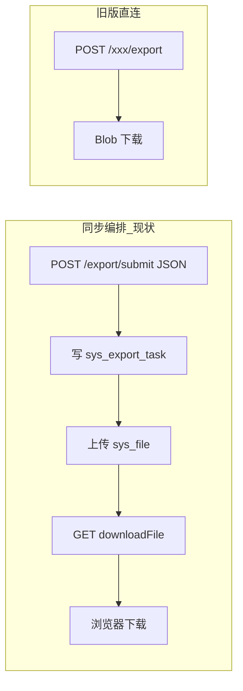
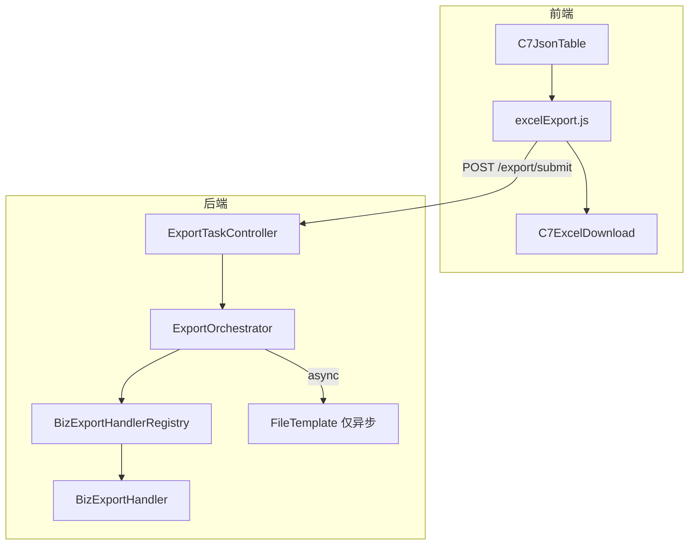
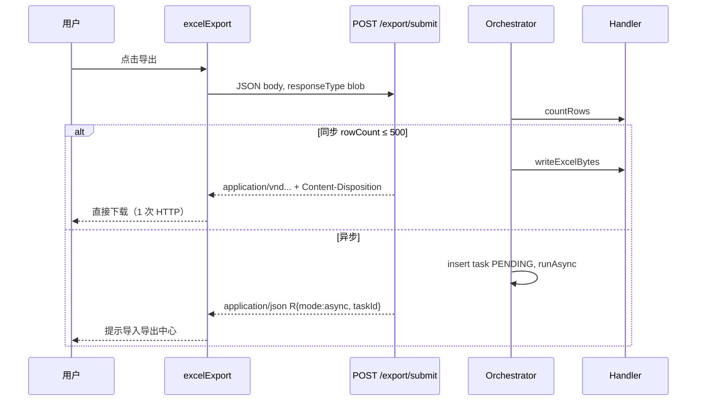

# Excel 导出编排简化设计（薄编排）

> **状态**：设计稿（§14 已确认；**E1～E2 薄编排待实现**；§15 流式为二期）  
> **日期**：2026-06-03  
> **关联**：`sdd/Excel导入大批量超时处理设计.md`（导入编排与导入导出中心）、`docs/docs/backend/modules/import-export-center.md`（现网说明）、OpenSpec `excel-import-async-center`  
> **动机**：现网导出编排对 **同步小数据** 也走「任务表 + 文件中心 + 二次 HTTP 下载」，与旧版「单接口 Blob」双轨并存，开发与使用成本高；本文给出简化后的目标架构与分阶段落地方式。

---

## 1. 背景与问题

### 1.1 业务背景

- 列表页普遍需要 **按当前筛选条件导出 Excel**。
- 日志类数据（登录日志、操作日志）行数可达数千～数万，**同步长连接**易触发前端 `timeout`、网关 `proxy_read_timeout` 或线程长时间占用。
- 产品侧已有 **「导入导出中心」**，用于查看异步任务与补下载结果文件（对齐 `原始需求/需求.md`）。

### 1.2 现网实现（2026-06 已实现）

| 维度 | 说明 |
|------|------|
| 平台 API | `POST /export/submit`（JSON）、`GET /export/task/{id}`、`GET /export/task/list` |
| 编排 | `ExportOrchestratorServiceImpl`：`countRows` → 行数 &gt; `syncMaxRows`（默认 500）则异步，否则同步 |
| 结果落盘 | 同步/异步均：`BizExportHandler.writeExcelBytes` → `FileTemplate.upload(export-result)` → `sys_file` → `sys_export_task.result_file_id` |
| 前端（编排） | `export-biz-type` → `runPlatformExport` → `submitExport` → **`downloadFile(resultFileId)` 第二次请求** |
| 前端（旧版） | `exportFunction` → `downloadRequest('/xxx/export')` → **一次请求即 Blob** |
| 已接入编排 | 仅 `monitor:logininfor`、`monitor:operlog` |
| 仍走旧版 | 用户、角色、字典、配置、定时任务、慢 SQL 等 |

### 1.3 现网痛点（为何「过于复杂」）



| # | 痛点 | 影响 |
|---|------|------|
| P1 | **同步也两跳 HTTP** | 小数据导出多一次 RTT；与 RuoYi 习惯不一致 |
| P2 | **同步也写任务表 + 文件中心** | 概念重；用户不会在中心找「刚点完就下完」的任务 |
| P3 | **双轨 API 并存** | 同一业务（如登录日志）仍有 `POST /monitor/logininfor/export` 与 Handler 两套入口 |
| P4 | **页面接入方式分裂** | `exportFunction` vs `export-biz-type` + `exportQueryNormalizer` |
| P5 | **与导入不对称** | 导入同步返回 JSON 统计合理；导出同步应返回 **文件流** 更自然 |

### 1.4 根因归纳

编排层 **复用了异步路径的落盘模型**，未区分「同步 = 即时下载」与「异步 = 任务 + 中心」两种产品语义。

---

## 2. 目标与非目标

### 2.1 目标

1. **小批量导出（≤ 同步阈值）**：用户体验与旧版一致 —— **一次 HTTP，响应体为 Excel（Blob）**，无 `resultFileId` 二次下载。
2. **大批量导出（&gt; 同步阈值）**：保持异步任务 + `sys_export_task` + 文件管理 + **导入导出中心** 查看/下载。
3. **统一业务实现**：每个 `bizType` 仅维护 **`BizExportHandler`**（或 Service 方法），同步直出与异步落盘共用 `writeExcelBytes`。
4. **前端收敛**：列表页优先只配置 **`export-biz-type`**；`C7JsonTable` 内封装 query 规范化与同步/异步分支。
5. **可配置、可观测**：阈值、是否写同步任务审计、超时与 nginx 文档对齐。

### 2.2 非目标

1. 不在本方案中改造 **未接入编排** 的业务页（用户/角色等）的导出实现，除非进入分期迁移。
2. 不引入分片导出、多 Sheet 合并、邮件推送等扩展能力。
3. 不改变 **导入** 编排语义（导入同步返回 JSON 统计不变）。
4. 不要求一期删除所有 `POST /xxx/export`（可标记废弃并委托，见 §8）。

---

## 3. 设计原则

| 原则 | 说明 |
|------|------|
| **薄编排** | 编排只解决「行数分流 + 异步任务 + 中心」；同步路径不引入文件中心 |
| **单请求单语义** | 同步：响应 = 文件；异步：响应 = JSON `{ mode, taskId }` |
| **Handler 单一真相** | 导出 SQL/Excel 生成只在 Handler（或其所调 Service）实现一次 |
| **渐进迁移** | 旧 `exportFunction` 长期可用；新页/日志类优先 `export-biz-type` |
| **失败可辨** | Blob 响应若实为 JSON 错误体，前端沿用 `blobValidate` 解析（与现 `downloadRequest` 一致） |

---

## 4. 目标架构

### 4.1 逻辑分层



### 4.2 分流决策（与现网一致，落盘策略不同）

```
输入: bizType, queryParams, mode?, syncMaxRows?
1. handler = registry.require(bizType)
2. rowCount = handler.countRows(queryJson)
3. if rowCount > asyncMaxRows → 拒绝（缩小筛选）
4. effectiveMax = min(request.syncMaxRows, qc.export.sync-max-rows-cap) 或配置默认
5. async = (mode == async) OR (rowCount > effectiveMax)
6. if async → 异步流水线（见 §5.3）
   else → 同步直出（见 §5.2）
```

### 4.3 端到端对比（目标态）



---

## 5. 详细设计

### 5.1 API：`POST /export/submit`（统一入口，双响应形态）

**请求**（保持现 `ExportSubmitRequestBo`）：

| 字段 | 类型 | 必填 | 说明 |
|------|------|------|------|
| `bizType` | string | 是 | 如 `monitor:logininfor` |
| `queryParams` | object | 否 | 列表筛选条件（与列表查询一致，不含分页） |
| `mode` | string | 否 | `async` 强制异步；空则按行数 |
| `syncMaxRows` | int | 否 | 覆盖本次同步上限（受 `sync-max-rows-cap` 限制） |

**响应（由编排分支决定 Content-Type）**：

| 分支 | HTTP 状态 | Content-Type | Body |
|------|-----------|--------------|------|
| 同步成功 | 200 | `application/vnd.openxmlformats-officedocument.spreadsheetml.sheet`（或 `application/octet-stream`） | Excel 二进制 |
| 同步/异步业务失败 | 200 或 4xx | `application/json` | 统一 `R` 错误（与全局异常处理一致） |
| 异步已接受 | 200 | `application/json` | `R.ok({ mode: "async", taskId, totalRows })` |

**响应头（同步文件）**：

- `Content-Disposition: attachment; filename*=utf-8''{encoded}`  
- 文件名来自 `handler.defaultFileName()`。

**权限**：保持 `system:ioCenter:submit`。

**说明**：不再在同步成功时返回 `resultFileId`；`ExportSubmitResultVo.resultFileId` 仅用于兼容期或异步完成后的任务查询（见 §5.5）。

### 5.2 同步路径（薄编排核心）

#### 5.2.1 处理步骤

1. `countRows`（已执行，用于分流）。
2. `byte[] bytes = handler.writeExcelBytes(queryJson, (int) rowCount)`。
3. **直接写入 `HttpServletResponse` 输出流**（不经 `FileTemplate.upload`）。
4. **默认不插入** `sys_export_task`（见配置 `sync-write-task`）。

#### 5.2.2 可选审计（`sync-write-task: true`）

若运维需要统计同步导出次数，可插入一条 **已完成** 任务记录，但 **不设置 `result_file_id`**（或 `result_file_id` 为空），避免误导用户去文件中心下载。

#### 5.2.3 Controller 形态（建议）

将 `ExportTaskController.submit` 由 `R<ExportSubmitResultVo>` 改为 **`void` + `HttpServletResponse`**（或返回 `ResponseEntity<?>`），内部：

```text
SubmitOutcome outcome = orchestrator.resolve(bizType, query, mode, syncMaxRows);
switch (outcome.type()) {
  case SYNC_STREAM -> writeBytes(response, outcome.bytes(), outcome.fileName());
  case ASYNC_ACCEPTED -> writeJson(response, R.ok(outcome.vo()));
  case ERROR -> writeJson(response, R.fail(...));
}
```

`ExportOrchestratorService` 新增方法 `resolve` 或拆分 `submitSyncStream` / `submitAsync`，避免在 Service 内直接操作 Response（Controller 负责写流）。

### 5.3 异步路径（与现网基本一致）

1. 插入 `sys_export_task`：`status=PENDING`，`export_mode=async`。
2. `ExportTaskAsyncExecutor.runAsync(taskId)`。
3. 执行 `runExportJob`：`writeExcelBytes` → `FileTemplate.upload(export-result)` → 更新 `result_file_id`、`status=SUCCESS`。
4. 失败：`status=FAILED`，`error_message` 截断保存。

**并发**：仍受 `qc.export.async-max-concurrent` 限制（实现于 `ExportTaskAsyncExecutor` / 线程池配置）。

**用户下载**：导入导出中心 → `GET /system/file/download/{fileId}`（或任务详情带 `resultFileId`）。

### 5.4 `BizExportHandler`（不变更契约）

```java
String bizType();
long countRows(String queryJson);
byte[] writeExcelBytes(String queryJson, int maxRows);
String defaultFileName();
```

各业务 **继续** 在 Handler 内调用既有 Service（如 `SysLogininforService.exportExcelBytes`），与旧 `Controller#export(HttpServletResponse)` 共用实现，避免双份 SQL。

### 5.5 任务查询 API（保留）

| 方法 | 路径 | 用途 |
|------|------|------|
| GET | `/export/task/{taskId}` | 中心页 / 轮询进度 |
| GET | `/export/task/list` | 导入导出中心 — 导出 Tab |

`ExportTaskVo.resultFileId`：仅异步成功后有值。

### 5.6 旧版 `POST /xxx/export` 策略

| 阶段 | 策略 |
|------|------|
| 实现期 | 保留接口；实现改为 **委托** `BizExportHandler` + 同步直写 `HttpServletResponse`（与编排同步路径同代码） |
| 稳定后 | 文档标记 **@Deprecated**；新前端不再调用 |
| 可选 | 通过配置 `qc.export.legacy-endpoints-enabled=false` 返回 410，强制走 `/export/submit` |

---

## 6. 前端设计

### 6.1 `excelExport.js`（目标行为）

**`runPlatformExport(bizType, queryParams, defaultFileName)`**：

1. 调用 `exportRequest({ url: '/export/submit', data: {...}, responseType: 'blob', timeout: 120000 })`。
2. 若 `blobValidate(data)` 为 true → 解析 `Content-Disposition`（或 `defaultFileName`）→ 返回 `{ data: blob, headers }` 给 `C7ExcelDownload`。
3. 若 Blob 实为 JSON（`type` 含 `application/json`）→ `text()` + `JSON.parse`：
   - `data.mode === 'async'` → `ElMessage.info` 提示中心 + `throw EXPORT_ASYNC`（与现网一致）。
   - 否则按 `code/msg` 弹错。

**删除**：同步成功后 **`downloadFile(resultFileId)`** 二次请求。

### 6.2 `C7JsonTable`

保持 `exportDownloadFn` 分支：

- 有 `exportBizType` → `runPlatformExport`。
- 否则 → `exportFunction(snapshot)`（旧版 `downloadRequest`）。

**增强（二期可选）**：内置默认 `exportQueryNormalizer`：

- 删除 `pageNum`、`pageSize`、`orderByColumn`、`isAsc`。
- 若存在 `createTimeRange: [begin, end]` → 设置 `beginTime`/`endTime` 并删除 range。

页面仅在特殊字段（如 `deptId` 空串剔除）时覆盖 normalizer。

### 6.3 页面配置示例（登录日志）

```vue
<C7JsonTable
  export-biz-type="monitor:logininfor"
  export-default-file-name="logininfor-export.xlsx"
  :export-query-normalizer="normalizeListParams"
  ...
/>
```

实现后 **无需** 再维护 `exportLogininfor` API 调用（API 文件可保留废弃注释）。

### 6.4 与 `C7ExcelDownload` 的契约

不变：`downloadFn` 返回 `Blob` 或 `{ data, headers }`；`EXPORT_ASYNC` 时由 `C7ExcelDownload` 捕获后不当作「下载失败」红错（可选：改为 `warning` 级别提示）。

### 6.5 全局 axios

- 编排导出继续使用 **`exportRequest`**（120s），勿用默认 10s。
- 同步直出后 **不再需要** 为编排单独 `downloadFile` 调大超时。

---

## 7. 配置项

`application.yml` → `qc.export`：

| 配置键 | 类型 | 默认 | 说明 |
|--------|------|------|------|
| `enabled` | boolean | true | 关闭后 `/export/submit` 报错；业务页可回退旧 export（需产品约定） |
| `sync-max-rows` | int | 500 | 超过则异步 |
| `sync-max-rows-cap` | int | 5000 | 请求覆盖上限 |
| `sync-timeout-seconds` | int | 120 | 文档与 nginx 建议；前端 `exportRequest` 对齐 |
| `async-max-concurrent` | int | 3 | 异步并发 |
| `async-max-rows` | int | 50000 | 超过拒绝导出 |
| `result-classify` | string | export-result | **仅异步**落盘分类 |
| **`sync-write-task`** | boolean | **false** | 同步是否写 `sys_export_task` 审计 |
| **`legacy-endpoints-enabled`** | boolean | true | 是否保留 `POST /xxx/export` |

---

## 8. 数据模型

### 8.1 `sys_export_task`（无 DDL 变更）

异步记录保持现字段。同步默认 **不写**；若 `sync-write-task=true`，可写：

- `export_mode=sync`，`status=SUCCESS`，`total_rows`/`processed_rows` 填实际值，`result_file_id=NULL`。

### 8.2 `sys_file`

同步直出 **不产生** 新文件记录；仅异步上传 `export-result`。

---

## 9. 安全与权限

| 项 | 说明 |
|----|------|
| 鉴权 | `Sa-Token` + `@SaCheckPermission("system:ioCenter:submit")` |
| 数据范围 | Handler 内查询须与列表页相同的数据权限（如 `@DataScope`、部门过滤） |
| 任务归属 | `list`/`get` 仍校验 `create_by` 为当前用户 |
| Client 签名 | `/export/submit` 为 JSON POST，走现有 `request` 签名逻辑；**不再**对同步结果二次 `downloadFile`（减少签名编码问题面） |

---

## 10. 风险与缓解

| 风险 | 缓解 |
|------|------|
| 同一 URL 返回 JSON/Blob 混淆 | 前端统一 `responseType: 'blob'` + `blobValidate` + JSON 解析；集成测试覆盖两种 Content-Type |
| 同步大文件内存 | `sync-max-rows` + `writeExcelBytes` 的 `maxRows` 上限；超大强制异步 |
| 网关超时 | 文档要求 nginx `proxy_read_timeout` ≥ `sync-timeout-seconds`；异步不依赖长连接 |
| 重复提交异步任务 | 导出 Tab 展示进行中任务；按钮 loading；可选 bizType+query hash 去重（二期） |
| 旧接口与编排行为不一致 | 委托同一 Handler；回归对比字节/hash |

---

## 11. 实施分期

| 阶段 | 内容 | 涉及模块 | 验证 |
|------|------|----------|------|
| **E1 后端同步直出** | Orchestrator 同步分支写 response；Controller 双 Content-Type；`sync-write-task` 默认 false | `exporttask/*` | Postman：`rowCount≤500` 返回 xlsx 单请求；`>500` 返回 JSON taskId |
| **E2 前端薄客户端** | `excelExport.js` 去掉 `downloadFile`；blob/json 分支 | `excelExport.js` | 登录/操作日志页导出：Network 仅 1 条 submit |
| **E3 旧接口委托** | `SysLogininforController#export` 等委托 Handler | 各 `*Controller` | 旧 `exportFunction` 与编排结果一致 |
| **E4 文档与配置** | 更新 `import-export-center.md`、本文状态；`qc.export` 新项 | docs、sdd | VitePress 构建通过 |
| **E5 业务迁移（可选）** | 用户/角色等按需 `export-biz-type` + Handler | 各业务模块 | 大数据异步、小数据一键下载 |

**建议优先级**：E1 + E2 即可显著降复杂度；E3～E5 可迭代。

---

## 12. 验收标准

1. **登录日志、操作日志**：筛选结果 ≤500 行时，点击导出 **仅 1 次** `POST /export/submit`，响应为 Excel，浏览器立即下载。
2. 同一条件 &gt;500 行（或 `mode=async`）：**3 秒内** 返回 `taskId`，页面提示前往导入导出中心；完成后可在中心下载 xlsx。
3. 异步任务 `result_file_id` 非空；同步默认任务表无记录（`sync-write-task=false`）。
4. `countRows` 超过 `async-max-rows` 时返回明确业务错误，不创建任务。
5. 编排失败时返回 JSON 错误，前端 **不** 触发错误文件名下载。
6. 回归：仍使用 `exportFunction` 的页面（如用户管理）行为与改动前一致。

---

## 13. 与导入编排的对称性

| 维度 | 导入 | 导出（目标态） |
|------|------|----------------|
| 同步响应 | JSON 统计 + 可选 errorFileId | **Excel 二进制流** |
| 异步响应 | JSON taskId | JSON taskId |
| 同步落盘 | 源/失败文件进文件管理 | **不落盘** |
| 异步落盘 | import-source / import-error | export-result |
| 中心页 | 导入 Tab | 导出 Tab |
| 列表接入 | `importFunction` + `C7JsonTable` 映射 | `export-biz-type` + `excelExport` |

不对称是 **刻意的**：导入需要反馈行级统计；导出需要文件。

---

## 14. 已确认问题（2026-06-03）

| # | 结论 |
|---|------|
| Q1 | **不写**同步任务审计：`sync-write-task=false`（默认） |
| Q2 | 业务失败 **200 + JSON `R`**；同步成功 **200 + xlsx 流** |
| Q3 | 一期 **委托**旧 `POST /xxx/export` 至 Handler，不删除 |
| Q4 | 超阈值 **自动异步**；弹窗确认留二期 |

---

## 15. 二期：分页流式导出（内存友好）

> **范围**：在 **E1～E2 薄编排** 落地之后的增强，不阻塞一期。  
> **背景**：见上文「流式写出」分析——现网即使 `exportExcel(..., HttpServletResponse)` 也只是 **HTTP 响应流式**，数据仍 **先 `selectList` 进 `List`**；编排路径更是 **`writeBytes` 全量 `byte[]`**。

### 15.1 目标

1. 导出 **万级行** 时 JVM 峰值内存与行数近似 **线性可控**（按批常量上限），避免 OOM。
2. 同步直出（≤ `sync-max-rows`）与异步落盘 **共用** 分页写能力。
3. 不改变一期 **分流阈值** 与中心页交互。

### 15.2 非目标

- 不实现 CSV、多 Sheet 并行、跨库联邦导出。
- 不要求单请求无限行（仍受 `async-max-rows` 硬顶）。

### 15.3 分层流式含义

| 层级 | 一期（薄编排） | 二期（本节的「真流式」） |
|------|----------------|---------------------------|
| DB → 应用 | `LIMIT n` 一次查入 `List` | **分页/游标** 按 `batchSize` 拉取 |
| 应用 → Excel | `doWrite(整表 list)` | `ExcelWriter` **多次 `write(分批 list)`** 或 `doWrite`  Iterable |
| Excel → 客户端 | 同步：`OutputStream`；异步：`byte[]` 上传 | 同步：仍 `OutputStream`；异步：可 **流式写入临时文件** 再 `FileTemplate.upload(InputStream)`，避免整文件 `byte[]` |

### 15.4 Handler 契约扩展（建议）

在 `BizExportHandler` 增加默认方法或子接口：

```java
/** 按批写入；返回 false 表示无更多数据。 */
void writeExcelBatch(String queryJson, int offset, int batchSize, ExcelBatchSink sink);

interface ExcelBatchSink {
  void accept(List<?> batchRows); // 或 EasyExcel WriteSheet 上下文
}
```

- **默认实现**：兼容旧逻辑 —— 内部仍 `loadAll` + 单次 `writeBytes`（便于未改造 Handler 渐进迁移）。
- **优化实现**：登录/操作日志等大数据 Handler 覆盖 `writeExcelBatch`。

编排侧：

- **同步**：`ExcelUtils.exportExcelStreaming(handler, query, maxRows, response)` —— 打开 `response.getOutputStream()`，循环拉批直到无数据或达 `maxRows`。
- **异步**：写入 `Files.newTempFile()` 或管道流，上传后删临时文件；**禁止** `byte[]` 整文件驻留（除非单批）。

### 15.5 批大小与配置

| 配置键 | 默认 | 说明 |
|--------|------|------|
| `qc.export.stream-batch-size` | 1000 | 每批 DB 行数 |
| `qc.export.stream-enabled` | false | 二期开关；按 bizType 白名单启用 |

### 15.6 与 MyBatis 的配合

| 方式 | 适用 | 注意 |
|------|------|------|
| **分页 `LIMIT offset,size`** | 通用、易实现 | 深分页 offset 大时变慢；日志导出可按 `create_time + id` **游标** 替代 offset |
| **`Cursor`/流式 ResultSet** | 单表顺序扫 | 需只读事务、及时关闭游标；与连接池超时协调 |

推荐日志类导出使用 **键集分页**（`WHERE (create_time, id) < (:lastTime, :lastId) ORDER BY create_time DESC LIMIT :batch`**）。

### 15.7 验收（二期）

1. 模拟 2 万行登录日志导出：堆内存峰值 **不明显随总行数倍增**（对比现网 `List`+`byte[]` 基线）。
2. 同步 ≤500 行：仍 **单 HTTP** 下载，结果行数与筛选一致。
3. 异步 5 万行（上限内）：任务成功，`result_file_id` 可下载，无 OOM。

### 15.8 分期代号

| 阶段 | 内容 |
|------|------|
| E6 | `ExcelUtils` 流式写 `OutputStream` + 键集分页示例（logininfor Handler） |
| E7 | 异步改临时文件流上传；`stream-enabled` 配置 |
| E8 | 用户/角色等大数据模块按需迁移 |

---

## 16. 附录：现网代码索引

| 位置 | 说明 |
|------|------|
| `ExportOrchestratorServiceImpl` | 分流、同步/异步、`runExportJob` |
| `ExportTaskController` | `/export/submit` 等 |
| `LogininforBizExportHandler` / `OperlogBizExportHandler` | 已注册 bizType |
| `QcExportProperties` | `qc.export.*` |
| `quick-ui/src/utils/excelExport.js` | 现二次 `downloadFile` |
| `quick-ui/src/packages/C7JsonTable/index.vue` | `exportDownloadFn` |
| `quick-ui/src/api/export/task.js` | `submitExport` |
| `SysLogininforController#export` | 旧直连仍保留 |
| `ExcelUtils.exportExcel` / `writeBytes` | 旧直连写 response；编排全量 `byte[]` |
| `SysLogininforServiceImpl#loadExportRows` | 一次 `selectList` + LIMIT |
| `docs/docs/backend/modules/import-export-center.md` | 用户文档（实现后需更新 §同步路径） |

---

## 17. 修订记录

| 版本 | 日期 | 说明 |
|------|------|------|
| v0.1 | 2026-06-03 | 初稿：薄编排、同步直出、分期与验收 |
| v0.2 | 2026-06-03 | §14 确认；新增 §15 二期分页流式导出 |
